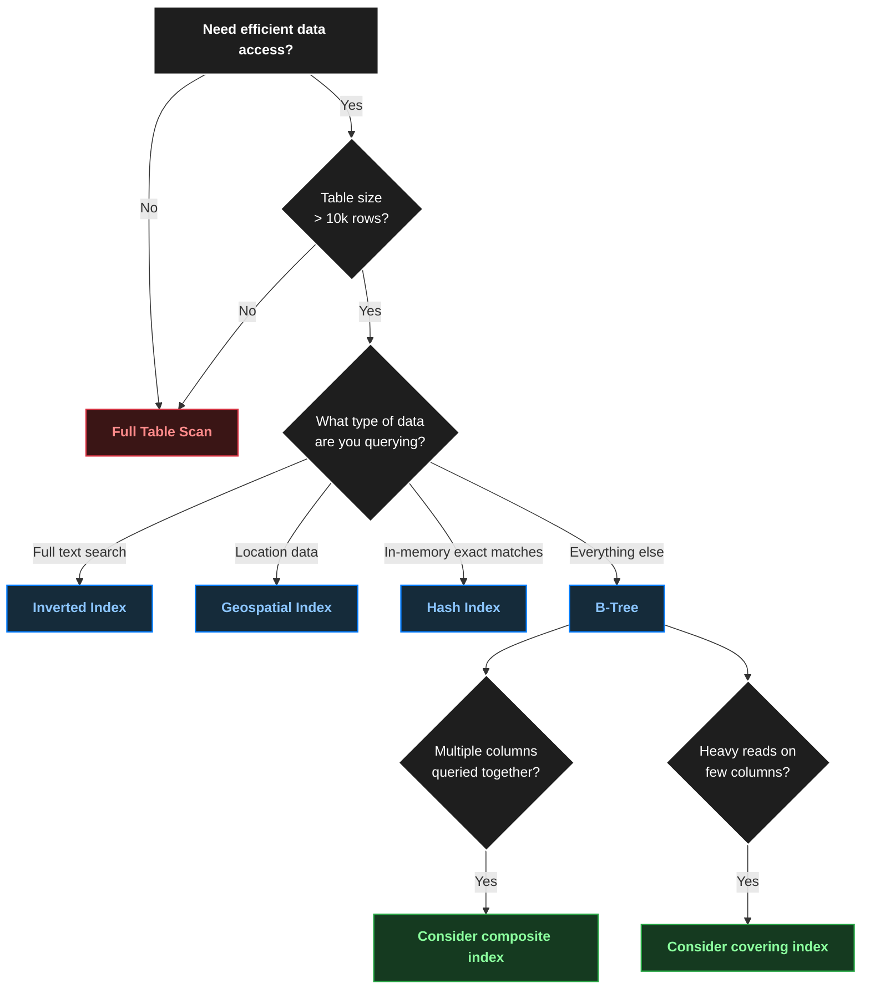

# Database Indexes :: Data Structure Type
> - Choosing the right indexes is often a key focus in interviews. 
> - Mastery of **different index types** and their trade-offs is essential.

---
## Most common one
### 1. B-Tree Indexes
- [btree.md](03_DataStructure/01_core_02_btree.md)

---
### 2. LSM Trees (Log-Structured Merge Trees)
- [LSM.md](03_DataStructure/01_core_03_LSM.md)

---
### 3. Hash Indexes
[01_core_04_hashtable.md](03_DataStructure/01_core_04_hashtable.md)

---
### 4. Geospatial Indexes
[01_core_05_geo-spactial.md](03_DataStructure/01_core_05_geo-spactial.md)

---
### 5. Inverted Indexes
[01_core_06-inverted.md](03_DataStructure/01_core_06-inverted.md)

## more

| Index Type       | Structure              | Best for                          |
| ---------------- | ---------------------- | --------------------------------- |
| **Bitmap index** | Bitmaps                | Low-cardinality columns           |
| **GIN/GiST**     | Specialized structures | JSON, arrays, full-text, spatial  |

---
### Summary 

```
                    Database Indexes
                          │
        ┌─────────────────┼─────────────────┐
        │                 │                 │
     B-Tree             Hash           Specialized
        │                 │                 │
 Range + Sort        Exact Match      ┌──────┴──────┐
        │                              │             │
   age > 30                       Geospatial    Inverted
   ORDER BY name                  Location       Text
```

| Index Type           | Best For                | Example Query                             | Key Characteristic                          |
| -------------------- | ----------------------- | ----------------------------------------- | ------------------------------------------- |
| **B-Tree**           | General-purpose queries | `WHERE age > 30`, `ORDER BY name`         | Supports equality, range, and sorting       |
| **Hash Index**       | Exact-match queries     | `WHERE user_id = '123'`                   | Very fast equality lookups; poor for ranges |
| **Geospatial Index** | Location-based queries  | `WHERE distance(location, point) < 5km`   | Optimized for spatial/location searches     |
| **Inverted Index**   | Text search             | `WHERE description CONTAINS 'kubernetes'` | Maps terms → documents containing them      |


---
## Index Optimization Patterns
### 1. Composite Indexes

```postgres-psql
SELECT * FROM posts 
WHERE user_id = 123 
AND created_at > '2024-01-01'
ORDER BY created_at DESC;

-- individual index
CREATE INDEX idx_user ON posts(user_id);
CREATE INDEX idx_time ON posts(created_at);

-- composite index
CREATE INDEX idx_user_time ON posts(user_id, created_at);

-- order of columns in a composite index is crucial. 👈
```

Consider common interview scenarios like (check order):
```
Order history lookups   : (customer_id, order_date)
Event processing        : (status, priority, created_at)
Activity feeds          : (user_id, type, timestamp)
```

### 2. Covering Indexes
**Overview**
- A covering index is one that includes all the columns needed by your query 
- not just the columns you're filtering or sorting on.
- With the covering index, PostgreSQL can return results purely from the index data - **no need to look up each post in the main table**
- The trade-off is, of course, **size**

**use case:**
- social feeds, 
- leaderboards, 
- other read-heavy features where query speed is critical

**Example:**

>  same principles apply to even NoSQL solutions.

```postgres-psql
CREATE TABLE posts (
    id SERIAL PRIMARY KEY,
    user_id INT,
    title TEXT,
    content TEXT,
    likes INT,
    created_at TIMESTAMP
);

-- Regular index
CREATE INDEX idx_user_time ON posts(user_id, created_at);

-- Covering index includes likes column
CREATE INDEX idx_user_time_likes ON posts(user_id, created_at) INCLUDE (likes);
```

## Conclusion

