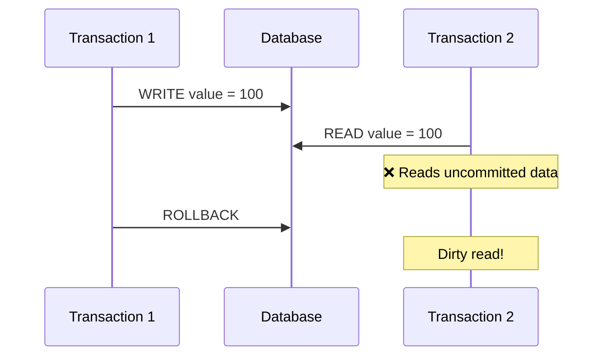
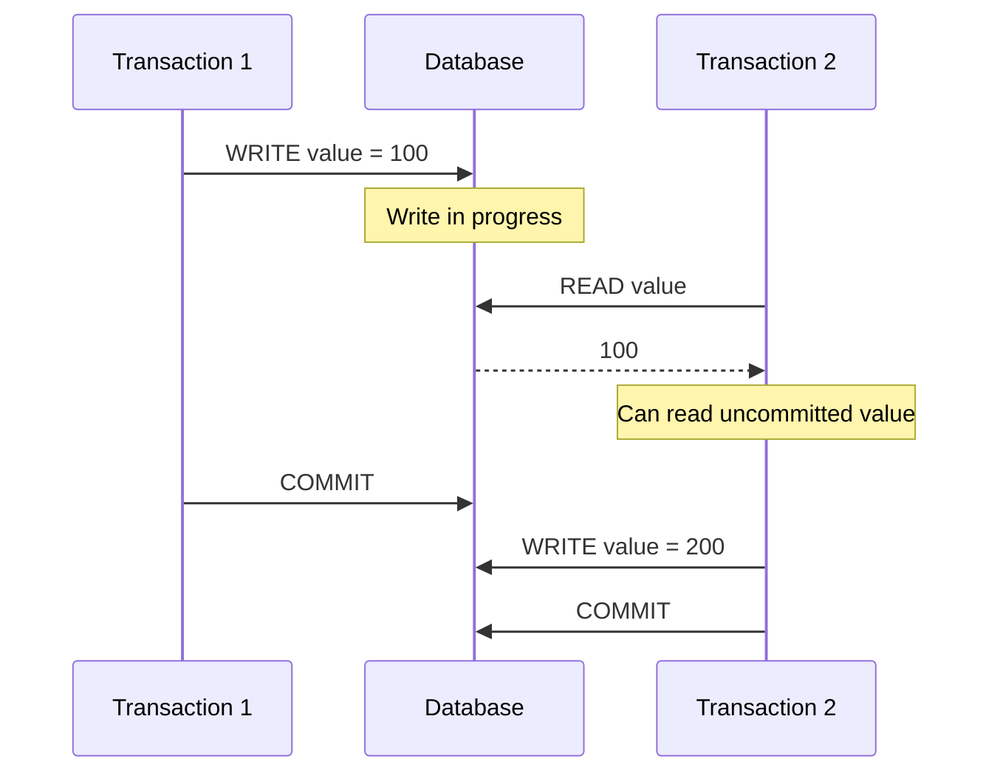
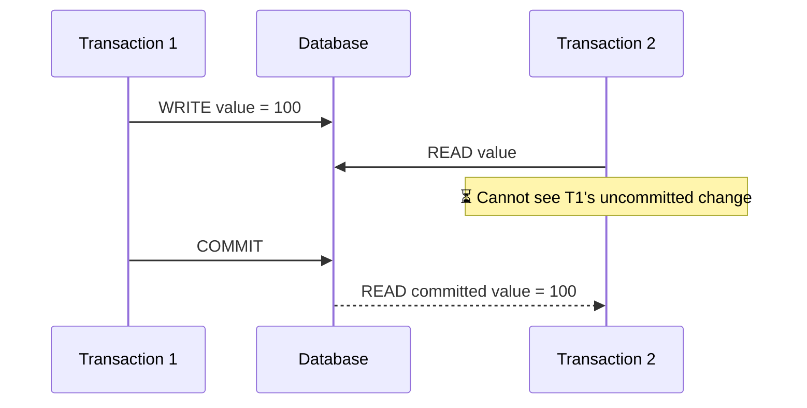
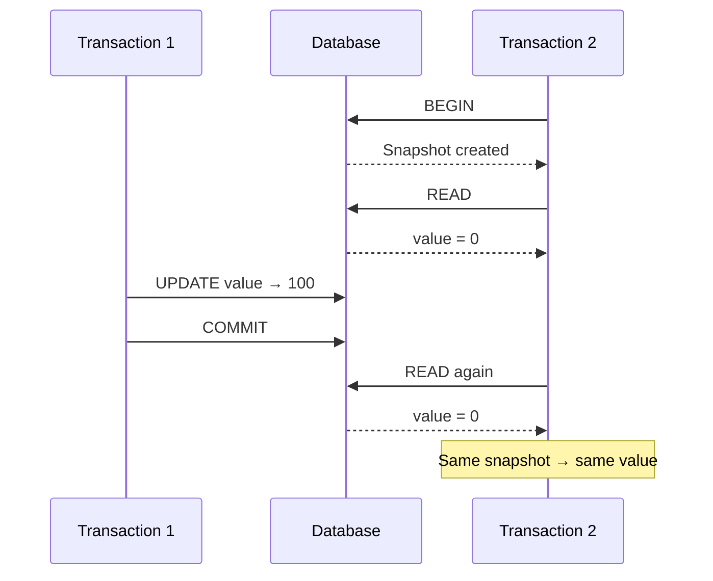
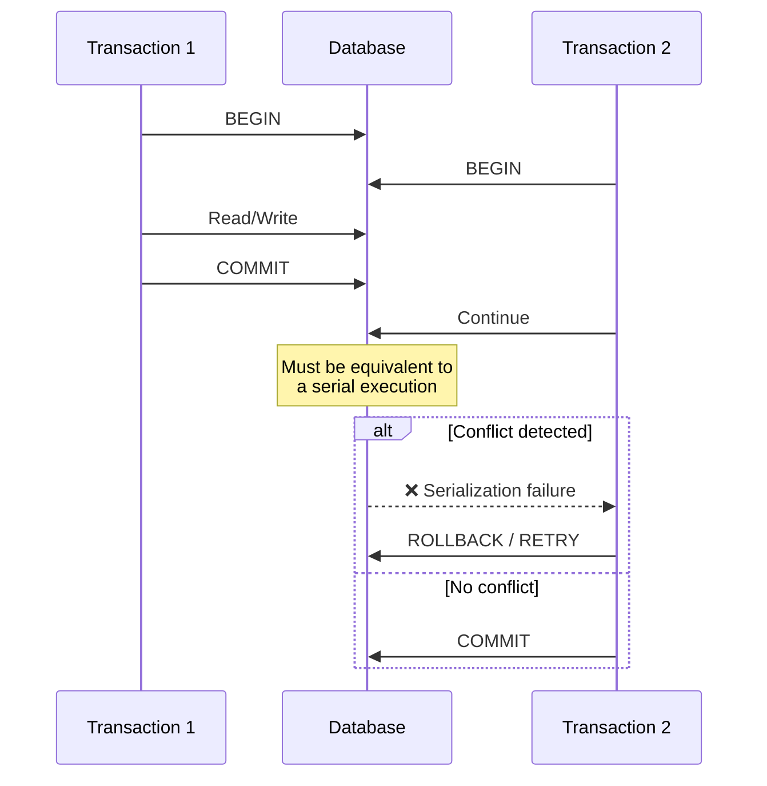

# ACID

## Overview
- All DB has underlying solution for ACID
- https://www.youtube.com/watch?v=Sahvj-0UYxM

## Atomicity
```sqlite-psql
BEGIN TRANSACTION
 -- SQL-1
 -- SQL-2
 -- ...
 -- unit of work
COMMIT
```

---
## Consistency
Takes data from one valid state to another valid state
- pk
- fk
- constraints

---
## ISOLATION
- the amount of data that is visible in a transaction
- when the other services access the same data simultaneously.
  
> **READ_UNCOMMITTED >> READ_COMMITTED >> REPEATABLE_READ >> SERIALIZABLE** 👈🏻

```sql
# postgres
BEGIN TRANSACTION ISOLATION LEVEL SERIALIZABLE;

SHOW default_transaction_isolation;  -- Typically "read committed"
ALTER SYSTEM SET default_transaction_isolation = 'repeatable read'; 
```

```Java
Connection conn = dataSource.getConnection();
conn.setTransactionIsolation(Connection.TRANSACTION_SERIALIZABLE);
```
```java
@Transactional(isolation = Isolation.READ_COMMITTED) //👈
    public void standardOperation() { }
```

### NO ISOLATION : Dirty read
`no isolation`
- txn1 , txn2  -> both are reading/writing same record, same time.




### READ UNCOMMITTED ✔️
`write-lock`
- txn-1 took w-lock first > performing write
- txn-2 waits for writing only
  - but not waiting for read
  - can still read 👈🏻
  - hence called read-uncommitted
- txn-1 done
- txn-2 took w-lock > performing write



---
### READ COMMITTED  ✔️✔️
`read lock` `write lock`
- txn-1 took write-lock > performing write
- txn-2 has to take read-lock, once write-lock is release
- txn-1 released write-lock
- txn-2 took Read-lock > read



---
### REPEATABLE READ ✔️✔️✔️
`version/sanpshot`
- txn-1 took w-lock > performing write. set **value-1**
- txn-2 waits
- txn-1 released w-lock
- txn-2 took R-lock >> Read **value-1** >> released lock
- txn-1 took w-lock >> performing write AGAIN to **value-2**
- txn-2 should read updated **value-2**

sol - read from **latest version**


  
---
### SERIALIZABLE ✔️✔️✔️✔️
`range lock` 
- Solves **phantom read**
- prevents from **write skew** completely 👈


---
## SUMMARY
```
Isolation_Level	    Dirty_Reads	    Non-Repeatable-Reads	Phantom-Reads
READ_UNCOMMITTED	✗	            ✗	                    ✗
READ_COMMITTED	    ✓	            ✗	                    ✗
REPEATABLE_READ	    ✓	            ✓	                    ✗
SERIALIZABLE	    ✓	            ✓	                    ✓
```

---
## Durability
- data never crashes

