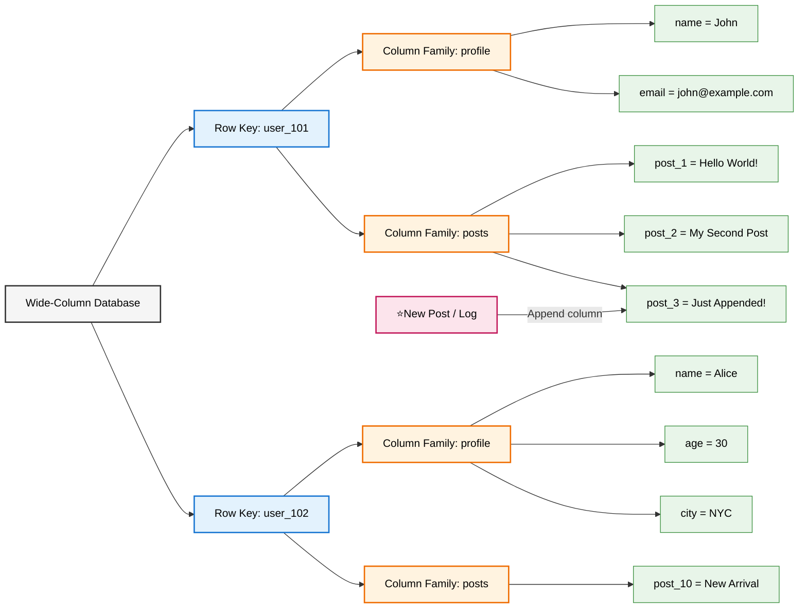
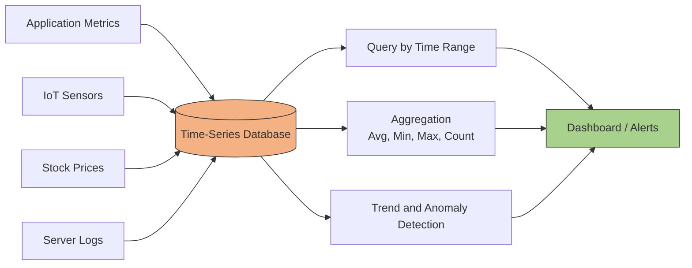

# Data Modeling
- https://www.youtube.com/watch?v=6bZdMZb8xI8 | SQL
- https://academy.bytemonk.io/products/system-design-mastery-beta/categories/2158360645/posts/2190592401 | keyValue store
- https://www.hellointerview.com/learn/courses/system-design/lesson/foundations/data-modeling

---
## Overview
Data Modeling
- process of defining how your application’s data is **structured, stored, and related.**
- not expected to normalize everything or produce a complete schema diagram
- expected to design something clear, functional, and aligned with your system’s requirements

Delivery phase
- During **requirements gathering** step
  - identify your core entities.
  - These usually map 1:1 with tables or collections and form the backbone of your schema. 
- Later, in the **High-Level Design** step, 
  - you'll sketch a basic schema alongside your database component.

> ⚠️ A sloppy data model can lead to painful issues later. Resist choosing exotic database types.

```
SQL
 └── Relational

NoSQL
 ├── Key-Value       → Redis, DynamoDB
 ├── Document        → MongoDB, DynamoDB
 ├── Wide-Column     → Cassandra, HBase
 └── Graph           → Neo4j, Neptune

Specialized
 ├── Time-Series
 ├── Search
 ├── Vector
 ├── Spatial
 └── Ledger
```

| SQL                                        | NO-SQL                                            |
|--------------------------------------------|---------------------------------------------------|
| Data has clear relationships               | Data is accessed mainly by a unique key           |
|                                            | data model is not **hierarchical**                |
| Complex joins are required                 | Joins are not required                            |
| Strong ACID transactions matter            | Very high throughput and low latency matter       |
| Schema is structured and stable            | Schema is flexible or values are opaque           |
| Complex filtering and reporting are needed | Simple `GET`, `PUT`, `DELETE` operations dominate |
| Example: banking, orders, inventory        | Example: sessions, carts, cache, user preferences |

---
## A1. Relational Databases (SQL)
> default unless your requirements clearly signal a specialized model | stick with PostgreSQL.

Structure
```
Database
 └── Table
      ├── Primary Key
      ├── Column A
      ├── Column B
      └── Column C
```
best for:
- Strong consistency
- Relationships and Joins
- ACID transactions
- Complex queries

---
> **NOSql DB** : no relation | no schema |  no querying language | simple operations like get, put, and delete.

## B1. Document DB
> Data → JSON-like documents

```
Collection
 └── Document
      ├── _id
      ├── field A
      ├── field B
      └── nested objects / arrays
```

Example
- MongoDB
- dynamoDb

Best for:
- Flexible schema
- Nested data

---
## B2. key-value Store
**Structure** === **dictionary** or **map**
```
Table
 ├── Key:value
 └── ...
 
Table (dyanamoDB , little richer)
 ├── Partition Key
 ├── Sort Key
 ├── Attribute A
 ├── Attribute B
 └── Attribute C
```

- key -> `String` | hashed to memoryLoc
- value ->` String, arrays, integer`

**best for**:
- Very fast lookups
- Caching
- Sessions
- Simple access patterns

---
## B3. wide column database
> Data → partitioned rows with flexible columns
**structure**
- **Column family/table** → defined ahead of time.
- **Column** → values are written with the row; schema can be flexible depending on the column.

```
Keyspace
 └── Table
      ├── Partition Key
      ├── Clustering Columns (Sort Key)
      └── Other Columns/Column Family
```

**Example**
- HBase, Cassandra
- Modern/cloud-managed: Google Bigtable, Amazon KeySpaces

Best for:
- Massive datasets
- Horizontal scaling
- High write throughput
- Distributed systems

```
Relational DB
     ↓
"Tables" → Rows → Columns (schema)
     ↓
Strong schema + joins


Wide-column DB
     ↓
"Partition" → Rows → Columns (no schema)
     ↓
Distributed + query-driven schema
```
| Characteristic | Wide-column DB                               |
| -------------- |----------------------------------------------|
| Data model     | Rows + column families                       |
| Schema         | Flexible                                     |
| Scaling        | Horizontal , Usually highly distributed and Availability |
| Partitioning   | Usually by partition/row key                 |
| Best for       | Huge distributed datasets                    |
| Reads          | Designed around known access patterns        |


**understand structure by Example**

---
## B4. Graph DB
> Data → nodes + relationships

```
John ──FRIEND_OF──> Alice
 │
 └──WORKS_AT──> Capital Group
```
**Example:**
- Neo4j
- Amazon Neptune

**Overview**
- Built on a **graph data model**
    - where relationships between data points are of prime importance.
    - datasets with many billions of interconnections
- **PGQL**
    - Simplifies complex queries
    - and provides deeper insights into relationships with less effort
    - Excels at finding **shortest paths** between nodes

**Best for:**

| Use case               | Why graph DB fits                      |
| ---------------------- | -------------------------------------- |
| Social networks        | Friends, followers, mutual connections |
| Recommendation systems | User → product → similar users         |
| Fraud detection        | Find suspicious relationship patterns  |
| Knowledge graphs       | Connect people, places, topics         |
| Network topology       | Servers, routers, dependencies         |
| Access control         | Users, roles, permissions              |


rdbms with lots of relation/s --> messy


---
## C1. Specialized

| Type            | Examples                   | Best for                      |
| --------------- | -------------------------- | ----------------------------- |
| **Time-Series** | InfluxDB, TimescaleDB      | Metrics, IoT, monitoring      |
| **Search**      | Elasticsearch, OpenSearch  | Full-text search              |
| **Vector**      | Pinecone, Milvus, pgvector | AI/RAG similarity search      |
| **Spatial**     | PostGIS                    | Geographic/location data      |
| **Ledger**      | Amazon QLDB                | Immutable transaction history |


### 1. Time Series


**optimized for:**
  - for storing time-stamped data 
  - or events that occur at specific intervals (e.g., every millisecond).
  - high-volume sequential write

Example: `InfluxDB, dataDog, AWS CloudWatch, Prometheus`.



---
### 2. BLOB Store


- Stores unstructured data like photos, audio, video files, and large text files.
- Behaves like key-value stores for data-access.
- **optimized for** :
    - Storing massive amounts of unstructured data
    - storage classes option to save cost
    - highly scalable
    - reliable
    - available
- Examples: GCS,S3, Azure Blob Storage
- [AWS_S3-1.md](../../CE_02_AWS_SAA/02_storage/05_01_S3.md)
- [AWS_S3-2.md](../../CE_02_AWS_SAA/02_storage/05_02_S3-advance.md)

### 3. vector

---

## Interview
Tip-1
- Don't focus too much on:
  - "Cassandra is wide-column, DynamoDB is key-value."
- Instead focus on:
  - Both are distributed NoSQL databases designed for predictable, high-scale access patterns.