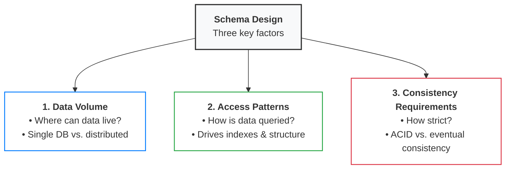

# Schema design Fundamental
- https://www.hellointerview.com/learn/courses/system-design/lesson/foundations/data-modeling#start-with-requirements

---
## 1. Three key factors
- ask these in Requirements phase


### Data volume
> determines where your data **can physically live.** 
- A social media app with millions of users might need data spread across multiple data stores, which drives schema design choices.
- If user data and post data need to live on separate systems for performance or organizational reasons,
- they necessarily need distinct schemas with careful consideration of how they reference each other.

### Access patterns
> How will **your data be queried?**
- A news feed that loads "recent posts by followed users" suggests you'll want denormalized data or carefully designed indexes.
- An analytics dashboard that aggregates data across time periods might need different table structures entirely. 
- This comes naturally from your APIs. Just ask what queries will I need to support each endpoint?

### Consistency requirements
> - determine **how tightly coupled your data can be.** 
> - choose separably for each core feature

- Financial transactions need strong consistency (no partial charges), which often means keeping related data in the same database with ACID guarantees.
- But a user's activity feed can handle eventual consistency (it's okay if a like shows up a few seconds later),
- which allows you to distribute that data across separate systems with different schemas optimized for different access patterns.

---

## 2. SQL :: Entities, Keys & Relationships 
> 🔴 For SQL, what about other type /
- identify core **entities**, 
- map them into **tables** 
- just pick an obvious **primary key** and explain why.
  - Use `system-generated IDs ` 
  - stay **stable** even when business rules change.
- With entities defined, connect them with **relationships** 1:1, 1:M, M:M
  - marks f**oreign keys** with arrows showing what they reference.
  - These relationships are enforced through foreign keys
  - **Foreign keys help ensure referential integrity** 👈
  -  meaning they prevent orphaned records.
  - > tradeoff:  At very large scale, some companies drop FK for **write performance** and enforce integrity at the application level
- finally, **constraints** like NOT NULL, UNIQUE, or CHECK


**Example**:
```
users:      id (PK), username, email
posts:      id (PK), user_id (FK → users.id), content, created_at
comments:   id (PK), post_id (FK → posts.id), user_id (FK → users.id), content
likes:      user_id (FK → users.id), post_id (FK → posts.id)
```

## 3. SQL :: Normalization vs. Denormalization
> 💡 Interview Rule of Thumb:
> - Always start with a clean, normalized model. 
> - Only denormalize when you hit specific read-performance bottlenecks that cannot be resolved with indexing
> - and preferably denormalize into a cache (like Redis) rather than the primary database.

### Normalized (Single Source of Truth)
- Definition: storing each piece of information in exactly one place
- Benefits: prevents data anomalies.
- tradeoff: Requires costly SQL JOIN operations across tables during reads.
  - **cache** in front that has a "denormalized representation of the data" is an option. 👈
  - source of truth stays clean and normalized,
  - but your cache can have pre-computed joins, aggregations,
  
### Denormalized (Optimized for Read Speed)
- Definition: Deliberately duplicating data across multiple tables or caches
- Benefits: Eliminates JOINs to make read operations significantly faster.
- Trade-off: High risk of data inconsistency when updating records (must update all duplicates).

Few key exceptions where denormalization might make sense:
```
- Analytics and reporting:
 systems where you're aggregating data that changes infrequently
 
- Event logs and audit:
trails where you're capturing a snapshot of data at a point in time

- Heavily read-optimized systems :
like search engines where consistency is less critical than speed 
```

## 4. indexing
- [03_concept_00_indexes.md](01_design_03_indexes-1.md)


## 5.Scaling and sharding
- [03_concept_03_sharding.md](../SD_06_think-in-scale/01_02_sharding.md)
