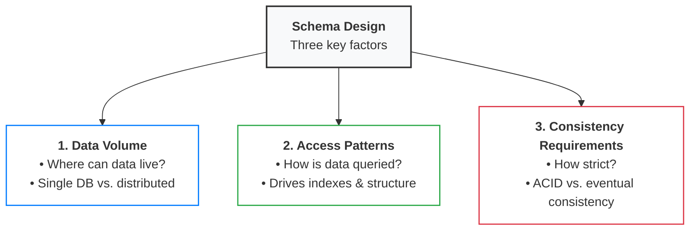

# Schema design
## 3 key factors

**Data volume** 
> determines where your data **can physically live.** 
- A social media app with millions of users might need data spread across multiple data stores, which drives schema design choices.
- If user data and post data need to live on separate systems for performance or organizational reasons,
- they necessarily need distinct schemas with careful consideration of how they reference each other.

**Access patterns**
> How will **your data be queried?**
- A news feed that loads "recent posts by followed users" suggests you'll want denormalized data or carefully designed indexes.
- An analytics dashboard that aggregates data across time periods might need different table structures entirely. 
- This comes naturally from your APIs. Just ask what queries will I need to support each endpoint?

**Consistency requirements** 
> determine **how tightly coupled your data can be.** 
- Financial transactions need strong consistency (no partial charges), which often means keeping related data in the same database with ACID guarantees.
- But a user's activity feed can handle eventual consistency (it's okay if a like shows up a few seconds later),
- which allows you to distribute that data across separate systems with different schemas optimized for different access patterns.