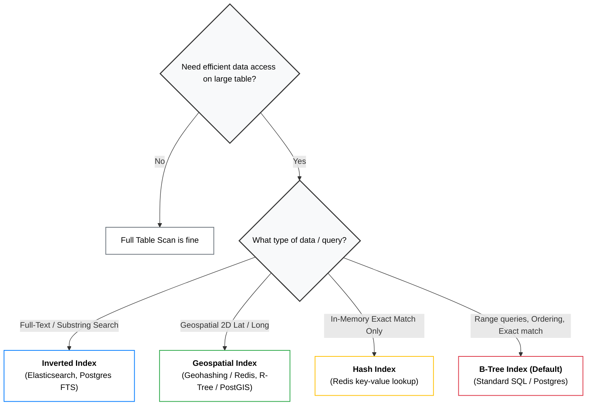
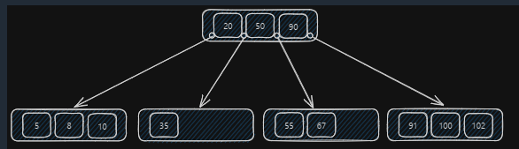
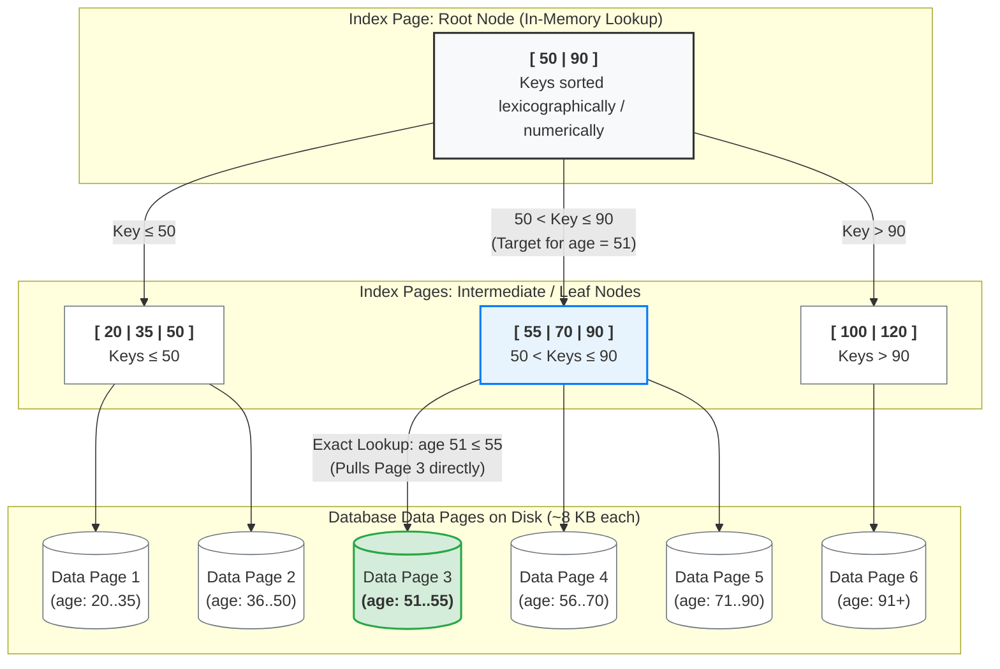

# Database Indexes :: Data Structure Type
- https://www.hellointerview.com/learn/courses/system-design/lesson/foundations/db-indexing

> 💡Choosing the right indexes is often a key focus in interviews. 
> Mastery of **different index types** and their trade-offs is essential.

---
## Most common one

| Index Type | Structure / Mechanism | Best Used For | Production Examples |
| :--- | :--- | :--- | :--- |
| **B-Tree** *(Default)* | Balanced search tree of sorted keys pointing to child nodes or data pages. | Exact match (`=`), Range queries (`<`, `>`), Sorting (`ORDER BY`), Prefix matching. | PostgreSQL, MySQL, default for most relational DBs. |
| **Hash Index** | Hash table mapping key hashes directly to page pointers. | Pure exact lookups (O(1)) in memory; **not** suitable for range queries or sorting. | Redis, in-memory caches. *(Rarely used as primary on-disk DB index)*. |
| **Geospatial Indexes** | • **Geohashing**: Converts 2D lat/long into 1D prefix strings indexed via B-Trees. • **R-Trees**: Hierarchical bounding boxes/clusters. • **Quad Trees**: Recursive 4-way grid splitting based on node density. | 2D spatial queries, radius search, bounding-box proximity. | Redis (Geohashing), PostGIS extension on PostgreSQL (R-Trees). |
| **Inverted Index** | Maps individual terms/tokens to the list of document/row IDs containing them. | Full-text search, arbitrary substring/keyword search within strings. | Elasticsearch, Apache Lucene, PostgreSQL Full-Text Search. |

---
### 1. B-Tree Indexes

> _m (order):The maximum number of children (pointers) an internal node is allowed to have._

Every node in a B-tree **follows strict rules:**
- All leaf `nodes` must be at the **same depth**
- Each `node` can contain between m/2 and m keys
- A node with k `keys` must have exactly **k+1 children**
- `Keys` within a node are kept in **sorted order**

**Why B-trees are the default choice**
- They maintain **sorted order**, making _range queries and ORDER BY_ operations efficient
- They're **self-balancing**, ensuring predictable performance even as data grows.
  - And remain balanced even with random inserts and deletes
- They **minimize disk I/O** by matching their structure to how databases store data
- They handle both:
  - **equality** searches (email = 'x') 
  - **range searches** (age > 25) equally well

---
### 2. LSM Trees (Log-Structured Merge Trees)

---
### 3. Hash Indexes

---
### 4. Geospatial Indexes

---
### 5. Inverted Indexes

---
## Index Optimization Patterns
### Composite Indexes
### Covering Indexes

