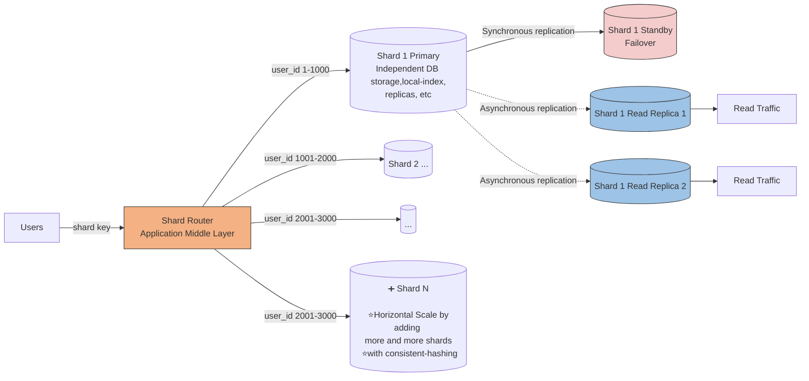
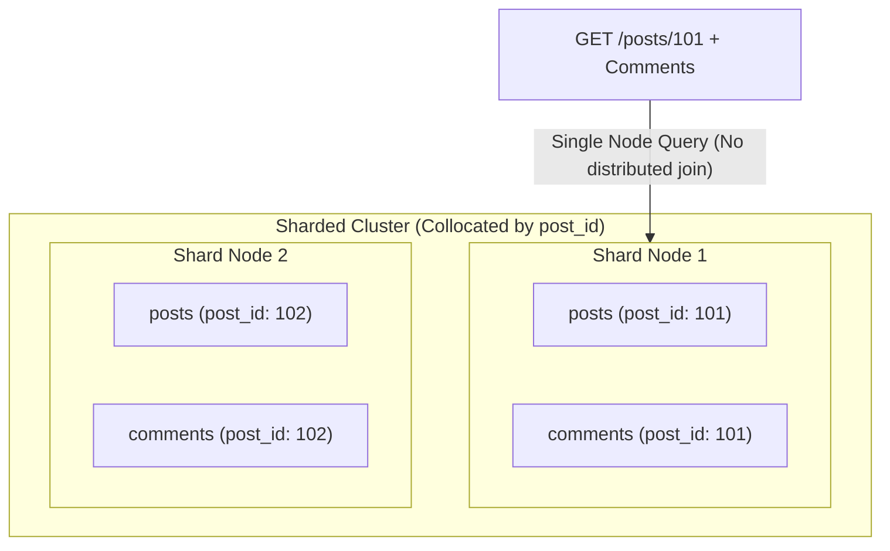
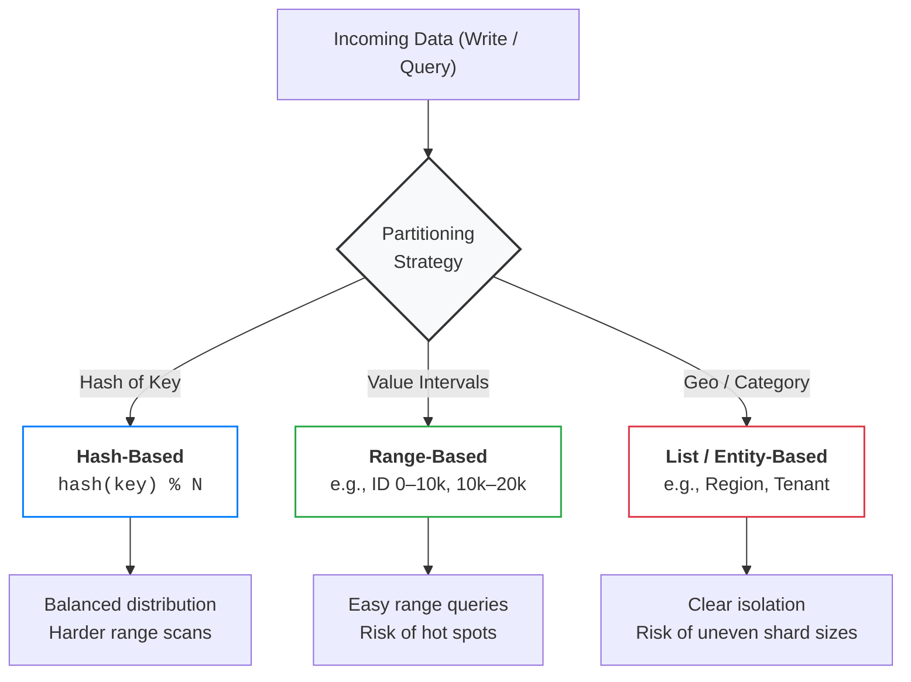
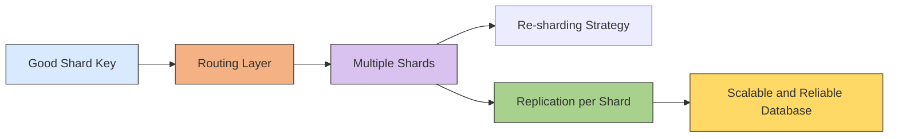

# Sharding
- [https://academy.bytemonk.io/products/system-design-mastery-beta/categories/2158360645/posts/2192332143](https://academy.bytemonk.io/products/system-design-mastery-beta/categories/2158360645/posts/2192332143)
> first component is system is DB, who needs scaling
---
## Overview
- When your data gets too large for a single database, you need to shard it across multiple machines
- The **key is choosing a partition strategy that keeps related data together** 👈
- Horizontal scaling (both read / write) of DB.
- Sharding = **horizontal** partitioning across **multiple database servers**.
- each shard is **independent Database server** with its own replication, index,etc

```
Partitioning → split data
Sharding     → place those partitions on different servers
```

**Highly available + fault-tolerant (replicas) + scalable (with consistent-hashing)**


## Choosing a good shard key.
> - Golden Rule: Shard by your **primary access pattern** to keep related data collocated on the same shard.
> - choice of shard key is **often permanent** and affects every query

Good shard key:
- **evenly distributes** data/traffic | eg: **user_id - account ids - region identifier**
- supports common **query/access patterns**
- key should **not change**, else end up moving data across shards.
- **Collocation** (Keeping Related Data Together) 👈


---
## Strategies



### time-range sharding
> ⚠️ Be careful with time-range sharding. 
> - While it sounds appealing for "recent posts" queries, all current writes hit the same shard (the latest time range), creating a hot shard. 
> - This is usually an **anti-pattern for write-heavy systems.** 👈
> - Time-range partitioning works better for archival or analytics workloads where recent data is read-heavy but writes are spread out.

---
## Challenges
> Avoid cross-shard queries, This is expensive and complex.

| Challenge   (Set-1)          |                                                                                                                                   |
|------------------------------| -------------------------------------------------------------------------------------------------------------------------------------------- |
| **Cross-shard transactions** | A transaction touching multiple shards may require distributed protocols such as two-phase commit, increasing latency and failure complexity |
| **Global secondary indexes** | Maintaining one searchable index across all shards requires coordination and can become expensive                                            |
| **Monitoring**               | Every shard must be monitored separately because load, storage, replication lag, and latency can vary                                        |

| Challenge (Set-2)            |                                                                 |
|------------------------------| --------------------------------------------------------------------- |
| **Hot shard**                | One shard receives most requests and becomes the bottleneck           |
| **Cross-shard queries**      | Requires scatter-gather across multiple databases                     |
| **Cross-shard joins**        | Expensive and difficult; often handled in application code            |
| **Rebalancing**              | Moving data when adding or removing shards is operationally expensive |
| **Failure handling**         | Each shard needs replicas, backups, monitoring, and failover          |
| **Routing complexity**       | Router must always know the correct shard mapping                     |

---
## Sharding Summary
1. Choose a strong shard key
2. Build a reliable routing layer
3. Plan for re-sharding
4. Combine sharding with replication


