# AI Note: Database Replication
- https://academy.bytemonk.io/products/system-design-mastery-beta/categories/2158360645/posts/2192327732 (Skip, check AWS notes, kind of same)
- https://www.youtube.com/watch?v=CSCw16AfWHM
- [AWS RDS concepts](../../../CE_02_AWS_SAA/03_database)
- [CAP-theorem](../../SD_06_think-in-scale/01_04_CAP-theorem.md) : while replication partition occurred, then choose between AP, CP

## Overview
Design 1: Synchronous Replication
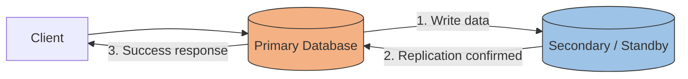
Design 2: Asynchronous Replication
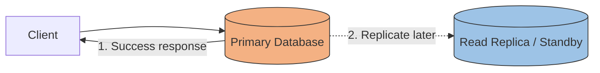
TradeOffs
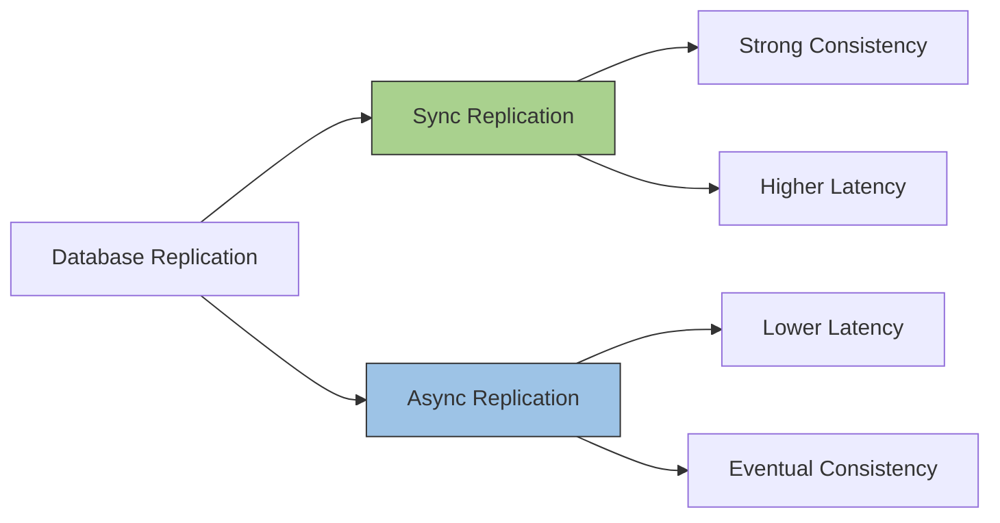
  
---
## 1. Core Concept

A database system can maintain more than one copy of its data.

```text
Primary Database
       |
       | Replication
       v
Secondary Database
```

The secondary database can serve different purposes:

* **Standby** → mainly High Availability (HA)
* **Read Replica** → mainly read scaling
* **DR Replica** → Disaster Recovery
* Sometimes one replica can serve more than one purpose.

The major architectural decision is:

```text
                    Replication
                         |
              +----------+----------+
              |                     |
        Synchronous             Asynchronous
              |                     |
        Higher consistency       Better performance
        Higher availability      Read scaling / DR
        Higher write latency     Possible replica lag
```

---

# 2. Synchronous Replication

With synchronous replication, the primary waits for confirmation from the secondary before considering the transaction committed.

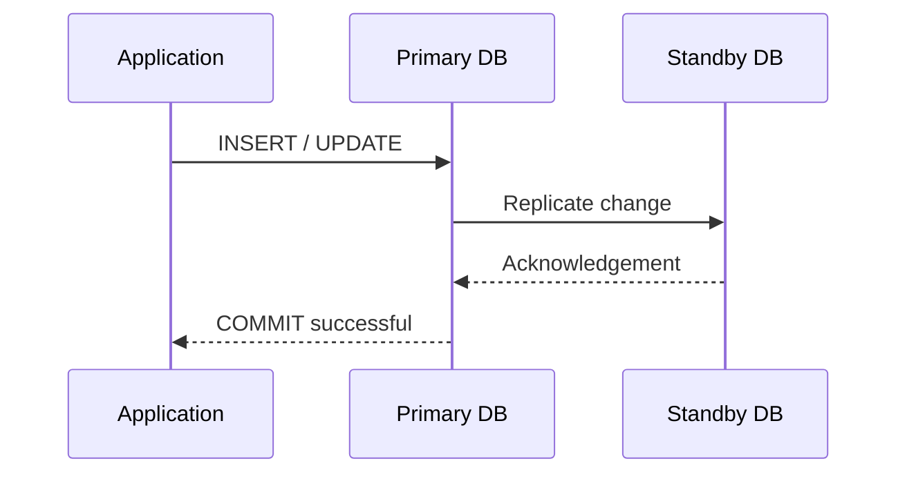

Conceptually:

```text
Application
     |
     | WRITE
     v
+-----------+
| Primary   |
+-----------+
     |
     | synchronous replication
     v
+-----------+
| Standby   |
+-----------+
     |
     | ACK
     v
Primary returns SUCCESS
```

### Important point

The application waits for something like:

```text
Write Primary
     ↓
Replicate Secondary
     ↓
Receive ACK
     ↓
Commit / return success
```

Therefore:

**Advantage:** the secondary stays very close to the primary.

**Cost:** every write has additional replication/network latency.

---

# 3. Why Synchronous Replication Helps Availability

Suppose:

```text
Primary
Account Balance = 1000

Standby
Account Balance = 1000
```

A transaction changes the balance:

```text
1000 → 900
```

With synchronous replication:

```text
Primary = 900
Standby = 900

then

COMMIT
```

Now imagine the primary immediately crashes.

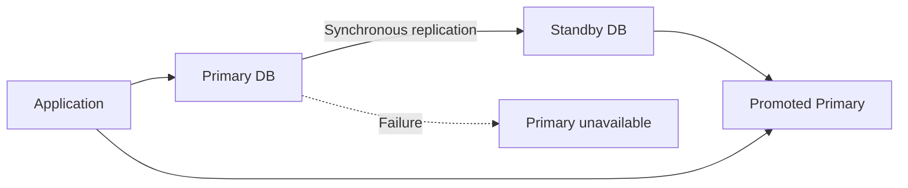

Because the standby received the committed change, it can become the new primary with minimal risk of losing acknowledged transactions.

This is why synchronous replication is commonly associated with:

> **High Availability**

---

# 4. Trade-Off of Synchronous Replication

Assume a normal database write takes:

```text
Primary processing = 3 ms
```

But replication adds:

```text
Network to secondary = 2 ms
Secondary persistence = 3 ms
ACK = 2 ms
```

Approximate total:

```text
3 + 2 + 3 + 2
≈ 10 ms
```

Without synchronous replication:

```text
~3 ms
```

With synchronous replication:

```text
~10 ms
```

This is simplified, but demonstrates the trade-off.

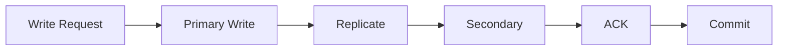

### Main trade-off

| Property                        | Synchronous     |
| ------------------------------- | --------------- |
| Write latency                   | Higher          |
| Data consistency between copies | Higher          |
| Data-loss risk during failover  | Very low        |
| Availability                    | Excellent       |
| Read scaling                    | Not necessarily |
| Distance                        | Usually nearby  |
| Typical use                     | HA              |

---

# 5. Asynchronous Replication

Asynchronous replication works differently.

The primary does **not normally wait for the replica to apply the change before completing the application write**.

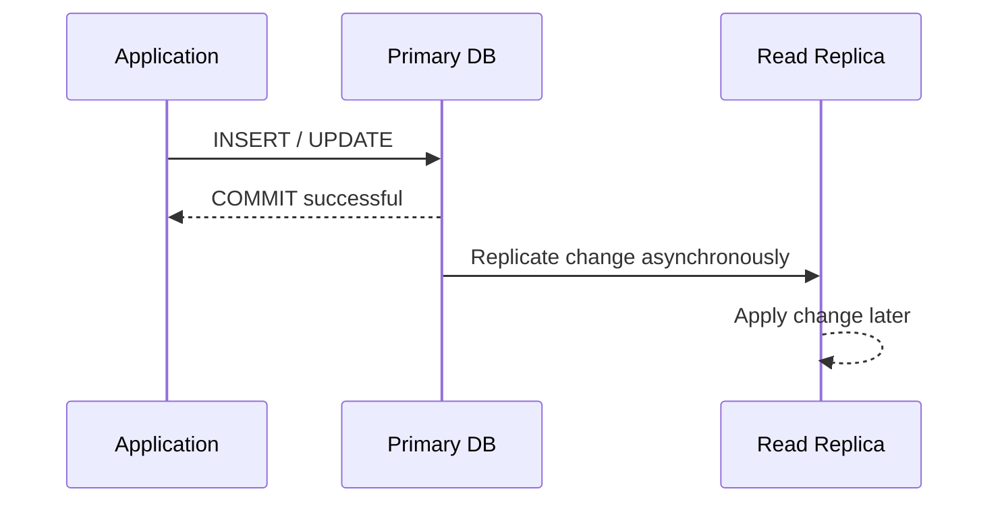

Conceptually:

```text
Application
     |
     | WRITE
     v
+-----------+
| Primary   |
+-----------+
     |
     +----------> Return SUCCESS
     |
     | asynchronously
     v
+-----------+
| Replica   |
+-----------+
```

The application doesn't have to wait for the replica.

Therefore:

```text
Lower write latency
        +
Independent replicas
        +
Good read scalability
        +
Long-distance replication possible
```

But there is a major trade-off:

> **Replica lag**

---

# 6. Replica Lag

Imagine this state:

```text
10:00:00.000

Primary:
balance = 900

Read Replica:
balance = 1000
```

A little later:

```text
10:00:00.150

Primary:
balance = 900

Read Replica:
balance = 900
```

For about 150 ms, the replica returned old data.

This is called:

> **replication lag**

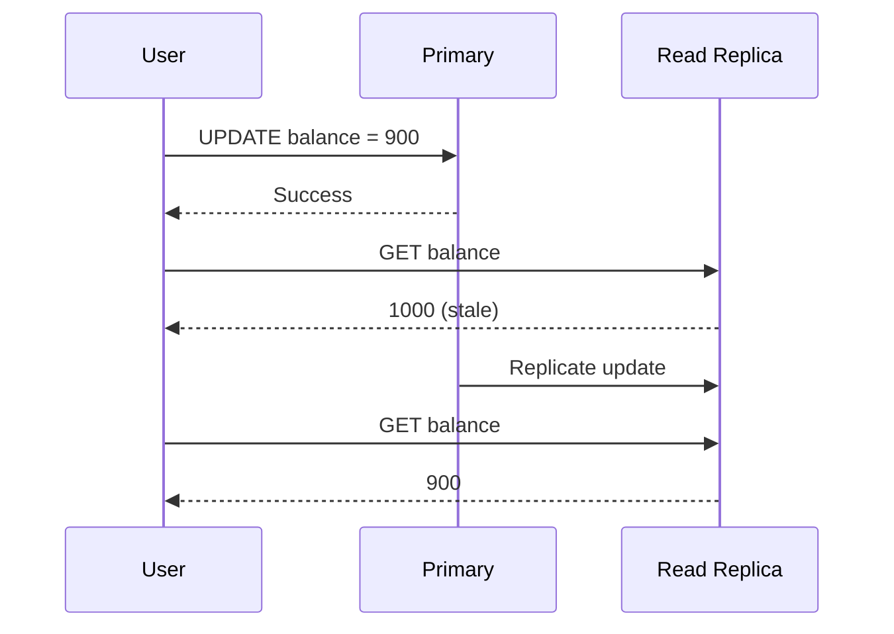

This creates an important distributed-system concept:

> **Eventual consistency**

The replica eventually catches up.

---

# 7. Sync vs Async

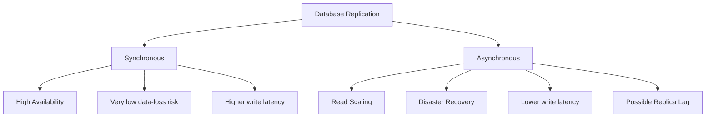

### Comparison

| Feature                   | Synchronous                               | Asynchronous                   |
| ------------------------- | ----------------------------------------- | ------------------------------ |
| Primary waits for replica | Yes                                       | No                             |
| Write latency             | Higher                                    | Lower                          |
| Replica lag               | Minimal                                   | Possible                       |
| Read consistency          | Better                                    | Can be stale                   |
| HA                        | Excellent                                 | Possible, but more complicated |
| Read scaling              | Usually not the main purpose              | Excellent                      |
| Geographic distance       | Usually same region/nearby                | Can be cross-region            |
| RPO                       | Near zero for supported failure scenarios | Greater than zero possible     |
| Common use                | HA                                        | Scaling / DR                   |

Neither design is universally better.

The correct choice depends on the requirement.

---

# 8. AWS RDS Mapping

This maps extremely well to Amazon RDS.

AWS effectively gives you multiple architectures.

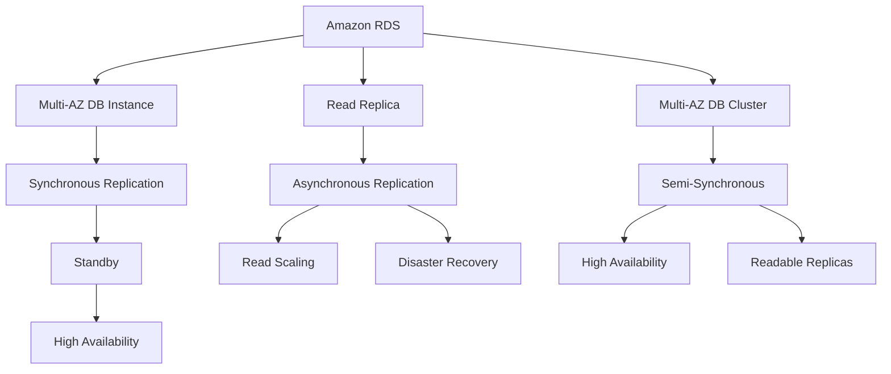

This third architecture—**Multi-AZ DB Cluster**—is important in modern RDS and makes the picture more nuanced.

---

# 9. AWS RDS Design 1 — Multi-AZ DB Instance

This is closest to your:

> Primary DB ← **SYNC** → Secondary DB

architecture.

AWS provisions:

```text
Availability Zone A                 Availability Zone B

+------------------+                +------------------+
| Primary RDS      | -- SYNC -----> | Standby RDS     |
|                  |                |                  |
| READ + WRITE     |                | No application  |
|                  |                | read traffic     |
+------------------+                +------------------+
```

AWS documents that a traditional RDS Multi-AZ **DB instance** maintains a synchronous standby in another Availability Zone. The standby exists for failover and doesn't serve normal read traffic.

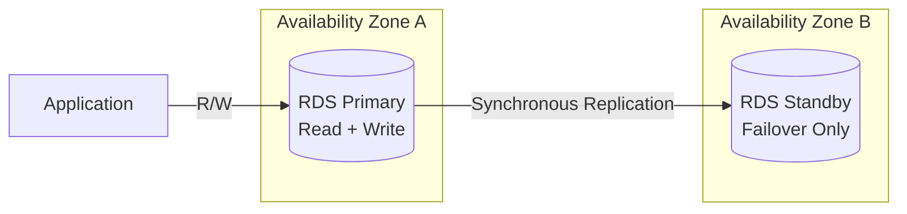

### Purpose

The main goal is:

> **High Availability**

NOT:

> Read scaling

That distinction is extremely important in interviews.

---

# 10. RDS Multi-AZ Failover

Consider:

```text
AZ-A
Primary RDS

AZ-B
Standby RDS
```

Everything is healthy:

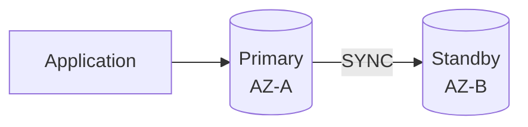

Now AZ-A has a failure:

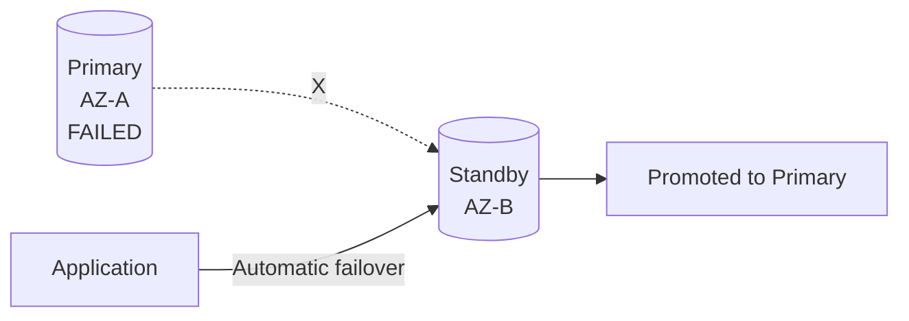

Amazon RDS detects certain failures and automatically switches to the standby. AWS says Multi-AZ DB instance failovers are typically around **60–120 seconds**, though recovery conditions and large transactions can make them longer.

This is managed by AWS.

Your application normally keeps using the RDS endpoint rather than being configured directly against the underlying host.

Conceptually:

```text
Before:

mydb.xyz.rds.amazonaws.com
          ↓
       DB-A


After failover:

mydb.xyz.rds.amazonaws.com
          ↓
       DB-B
```

---

# 11. Why Doesn't RDS Standby Serve Reads?

A common interview mistake is:

> "I have Multi-AZ, so I'll send SELECT queries to the standby."

For the traditional **Multi-AZ DB instance**, that's incorrect.

AWS explicitly states that the standby isn't a read-scaling solution and doesn't serve read traffic.

Its job is:

```text
Primary dies
      ↓
Standby takes over
```

Think:

> **Standby = insurance policy**

---

# 12. AWS RDS Design 2 — Read Replica

Now consider:

```text
Primary Database
       |
       | ASYNC
       v
Read Replica
```

This maps to RDS Read Replicas.

AWS RDS uses asynchronous engine-native replication for DB instance read replicas.

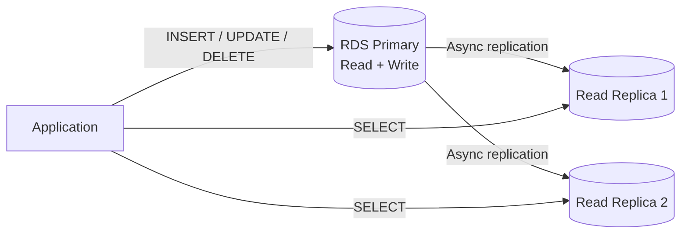

Here:

```text
Primary
   |
   +---- Async ----> Read Replica 1
   |
   +---- Async ----> Read Replica 2
```

The replicas can handle:

```sql
SELECT ...
```

while writes continue going to the primary.

---

# 13. Read Scaling Example

Suppose an application receives:

```text
10,000 DB queries/sec
```

Distribution:

```text
Writes = 1,000/sec
Reads  = 9,000/sec
```

Without read replicas:

```text
Primary = 10,000 queries/sec
```

With replicas:

```text
Primary
Writes = 1,000
Reads  = some portion

Replica 1
Reads = 3,000

Replica 2
Reads = 3,000

Replica 3
Reads = 3,000
```

Conceptually:

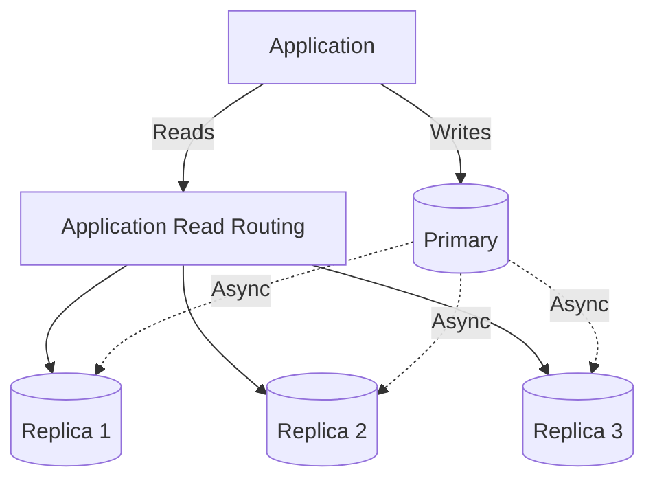

This is:

> **Horizontal scaling of database reads**

---

# 14. Read Replicas and Availability

Read replicas **can** help with recovery, but they should not be confused with an RDS Multi-AZ standby.

Suppose:

```text
Primary
   |
   | Async
   v
Read Replica
```

Primary fails.

The read replica can be promoted into an independent database, but ordinary read-replica promotion is an explicit process rather than the transparent automatic Multi-AZ failover mechanism. AWS notes that promotion involves rebooting the replica and can take several minutes or longer depending on the database.

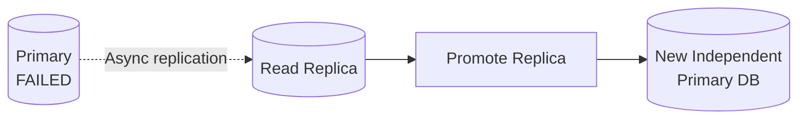

Potential issue:

```text
Primary:
transaction 100
transaction 101
transaction 102

Replica:
transaction 100
transaction 101
```

Primary crashes before transaction `102` reaches the replica.

You potentially lose:

```text
transaction 102
```

That's the async replication trade-off.

---

# 15. RPO Becomes Important

## Recovery Point Objective — RPO

RPO answers:

> **How much data can I afford to lose?**

Example:

```text
RPO = 5 minutes
```

means:

```text
In a disaster, losing up to ~5 minutes
of recent data may be acceptable.
```

Synchronous replication aims for something close to:

```text
RPO ≈ 0
```

for the infrastructure failures it is designed to tolerate.

Asynchronous replication:

```text
RPO > 0 potentially
```

because:

```text
Replication lag = possible lost updates
```

---

# 16. RTO

## Recovery Time Objective — RTO

RTO answers:

> **How long can the service remain unavailable?**

Example:

```text
RTO = 2 minutes
```

means:

```text
DB failure occurs
      ↓
service restored
      ↓
must happen within ~2 minutes
```

So remember:

```text
RPO → DATA
RTO → TIME
```

### Easy memory trick

```text
RPO = Point in the data
RTO = Time to recover
```

---

# 17. AWS RDS Multi-AZ DB Cluster

There is another RDS architecture you should know.

A modern RDS **Multi-AZ DB cluster** has:

```text
1 Writer
+
2 Readers
+
3 Availability Zones
```

and AWS describes the replication as **semisynchronous**. A commit requires acknowledgment from at least one reader, but not necessarily that the event has been fully executed and committed on every replica.

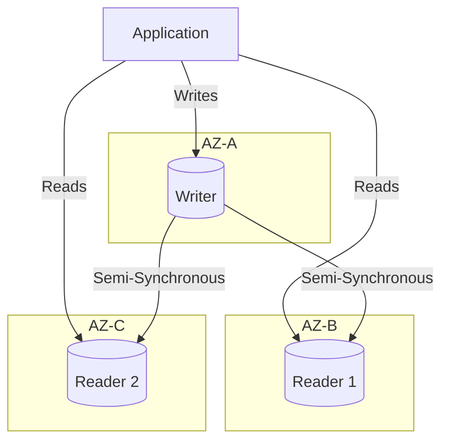

The reader instances:

* can serve read traffic
* act as failover targets
* exist in separate Availability Zones

AWS currently supports RDS Multi-AZ DB clusters for **MySQL and PostgreSQL**.

This gives you both:

```text
High Availability
       +
Read Scaling
```

within one cluster architecture.

---

# 18. Three RDS Concepts to Keep Separate

This is the most important table in these notes.

| Architecture             | Replication      | Secondary readable? |             Automatic HA | Main purpose      |
| ------------------------ | ---------------- | ------------------: | -----------------------: | ----------------- |
| RDS Multi-AZ DB Instance | Synchronous      |                   ❌ |                        ✅ | HA                |
| RDS Read Replica         | Asynchronous     |                   ✅ | ❌ normal promotion model | Read scaling / DR |
| RDS Multi-AZ DB Cluster  | Semi-synchronous |                   ✅ |                        ✅ | HA + reads        |

AWS documents these architectural distinctions directly.

---

# 19. Production Architecture: Multi-AZ + Read Replica

You don't necessarily have to choose between synchronous and asynchronous replication.

A very common architecture combines them.

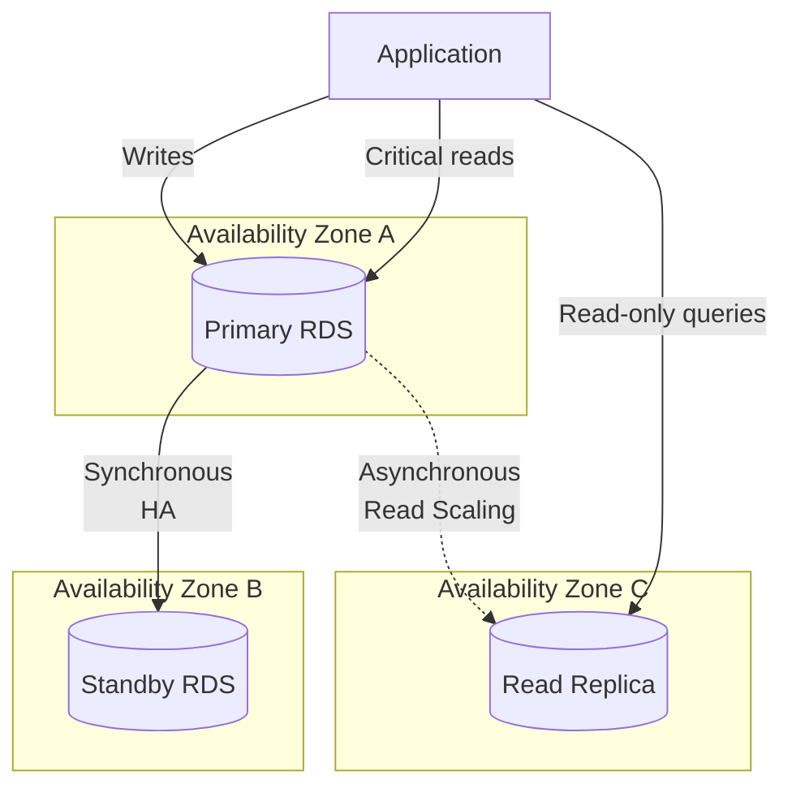

AWS explicitly documents this type of design: a source can have a synchronous Multi-AZ standby while also asynchronously replicating changes to a read replica.

Now you get:

```text
                   Primary
                  /       \
                 /         \
              SYNC         ASYNC
               /             \
          Standby          Read Replica
             |                  |
             HA              Read Scaling
```

This is a very strong system-design architecture.

---

# 20. Why Use Both?

Because they solve different problems.

### Requirement 1

> "Database must survive an Availability Zone failure."

Solution:

```text
Multi-AZ
```

### Requirement 2

> "Database receives too many SELECT queries."

Solution:

```text
Read replicas
```

### Requirement 3

> "We need both."

Solution:

```text
Multi-AZ
+
Read Replicas
```

---

# 21. Availability vs Scalability

Do not mix these concepts.

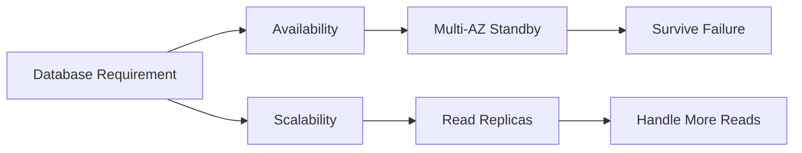

### High Availability

Question:

> What happens if my database crashes?

Answer:

```text
Multi-AZ / standby / failover
```

### Scalability

Question:

> What happens if I receive too many reads?

Answer:

```text
Read replicas
```

---

# 22. Availability vs Disaster Recovery

Also distinguish:

```text
High Availability
        ≠
Disaster Recovery
```

### High Availability

Usually protects from relatively local failures:

```text
Instance failure
AZ failure
hardware failure
maintenance
```

For example:

```text
AZ-A → Primary
AZ-B → Standby
```

Both still exist inside:

```text
us-east-1
```

AWS specifically notes that traditional Multi-AZ protects against instance/AZ disruption but doesn't by itself protect against a complete Region-level outage.

---

# 23. Cross-Region DR

For larger disasters, you might use:

```text
Region A
Primary
     |
     | asynchronous replication
     v
Region B
Read Replica
```

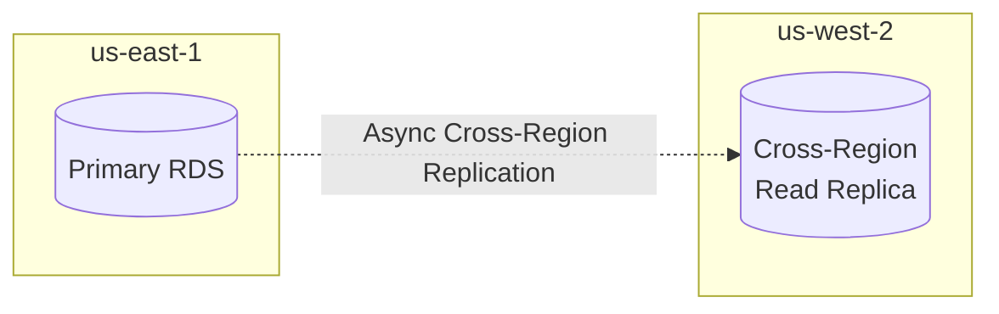

If Region A becomes unavailable:

```text
Promote Region B replica
         ↓
Redirect application
         ↓
Continue operation
```

AWS supports read-replica promotion as part of a multi-Region recovery strategy.

But because replication is asynchronous:

```text
RPO may not be zero.
```

---

# 24. Why Not Use Synchronous Replication Across Very Long Distances?

Imagine:

```text
Los Angeles
    |
    |
New York
```

Every database write would effectively require communication across that large network distance before completing.

```mermaid
sequenceDiagram
    participant App as Application
    participant LA as Primary LA
    participant NY as Secondary NY

    App->>LA: INSERT
    LA->>NY: Replicate
    Note over LA,NY: Long-distance network latency
    NY-->>LA: ACK
    LA-->>App: Success
```

That can dramatically increase write latency.

Therefore a common pattern is:

```text
Same-region / nearby replicas
        ↓
Sync / semi-sync
        ↓
Availability

Cross-region
        ↓
Async
        ↓
Disaster Recovery
```

This isn't an absolute law, but it is a useful architecture principle.

---

# 25. Read-After-Write Problem

Async replication creates another important system-design issue.

Imagine:

```text
POST /profile

UPDATE users
SET name='John'
```

Write goes to primary.

Immediately afterward:

```text
GET /profile
```

goes to a read replica.

```mermaid
sequenceDiagram
    participant U as User
    participant API as API
    participant P as Primary
    participant R as Replica

    U->>API: Update name to John
    API->>P: UPDATE name='John'
    P-->>API: Success
    API-->>U: Success

    U->>API: GET profile
    API->>R: SELECT profile
    R-->>API: Old name
    API-->>U: Old name

    P->>R: Replication catches up
```

User says:

> "I just changed my name. Why am I seeing the old value?"

That's replica lag.

---

# 26. How Applications Handle Read-After-Write

Several strategies exist.

### Strategy A — Read critical data from primary

```text
Writes → Primary
Critical immediate reads → Primary
General reads → Replica
```

Example:

```mermaid
flowchart LR
    APP[API]

    APP -->|Writes| P[(Primary)]
    APP -->|Read-after-write| P

    APP -->|Normal reads| R[(Replica)]

    P -. Async .-> R
```

This is often the simplest solution.

---

# 27. Example: Banking Application

Imagine:

```text
POST /transfer

Transfer $1,000
```

Immediately afterward:

```text
GET /account/balance
```

For financial data, returning a stale balance may be unacceptable.

So:

```text
Transfer
    ↓
Primary

Immediate balance
    ↓
Primary
```

But a query like:

```text
GET /transactions/history?year=2024
```

might be safe to serve from:

```text
Read Replica
```

depending on the business consistency requirement.

That's an important system-design decision:

> **Not every read needs the same consistency guarantee.**

---

# 28. Write Scaling Is Different

Read replicas solve:

```text
READ scalability
```

They don't automatically solve:

```text
WRITE scalability
```

Because:

```text
INSERT
UPDATE
DELETE
```

still normally go to:

```text
Primary / Writer
```

```mermaid
flowchart TB
    APP[Application]

    APP -->|Writes| P[(Primary)]

    P -.-> R1[(Replica)]
    P -.-> R2[(Replica)]
    P -.-> R3[(Replica)]

    APP -->|Reads| R1
    APP -->|Reads| R2
    APP -->|Reads| R3
```

Even if you have:

```text
100 read replicas
```

you can still have a writer bottleneck.

Write scaling may require completely different techniques such as:

```text
Partitioning
Sharding
Distributed databases
Data-model redesign
Caching
Batching
```

---

# 29. CAP Connection

Replication also connects to distributed-systems consistency concepts.

Asynchronous replicas can temporarily contain:

```text
Primary     Replica

X = 20      X = 10
```

Later:

```text
Primary     Replica

X = 20      X = 20
```

Therefore applications using replicas often need to think about:

```text
Eventual consistency
Read-after-write consistency
Replica lag
Routing
Failure handling
```

---

# 30. Failure Scenarios

## Scenario 1 — Primary instance crashes

### Multi-AZ

```text
Primary ❌
   ↓
Standby promoted
   ↓
Application continues
```

Good.

---

## Scenario 2 — Read replica crashes

```text
Primary ✅

Replica-1 ❌
Replica-2 ✅
```

Writes continue normally.

Read traffic can be moved to another replica.

Good.

---

## Scenario 3 — Primary crashes with only async replica

```text
Primary ❌

Replica behind by 5 seconds
```

Potential:

```text
RPO ≈ replica lag
```

Recent writes might not yet exist on the replica.

---

## Scenario 4 — AZ fails

```text
AZ-A
Primary ❌

AZ-B
Standby ✅
```

Multi-AZ provides automatic failover for supported failure conditions.

---

## Scenario 5 — Entire Region fails

```text
Region A ❌

Primary ❌
Standby ❌
```

A same-Region Multi-AZ deployment can't by itself solve the loss of the whole Region.

You need a regional DR strategy.

For example:

```text
Region A
Primary + Multi-AZ
        |
        | Async
        v
Region B
DR Replica
```

---

# 31. Full Production Architecture

A mature architecture might look like this:

```mermaid
flowchart TB
    USER[Users]

    APP[Application Services]

    USER --> APP

    subgraph REGION1[Primary Region]

        subgraph AZA[AZ-A]
            P[(Primary RDS)]
        end

        subgraph AZB[AZ-B]
            ST[(Standby)]
        end

        subgraph AZC[AZ-C]
            RR[(Read Replica)]
        end

        APP -->|Writes| P
        APP -->|Strong-consistency reads| P
        APP -->|Read-heavy queries| RR

        P -->|"SYNC - HA"| ST
        P -. "ASYNC - Read Scale" .-> RR
    end

    subgraph REGION2[DR Region]
        DR[(Cross-Region<br/>Replica)]
    end

    P -. "ASYNC - DR" .-> DR
```

Now each replica has a clear purpose:

```text
Primary
   |
   +-- SYNC --> Standby
   |              |
   |              +--> Availability
   |
   +-- ASYNC --> Read Replica
   |                |
   |                +--> Read scalability
   |
   +-- ASYNC --> Cross-Region Replica
                    |
                    +--> Disaster Recovery
```

This is the architecture mental model worth remembering.

---

# 32. Latency vs Durability Trade-Off

There is no free architecture.

```mermaid
flowchart LR
    SYNC[Synchronous]

    SYNC --> D1[Better durability]
    SYNC --> A1[Better HA]
    SYNC --> L1[Higher write latency]

    ASYNC[Asynchronous]

    ASYNC --> P1[Better write performance]
    ASYNC --> S1[Read scalability]
    ASYNC --> R1[Replica lag risk]
```

You are effectively deciding:

```text
How much latency am I willing to accept?

versus

How much data-loss/staleness risk am I willing to accept?
```

---

# 33. Standby vs Read Replica

Another interview favorite.

| Feature             | Standby                          | Read Replica                                  |
| ------------------- | -------------------------------- | --------------------------------------------- |
| Main goal           | HA                               | Read scaling                                  |
| Normal replication  | Sync in classic RDS Multi-AZ     | Async                                         |
| Read traffic        | No for classic Multi-AZ instance | Yes                                           |
| Write traffic       | No                               | No while operating as ordinary read replica   |
| Automatic failover  | Yes in Multi-AZ                  | Not the normal read-replica model             |
| Promotion           | Automatic HA process             | Explicit promotion possible                   |
| Replica lag concern | Much smaller                     | Yes                                           |
| Cross-region        | Not classic Multi-AZ standby     | Supported for relevant engines/configurations |

### Memory trick

```text
Standby
   ↓
Standing by for FAILURE

Read Replica
   ↓
Replicating for READS
```

---

# 34. Interview Question

### Question

You have an RDS PostgreSQL database and management says:

> "We require high availability. Let's add a read replica."

What's wrong?

### Answer

A read replica mainly provides **read scalability** and uses asynchronous replication, so it can experience replica lag.

For high availability, I'd normally evaluate an RDS **Multi-AZ deployment**, where AWS maintains failover capacity in another Availability Zone.

Then, if the workload is also read-heavy:

```text
Multi-AZ
+
Read Replica
```

can address both requirements.

---

# 35. Interview Question

### Question

Why not always use synchronous replication?

### Strong answer

Synchronous replication improves durability and failover characteristics because the primary waits for replication acknowledgment before completing a commit. However, that adds network and replica-processing latency to the write path.

For geographically distant replicas, that latency can become particularly expensive.

Therefore I would typically use:

```text
Sync / semi-sync
→ nearby replicas
→ high availability

Async
→ read replicas / distant replicas
→ scaling and DR
```

depending on the required RPO, RTO, consistency, and performance.

---

# 36. Interview Question

### Question

Why not always use asynchronous replication?

### Strong answer

Because asynchronous replication introduces replica lag.

If the primary fails before recent changes reach the replica, acknowledged updates could be unavailable on that replica.

It can also create stale-read problems.

Therefore for workloads requiring stronger HA and tighter RPO, synchronous or semi-synchronous replication is usually preferable.

---

# 37. Interview Decision Framework

When designing database replication, ask four questions:

```mermaid
flowchart TB
    Q[Database Design]

    Q --> Q1[Need automatic HA?]
    Q --> Q2[Need more read capacity?]
    Q --> Q3[Need regional DR?]
    Q --> Q4[Consistency requirement?]

    Q1 --> MA[Multi-AZ]
    Q2 --> RR[Read Replica]
    Q3 --> CR[Cross-Region Replica]
    Q4 --> ROUTE[Choose read/write routing]
```

Translate requirements like this:

```text
"We can't tolerate AZ failure"
        ↓
Multi-AZ

"SELECT traffic is overwhelming primary"
        ↓
Read Replica

"We can't lose an entire AWS Region"
        ↓
Cross-Region DR

"Users must immediately see their writes"
        ↓
Read from writer / stronger consistency path
```

---

# 38. Final Mental Model

The easiest way to remember everything:

```mermaid
flowchart TB
    P[(PRIMARY DATABASE)]

    P -->|"SYNC"| S[(STANDBY)]
    P -. "ASYNC" .-> R[(READ REPLICA)]
    P -. "ASYNC" .-> DR[(DR REPLICA)]

    S --> HA[Availability]
    R --> SCALE[Read Scalability]
    DR --> RECOVERY[Disaster Recovery]
```

Or simply:

```text
                     PRIMARY
                    /   |   \
                   /    |    \
              SYNC     ASYNC   ASYNC
                |        |       |
             Standby    Read     DR
                |      Replica  Replica
                |        |       |
                v        v       v
               HA     Scaling    DR
```

# 39. The One-Line Rule

Remember this for interviews:

> **Synchronous replication primarily trades write latency for stronger availability/durability, while asynchronous replication trades some consistency and potential data-loss risk for lower write latency, read scalability, and geographic flexibility.**

And specifically for AWS RDS:

```text
Multi-AZ DB Instance
      =
Synchronous Standby
      =
High Availability


Read Replica
      =
Asynchronous Replication
      =
Read Scaling / DR


Multi-AZ DB Cluster
      =
Semi-Synchronous
      =
High Availability + Readable Replicas
```

That distinction is the foundation for understanding RDS availability architecture.
