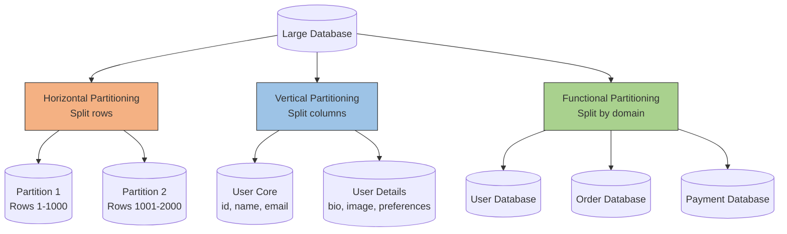
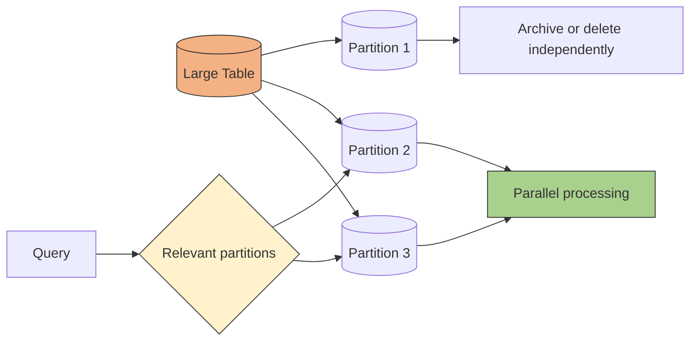
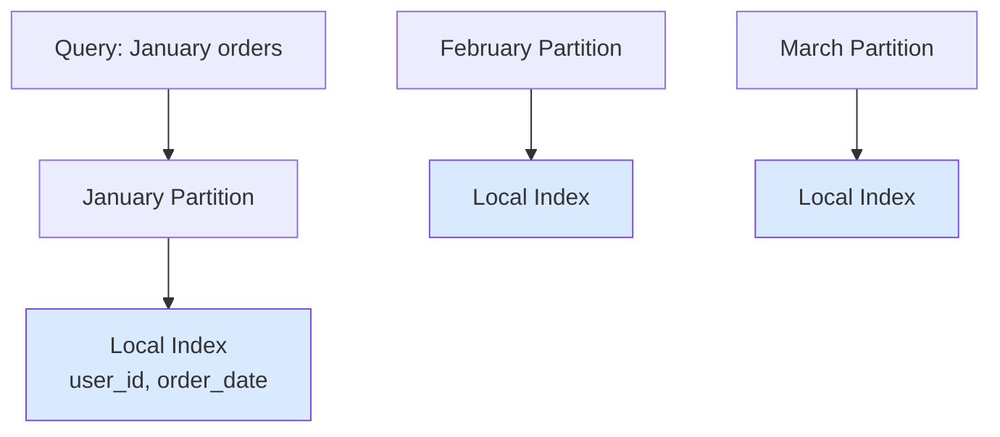
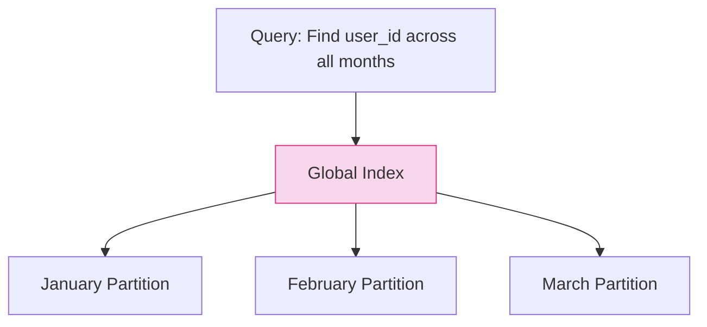
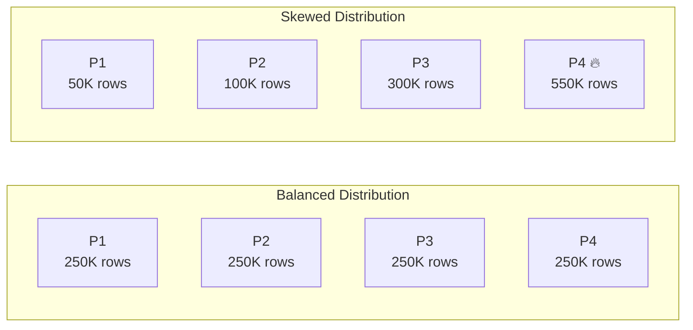

# Database partitioning
## Reference
- https://www.youtube.com/watch?v=oJj-pltxBUM&ab_channel=High-PerformanceProgramming | intro
- https://www.youtube.com/watch?v=VcTPmEJeKM4&ab_channel=AWSEvents | aws rds sharding
- https://www.hellointerview.com/learn/system-design/patterns/scaling-writes#vertical-partitioning

---
## Overview
- Database partitioning splits a large dataset/table into smaller parts called partitions 
- The data does not move off the machine
- simply divided into logical pieces the database can manage separately
- each has its own **indexes**

```Scenario:
- orders table with 500 million rows and 2 TB of data. 
- A query for last month’s orders has to scan the entire table. 
- Indexes become huge and slow to maintain
- rebuilding indexes can lock the whole table and impact performance.
```

| Partitioning type           | Split method             | Example                                                            |
| --------------------------- | ------------------------ | ------------------------------------------------------------------ |
| **Horizontal partitioning** | Split by rows            | Users 1–1M on DB1, users 1M–2M on DB2                              |
| **Vertical partitioning**   | Split by columns         | User profile columns in one table, large bio/image data in another |
| **Functional partitioning** | Split by business domain | Users DB, Orders DB, Payments DB                                   |


## 1. vertical partition
- vertical partitioning, can look similar to normalization, because both split columns into separate tables

| Aspect                      | Normalization                                                        | Vertical Partitioning                                                |
| --------------------------- | -------------------------------------------------------------------- | -------------------------------------------------------------------- |
| **Primary goal**            | Reduce data redundancy and improve data integrity                    | Improve performance, storage, or access patterns                     |
| **Why split columns?**      | To eliminate repeating/dependent data                                | To separate frequently vs. rarely accessed columns                   |
| **Database design concept** | Logical/data-model design                                            | Physical/performance-oriented design                                 |

> Easy way to remember
> - Normalization = split tables to improve data design.
> - Vertical partitioning = split columns to improve data access/performance.

---
[01_vertical-partition](../../SD_07_01_the_patterns/draw/05_write-scale/01_vertical-partition.excalidraw) 

Single table gets hammered from all directions. 
- Users write content, 
- the system updates engagement metrics constantly, 
- and analytics queries scan through massive amounts of data

With vertical partitioning, 
- you split this into **specialized tables**
- Each of these databases can be **optimized** for its specific access pattern, indexes
  - Post-content we'll use traditional B-tree indexes
  - Post-analytics we can use time-series optimized things
  - etc

> same concepts also  applied on horizontally partitioned logical tables.

---
## 2. horizontal partition

| Partitioning type               | How data is split | Example               |
| ------------------ | ----------------- | --------------------- |
| Range partitioning | By value range    | Dates, user IDs       |
| Hash partitioning  | By hash of key    | `hash(user_id) % 4`   |
| List partitioning  | By fixed category | Country or region     |
| Time partitioning  | By time window    | Daily or monthly logs |

---
### 1. Range partitioning

---
### 2. hash partition
```sql
CREATE TABLE users (
    user_id INT,
    username VARCHAR(50)
) PARTITION BY HASH (user_id);

-- Partition 0: Stores rows where `hash(user_id) % 4 == 0`
CREATE TABLE users_p1 PARTITION OF users
    FOR VALUES WITH (MODULUS 4, REMAINDER 0);

-- Partition 3: Stores rows where `hash(user_id) % 4 == 3`
CREATE TABLE users_p2 PARTITION OF users
    FOR VALUES WITH (MODULUS 4, REMAINDER 3);
```
---
### 3. List partitioning

---
### 4. Time-Based Partitioning
```sql
-- Parent table (logical)
  CREATE TABLE sales (
  id SERIAL,
  sale_date DATE,
  customer_id INT,
  amount DECIMAL(10,2)
  ) PARTITION BY RANGE (sale_date);

-- Yearly partitions
CREATE TABLE sales_2023 PARTITION OF sales
FOR VALUES FROM ('2023-01-01') TO ('2024-01-01');

CREATE TABLE sales_2024 PARTITION OF sales
FOR VALUES FROM ('2024-01-01') TO ('2025-01-01');

... manually create more in future...

-- ===== Automatic Partition Creation =====

-- PostgreSQL example: Function to create next month's partition
CREATE OR REPLACE FUNCTION create_next_month_partition()
RETURNS TRIGGER AS $$
BEGIN
    EXECUTE format(
        'CREATE TABLE IF NOT EXISTS sales_%s PARTITION OF sales '
        'FOR VALUES FROM (%L) TO (%L)',
        to_char(NEW.sale_date, 'YYYY_MM'),
        date_trunc('month', NEW.sale_date),
        date_trunc('month', NEW.sale_date) + INTERVAL '1 month'
    );
    RETURN NEW;
END;
$$ LANGUAGE plpgsql;


-- Trigger to run before INSERT
CREATE TRIGGER trg_sales_partition
BEFORE INSERT ON sales
FOR EACH ROW EXECUTE FUNCTION create_next_month_partition();

-- option-2: pg_cron
```


---
## Benefits
| Benefit                 | Explanation                                                                         |
| ----------------------- | ----------------------------------------------------------------------------------- |
| **Scalability**         | Data is distributed across multiple partitions or nodes, allowing horizontal growth |
| **Faster Queries**      | Partition pruning scans only the relevant partition                                 |
| **Parallel Processing** | Multiple partitions can be processed simultaneously                                 |
| **Easy Maintenance**    | Old partitions can be archived, detached, or deleted independently                  |


---
## Indexes on partition ⭐
local
- Pros: fast partition queries, easier maintenance.
- Cons: cross-partition searches may need multiple index scans.


global
- Pros: fast global search and one lookup path.
- Cons: expensive updates and harder partition maintenance.


---
## Challenges
### Partition Skew — Uneven Distribution
- Partition skew happens when some partitions hold much more data or traffic than others.
- choosing Bad partition key 


### More
| Problem                  | Impact                                              |
| ------------------------ | --------------------------------------------------- |
| Hot partition            | One node becomes overloaded                         |
| Uneven storage           | Some nodes fill faster                              |
| Higher latency           | Requests wait on the busiest partition              |
| Poor scalability         | Adding capacity may not fix the hotspot             |
| Inconsistent performance | Queries are fast on some partitions, slow on others |
