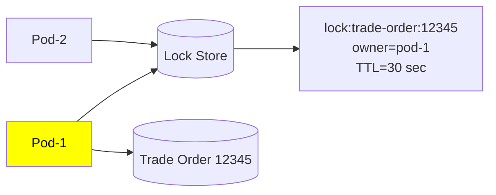
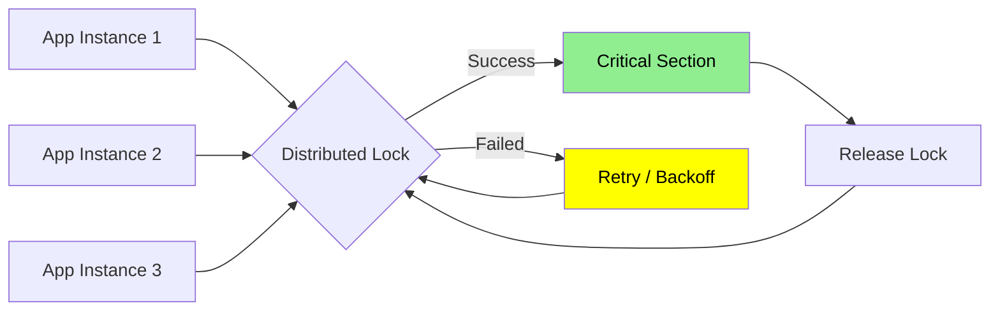
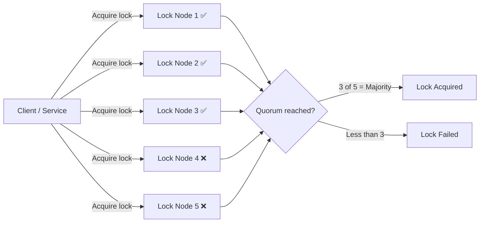

# Distributed Lock
- https://www.youtube.com/watch?v=qY4MfWv01pI (Skip)
- https://www.hellointerview.com/learn/system-design/patterns/dealing-with-contention#distributed-locks

## Overview
**problem: exclusive locking**
- database **lock** only lasts as long as the **transaction holding it.**
- That's fine when the protected work is a quick **read-decide-write**
- But sometimes you need to **hold exclusive access across something a transaction can't span.**
- eg: You pick seat A15 and the app holds it for you for `10 minutes` while you fill out your payment details.
  - db lock for 10 min, will stall any other txn. bad
  - That's where a distributed lock comes.
  
> It's the same locking idea, just  **held as a lease with its own lifetime**,  instead of a **transaction-scoped lock**

---
## Option where it lives
### 1. Redis with TTL
- The SET command with NX (only set if not exists) 
- and a TTL atomically creates a lock that Redis,
- clears on its own when the TTL passes
- pros: advantage is speed and simplicity
- cons: TTL lock isn't an airtight guarantee of exclusive lock + SPF (single point of failure)

### 2. Database columns

```sqlite-psql
-- Reservation row with a TTL

UPDATE seats
SET reserved_by = 'user123', reserved_until = NOW() + INTERVAL '10 minutes' --👈
WHERE seat_id = 'A15'
  AND (reserved_until IS NULL OR reserved_until < NOW());
  -- expiry lives right in the WHERE clause 👈
```
**pros**:  no new infrastructure 

**cons**:  database writes are slower than a cache, and the lock row itself becomes a contention point **under heavy load.**

### 3. ZooKeeper/etcd Lock
overview
- These are purpose-built **coordination services** designed specifically for distributed systems. 
- They provide **strong consistency** guarantees even during **network partitions and leader failures**. 
- ZooKeeper uses **ephemeral nodes** that automatically disappear when the client session ends, providing natural cleanup for crashed processes.
- Both systems use **consensus algorithms** (Raft for etcd, ZAB for ZooKeeper) to maintain consistency across multiple nodes.

**pros**: robustness, designed to handle the **complex failure scenarios** , (that Redis and database approaches struggle with)

**cons**: **operational complexity**, as you need to run and maintain a separate coordination cluster.

### Summary

| # |                           | How it works                                                  | Typical use                           |
| - |--------------------------------| ------------------------------------------------------------- |---------------------------------------|
| 1 | **Redis `SET NX` + TTL**       | Create lock only if key does not exist; TTL prevents deadlock | Simple fast distributed jobs          |
| 2 | **Redlock**                    | Acquire lock on majority of independent Redis nodes           | Redis-based distributed locking       |
| 3 | **DB Lock**                    | Use row lock, advisory lock, or unique constraint             | Apps already relying on relational DB |
| 4 | **ZooKeeper Lock**             | Create ephemeral sequential nodes; smallest node owns lock    | Strong coordination / leader election |
| 5 | **etcd Lease + CAS**           | Acquire key using transaction/CAS and attach a lease          | Kubernetes-style coordination  ⭐      |
| 6 | **DynamoDB Conditional Write** | `PutItem` succeeds only if lock key doesn't exist             | AWS-native locking                    |

> Distributed lock = a globally visible ownership record saying “resource X is currently owned by process Y.
```
    { 
        Lock Key   : lock:trade-order:12345
        Owner      : service-instance-7
        Expires At : 18:30:45
        Token      : 1042
    }
```





---
## Strategies

| Approach                 | How it works                                                              | Pros                                                | Cons                                              |
| ------------------------ | ------------------------------------------------------------------------- | --------------------------------------------------- | ------------------------------------------------- |
| **Centralized Locking**  | One central lock server decides who owns the lock                         | Simple, fast                                        | **Single point of failure**, bottleneck           |
| **Token-Based Locking**  | A unique token/lease represents lock ownership and moves between nodes    | More fault-tolerant, avoids one central coordinator | More complex; token loss/recovery must be handled |
| **Quorum-Based Locking** | Lock is acquired only after getting approval from a **majority of nodes** | Better fault tolerance, no single-node dependency   | Higher latency and complexity                     |

### 1. Centralized Locking

### 2. Token-Based Locking

### 3. Quorum-Based Locking


---
## Extra
### An ideal distributed lock

| # | Property             | Meaning                                                                 |
| - | -------------------- | ----------------------------------------------------------------------- |
| 1 | **Mutual Exclusion** | Only **one node/process** can hold the lock at a time                   |
| 2 | **Fault Tolerance**  | Locking system should remain available even if a node fails             |
| 3 | **Performance**      | Lock acquisition/release should be fast and efficient                   |
| 4 | **Fairness**         | Competing nodes should get a reasonable/fair chance to acquire the lock |


