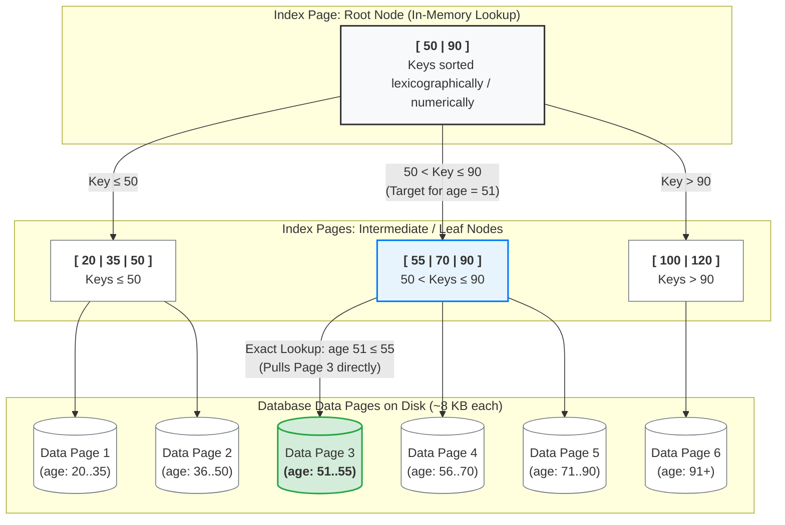

# B tree | read-heavy workloads
## Reference
- https://www.youtube.com/watch?v=Q9xD4J3tezw
- https://www.hellointerview.com/learn/courses/system-design/lesson/foundations/db-indexing#b-tree-indexes

---
## Overview

> _m (order):The maximum number of children (pointers) an internal node is allowed to have._

Every node in a B-tree **follows strict rules:**
- All leaf `nodes` must be at the **same depth**
- Each `node` can contain between m/2 and m keys
- A node with k `keys` must have exactly **k+1 children**
- `Keys` within a node are kept in **sorted order**

---
## Why B-trees are the default choice
- They maintain **sorted order**, making _range queries and ORDER BY_ operations efficient
- They're **self-balancing**, ensuring predictable performance even as data grows.
    - And remain balanced even with random inserts and deletes
- They **minimize disk I/O** by matching their structure to how databases store data
- They handle both:
    - **equality** searches (email = 'x')
    - **range searches** (age > 25) equally well

---
## Read behavior (fast)
- Root → Internal Node → Leaf Page → Record
- Reads are efficient because the database can quickly navigate (sorted tree structures) to the required page.

---
## Write behavior (Slow)
A write may require:
- Finding the target page
- Updating an existing disk page
- Splitting a page when it becomes full
- Updating indexes 👈
- Writing to the transaction log