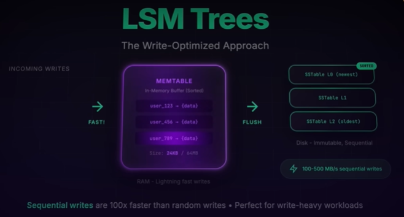
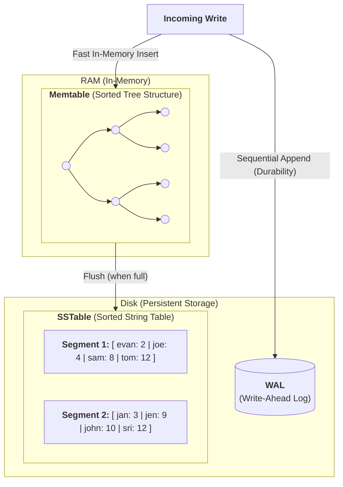

# LSM tree | write-optimized workload
## Reference
- https://www.youtube.com/watch?v=Q9xD4J3tezw
- https://www.hellointerview.com/learn/courses/system-design/lesson/foundations/db-indexing#lsm-trees-log-structured-merge-trees
---

## Overview

**Btree write approach**
- each index is its own separate structure that you can **create on any column**.
- means finding the right leaf page, reading it into memory, updating it, and writing it back to disk.
- For a few thousand writes per second, this works fine.
- for 100,000 writes per second, those random disk seeks become a bottleneck

**Different Approach for LSM**
- Instead of immediately writing each update to disk like B-trees do, LSM **trees buffer changes in memory** and write them out in large chunks.
- The LSM tree is the storage format for **your entire table**, **sorted by the primary key**, not just on colum ike in Btree.
-  Your primary key lookups are extremely fast, but secondary indexes require additional structures ( via GSIs/LSIs)
- Log-Structured Merge Trees:
  - **Memtable** (red-black tree)  in RAM
  - **SStable** (sorted strong tree) in Disk

## Working
**Memtable (Memory Component):** 
- New writes go into an in-memory structure called a memtable, 
- typically implemented as a sorted data structure like a `red-black tree` or skip list.
- This is **extremely fast** since it's all in RAM.

**Write-Ahead Log (WAL):** 
- To ensure **durability**, every write is also appended to a write-ahead log on disk. 
- This is a sequential append operation, which is much faster than random writes.

**Flush to SSTable:** 
- Once the memtable reaches a certain size (often a few megabytes),
- it's frozen and flushed to disk as an immutable Sorted String Table (SSTable).
- This is a single sequential write operation that can write megabytes of data at once.

**Compaction:** 
- Over time, you accumulate many SSTables on disk. 
- A background process called **compaction** periodically merges these files, 
- removing duplicates and deleted entries. 
- This keeps the number of files manageable and maintains read performance.

---
## behavior
### Write behavior (fast)
> - Write → WAL → MemTable → SSTable → Compaction
> - makes writes incredibly fast,  just appending to memory and a log file

Writes are fast because:
- Data is **first written to memory**
- Disk writes are mostly **sequential**
- Multiple writes are **flushed together** to disk as immutable "SS tables"
- Existing disk files are not immediately updated

### Read behavior (Slow)
> read --> MemTable → Level 0 SSTables → Level 1 SSTables → Level 2 SSTables --> ...

- slower, as they may need to check multiple **SS tables**,
- mitigated by :
  - [BloomFilter](01_core_01_BloomFilter.md)
  - background **compaction processes**
  - Sparse Indexes ??

---
## Real-World Examples
> Despite these optimizations, LSM trees fundamentally trade read performance for write performance

**Good for:**
- time-series databases, 
- logging systems, 
- analytics platforms
- metrics collection system, audit log, or IoT data platform

Basically, where you're constantly ingesting new data but queries are less frequent or can tolerate slightly higher latency.

**Example:**
- **Cassandra** handles Netflix's billions of viewing events.
- **RocksDB** (built by Facebook),  handles millions of social interactions per second—likes, posts, messages
- **DynamoDB** (AWS) is generally understood to use an LSM-tree–style storage
- ...

---
## Comparison
| Area                | B-Tree              | LSM Tree                            |
| ------------------- | ----------------------------- | ----------------------------------- |
| Write method        | Update pages in place         | Append and flush sequentially       |
| Read speed          | Usually faster                | May check multiple files            |
| Write throughput    | Moderate                      | Usually higher                      |
| Range queries       | Excellent                     | Good, but depends on compaction     |
| Background work     | Page maintenance              | Compaction                          |
| Read amplification  | Low                           | Can be higher                       |
| Write amplification | Page splits and index updates | Compaction rewrites data            |
| Best workload       | Read-heavy or balanced        | Write-heavy                         |

