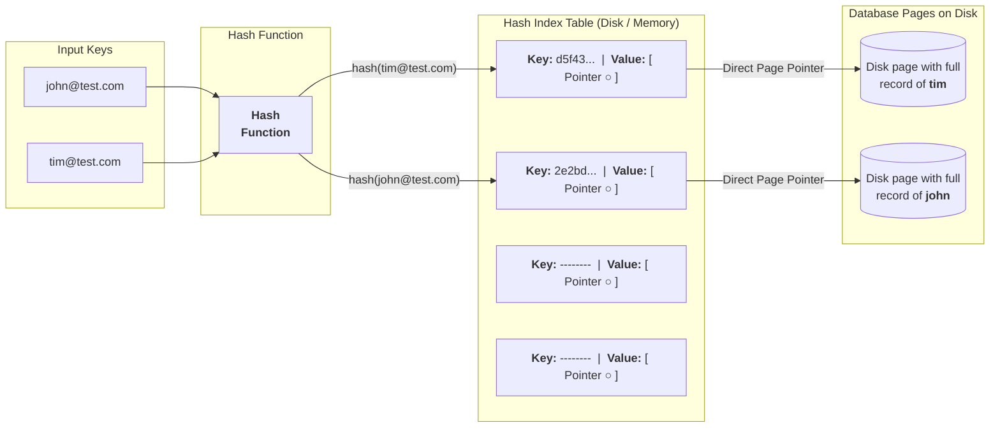

# hash indexes
## Reference
- https://www.hellointerview.com/learn/courses/system-design/lesson/foundations/db-indexing#hash-indexes

---
## Overview
- hash indexes serve a specialized purpose: they excel at **exact-match queries** 
  - B-trees perform nearly as well for exact matches while supporting range queries and sorting
- simply a persistent **hashmap implementation**| Hash collisions
- trading flexibility for **super-fast O(1)** lookups.

## Working

```
buckets[hash("alice@example.com")] -> [ptr to page 1]
buckets[hash("bob@example.com")]   -> [ptr to page 2]
```



---
## Real-World Examples
- in-memory databases. Redis
- Despite their speed for exact matches, hash indexes are relatively rare in practice 👈

> **B-trees** are usually the better choice due:
> - to their efficient handling of disk I/O patterns.
> - perform nearly as well for exact matches while supporting range queries and sorting

---
## Interview
**consider hash indexes when:**
- You need the **absolute fastest possible exact-match** lookups
- You'll **never need range queries or sorting**
- You have **plenty of memory** (hash indexes tend to be larger than B-trees)
