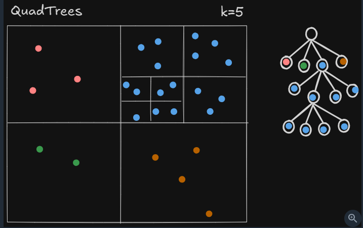
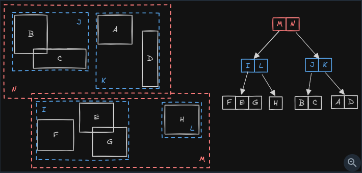

# Geospatial Indexes
## Reference
- https://www.hellointerview.com/learn/courses/system-design/lesson/foundations/db-indexing#geospatial-indexes

---
## Overview
- fairly specialized for **location data.** |  location-based services like Uber, Yelp, and Find My Friends
- check restaurant example. 
- regular indexes fall short
  - Standard B-tree indexes excel at ordering and querying **1-dimensional data.**
  - However, geographical locations are **2-dimensional** ($\text{Latitude}, \text{Longitude}$).
- we need indexes that **understand 2D spatial relationships**
  - Rather than treating latitude and longitude as independent dimensions

>  Note: don't need deep expertise in all three approaches

---
## 1. geohashes String
### Recursive Grid Subdivision
```
World Grid
             ┌───────────┬───────────┐
             │    0      │     1     │
             ├───────────┼───────────┤
             │    2      │     3     │
             └─────┬─────┴───────────┘
                   │  Recursive split
             ┌─────▼─────┬───────────┐
             │    20     │    21     │
             ├───────────┼───────────┤
             │    22     │    23     │
             └───────────┴───────────┘
```

- By assigning bits to each split, the latitude and longitude bits are interleaved and encoded into a **standard Base-32 string**
- Because a geohash is just a 1-dimensional string, a standard B-tree index can be built directly on top of the geohash column.
  - `CREATE INDEX idx_geohash ON restaurants(geohash);`

| Geohash Example | Precision Level               |          Approximate Cell Width |
| --------------- | ----------------------------- | ------------------------------: |
| `9`             | Region / Multi-state          |                      ≈ 5,000 km |
| `9q`            | State / Sub-region            |                      ≈ 1,250 km |
| `9q5`           | City / Large area             |                        ≈ 156 km |
| `9q5c`          | Neighborhood / District       |                         ≈ 39 km |
| `9q5cs`         | Local area                    |                        ≈ 4.9 km |
| `9q5cs...`      | Street block / Specific venue | Smaller as characters are added |


```
                  ┌───────────────────────────────┐
                  │    B-Tree Index on 'geohash'  │
                  └───────────────┬───────────────┘
                                  │
         ┌────────────────────────┼────────────────────────┐
         │                        │                        │
   ┌─────▼──────┐          ┌──────▼─────┐           ┌──────▼─────┐
   │ '9q5ca'    │          │ '9q5cs'    │           │ '9q5cz'    │
   └─────┬──────┘          └──────┬─────┘           └──────┬─────┘
         │                        │                        │
┌────────▼────────┐      ┌────────▼────────┐      ┌────────▼────────┐
│ Page 1 (Venues) │      │ Page 2 (Venues) │      │ Page 3 (Venues) │
└─────────────────┘      └─────────────────┘      └─────────────────┘
```

### Radius & Proximity Queries
- To find nearby locations (e.g., in a Yelp or Uber design), 
- compute the center cell’s geohash plus its 8 neighboring cells at the required precision.
- This achieves near $O(1)$ or $O(\log N)$ lookups without full table scans


### Real Example
- **Redis**: Features built-in `GEOADD` and `GEORADIUS` commands powered natively by geohashing and sorted sets.

---
##  2. quad trees (less common)


- rigidly divide **space into even 4-way quadrants**

---
##  3. R-trees ⭐
> - R-trees have emerged as the **default spatial index** in modern databases like PostgreSQL/PostGIS and MySQL
> - Think of organizing photos on a table

- An R-Tree (Rectangle Tree) is a self-balancing tree data structure designed specifically for indexing multi-dimensional spatial data (such as geographical coordinates, 2D/3D polygons, bounding boxes, and geometric shapes).
- polygon ?




---
## interview 
**Short explanation**
> - Traditional indexes like B-trees don't work well for spatial data because they treat latitude and longitude as independent dimensions.
> - To efficiently search for nearby locations, we need an index that understands spatial relationships. 
> - Geohash is a hash-based approach that converts 2D coordinates into a 1D string, preserving proximity. 
> - This allows us to use a regular B-tree index on the geohash strings for efficient proximity searches. 
> - However, tree-based approaches like R-trees can offer more flexibility and accuracy by grouping nearby objects into overlapping rectangles, creating a hierarchy of bounding boxes


