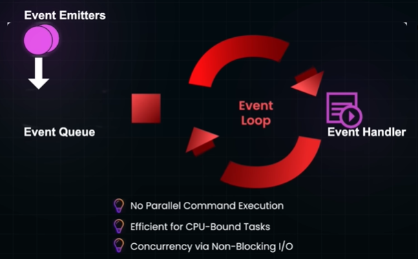
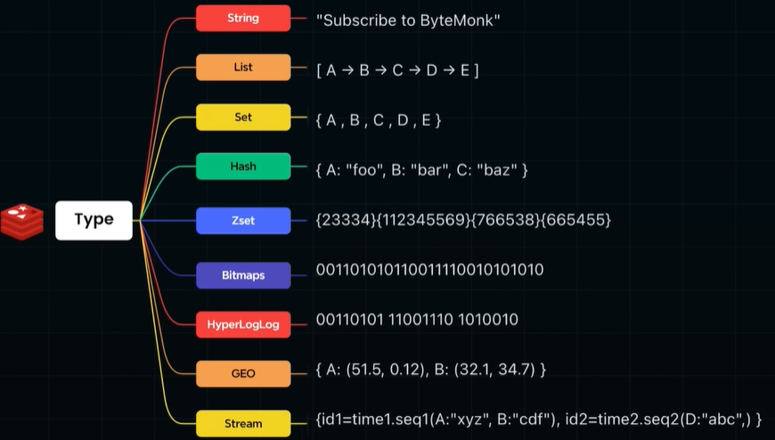
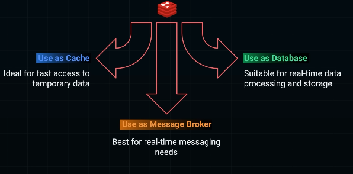
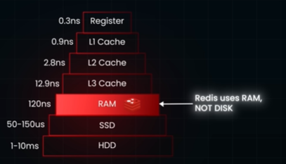

# redis (Remote Dictionary Server)
> - [02_DistributedLock.md](../SD_06_think-in-scale/02_02_distributed-Locking.md)
## ✔️Overview
- **incredibly fast** 
  - written in  C (low level), thus fine-grained control over memory and CPU usage
  - internally uses, **hash table**, O(1)
  - in-memory (**RAM**), data structure store
  - requiring minimal CPU resources for processing
- **Single thread event-loop** model
  - uses a single thread to handle all client requests
  - allows Redis to handle multiple client connections **concurrently** 
  - without being bottlenecked by I/O operations.
  - thus, avoids the complexities of managing locks or race condition

---  
## ✔️Distributed redis
...

---
## ✔️Can function as
💠**cache** 
- hit/miss
- ttl

💠**primary database** 
- **key-value** in-memory database structure, 
- allowing for constant time **(O(1)) data retrieval**
- Redis operates on simple, well-optimized data structures 

💠**lightweight message broker**
- pub-sub

---
## more

