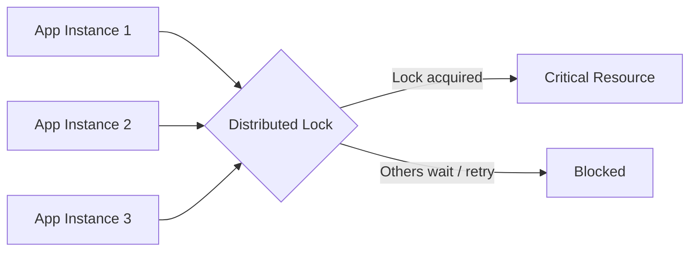
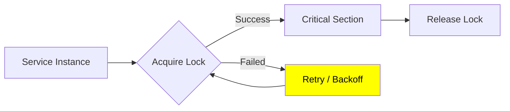
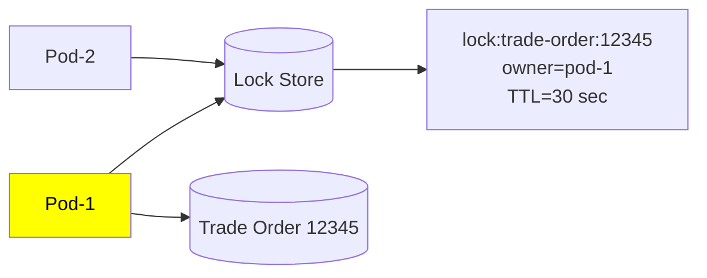
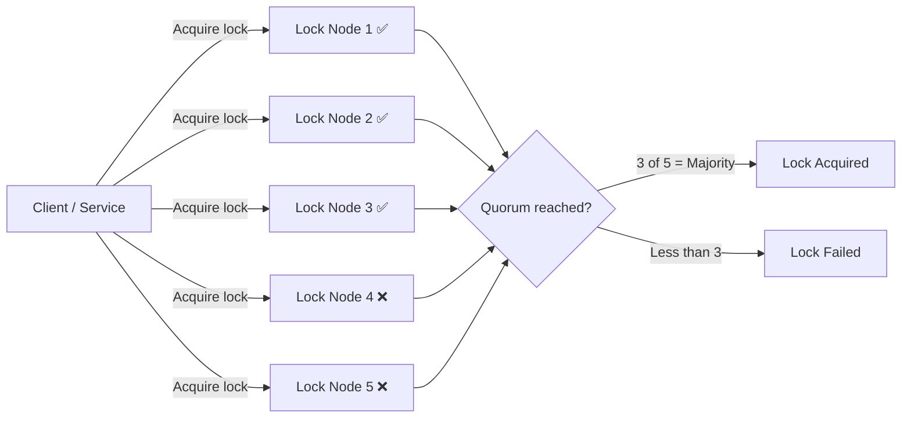

# Distributed Lock
## reference
- https://www.youtube.com/watch?v=qY4MfWv01pI (Skip)

## Overview
purpose:
- Ensures data integrity and consistency in distributed systems 
- by allowing only **one node** or process to access a shared resource at a time
- thus Solves: **race conditions and deadlocks**





---
## Distributed lock ?
> Distributed lock = a globally visible ownership record saying “resource X is currently owned by process Y.
```
    { 
        Lock Key   : lock:trade-order:12345
        Owner      : service-instance-7
        Expires At : 18:30:45
        Token      : 1042
    }
```


---
## ideal distributed locking principles

| # | Property             | Meaning                                                                 |
| - | -------------------- | ----------------------------------------------------------------------- |
| 1 | **Mutual Exclusion** | Only **one node/process** can hold the lock at a time                   |
| 2 | **Fault Tolerance**  | Locking system should remain available even if a node fails             |
| 3 | **Performance**      | Lock acquisition/release should be fast and efficient                   |
| 4 | **Fairness**         | Competing nodes should get a reasonable/fair chance to acquire the lock |


---
## Distributed Locking Approaches
| Approach                 | How it works                                                              | Pros                                                | Cons                                              |
| ------------------------ | ------------------------------------------------------------------------- | --------------------------------------------------- | ------------------------------------------------- |
| **Centralized Locking**  | One central lock server decides who owns the lock                         | Simple, fast                                        | **Single point of failure**, bottleneck           |
| **Token-Based Locking**  | A unique token/lease represents lock ownership and moves between nodes    | More fault-tolerant, avoids one central coordinator | More complex; token loss/recovery must be handled |
| **Quorum-Based Locking** | Lock is acquired only after getting approval from a **majority of nodes** | Better fault tolerance, no single-node dependency   | Higher latency and complexity                     |


**Quorum-Based Locking**



---
## Common implementations

| # | Algorithm / Approach           | How it works                                                  | Typical use                           |
| - | ------------------------------ | ------------------------------------------------------------- |---------------------------------------|
| 1 | **Redis `SET NX` + TTL**       | Create lock only if key does not exist; TTL prevents deadlock | Simple distributed jobs               |
| 2 | **Redlock**                    | Acquire lock on majority of independent Redis nodes           | Redis-based distributed locking       |
| 3 | **DB Lock**                    | Use row lock, advisory lock, or unique constraint             | Apps already relying on relational DB |
| 4 | **ZooKeeper Lock**             | Create ephemeral sequential nodes; smallest node owns lock    | Strong coordination / leader election |
| 5 | **etcd Lease + CAS**           | Acquire key using transaction/CAS and attach a lease          | Kubernetes-style coordination  ⭐      |
| 6 | **DynamoDB Conditional Write** | `PutItem` succeeds only if lock key doesn't exist             | AWS-native locking                    |


