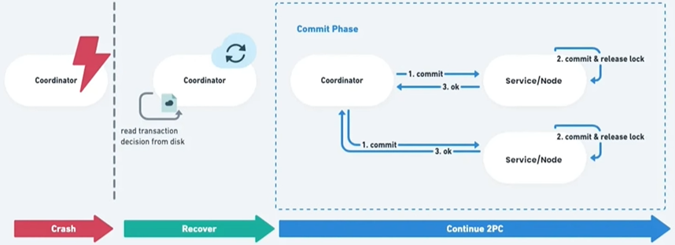
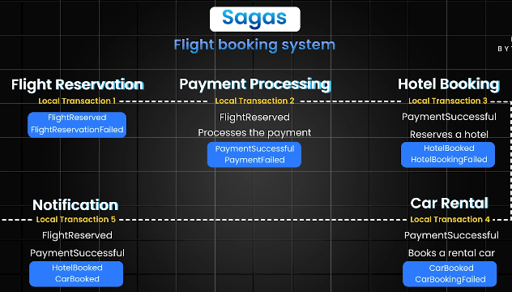
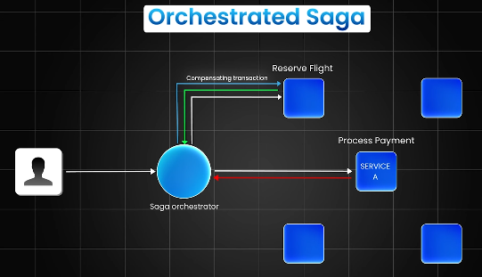
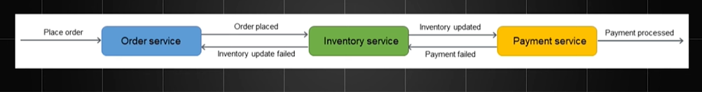
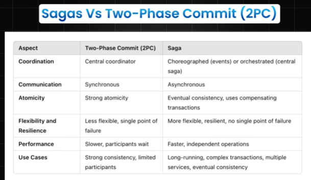
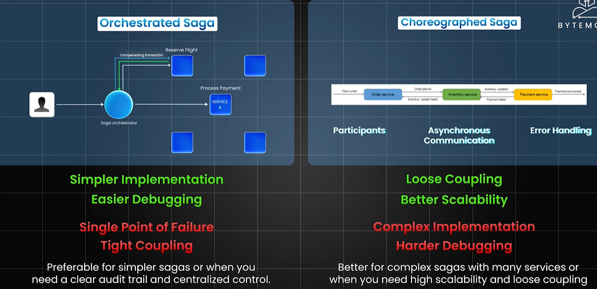
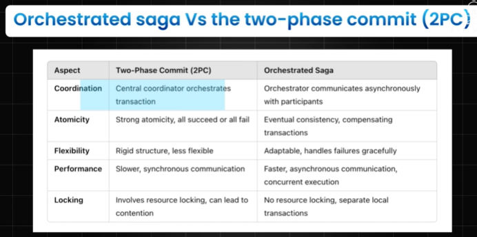

# Distributed Transaction
## Database per service pattern in ms
- https://www.youtube.com/watch?v=DKQLhy9bgdk
- each microservice its own independent database
- This approach enhances scalability, performance, and loose coupling. 👈🏻
- **Implementation Approaches**
    - Private table/s per service
    - Schema per service
    - Database server per service
- **Challenges and Data Consistency**
    -` Distributed transactions` become complex as each service has its own database, requiring eventual consistency models
    - `Data duplication`
    - `Cross-service queries` are difficult:
      - since data **cannot be easily joined** across different databases, 
      - forcing inter-service communication
- solution:
  - use [event-driven-arch.md](../SD_52_architecture/01_core_04_event-driven-arch.md)
  - data will propagate from service to service via event data. 👈🏻
  
## Overview
- Reference
  - https://www.youtube.com/watch?v=d2z78guUR4g bm ⭐
  - https://www.baeldung.com/cs/saga-pattern-microservices post
  - https://github.com/lekhrajdinkar/data-engineer/blob/main/docs/2012-2021/07_ACID%2BLocks.md | ACID
- monolith system, ACID on single database
- DS: Achieve **data-consistency** across different parts of a system,
  - transaction spans several services/ms
  - participant performs local transactions
  - thus extend the concept of ACID properties to scenarios where transactions span **multiple databases**
- Check below solution/s. ⤵️

--- 
## Solutions
### ✔️Two-Phase Commit (2PC)
- traditional
- Also called - **Blocking Atomic Commit Protocol**


> Flow
> >components: a coordinator service + participant service/s
> 
> 💠prepare Phase
> - A central coordinator sends a "prepare" message to all participants.
> - Each participant checks if it can commit and responds "yes" or "no"
> 
> 💠Abort Phase 
> - only if coordinator dies
> 
> 💠commit/rollback
> - If all participants respond "yes," the coordinator sends a "commit" message.
> - If even one responds "no" or times out, the coordinator sends a "rollback" message

- use opensource implementation like `Apache Zookeeper`, Dont built from scratch.

**Drawbacks of 2PC:**
- Latency and Performance
  - Additional communication and coordination steps introduce latency
- single point of failure
  - coordinator node, can become the
- Blocking 
  - All other services need to wait until the slowest service finishes
  - Services become dependent on each other and the coordinator
- Deadlock: 
  - Transactions can deadlock if participants wait for each other to release resources



---
### ✔️SAGA orchestration 
>  - preferred for simpler sagas 
>  - or when a clear audit trail and centralized control are needed

Example : flight booking




- A central Saga orchestrator manages the flow, 
- sending commands to participants
  - explicitly tells each service what action to take
- and tracking progress

Advantages
- Simpler implementation for individual services, 
- clear audit trail

Disadvantages
- Single point of failure if the orchestrator fails,
- services are highly dependent on the orchestrator

---
### ✔️SAGA choreography
> - better for complex sagas with many services 
> - or when high scalability 
> - and loose coupling are required



- No central conductor;
- participants communicate directly **through events**
- Each service listens for events from other services and **acts autonomously**

Advantage
- Services are more independent and less reliant on a central coordinator, **better scalability** 👈🏻

Disadvantages
- Complex implementation 
  - services need to understand events
  - difficult to trace the flow

> `Axon Saga` – a lightweight framework and widely used with Spring Boot-based microservices

### More
- Distributed transaction management across services.
- [youtube](https://www.youtube.com/watch?v=d2z78guUR4g&ab_channel=ByteMonk)
- [deepseek 🗨️](https://chat.deepseek.com/a/chat/s/81394dc5-20ff-45bb-8fc3-001520d7ef4f)
- Concept of a long-running, interconnected sequence of operations, like a "saga" in storytelling
- data consistency without relying on traditional ACID transactions (which are impractical in distributed systems).
- steps:
    - Breaks a transaction into smaller, local steps.
    - uses compensating actions (rollback logic) if a step fails.
    - eg: E-Commerce Order
```text
    Step 1: Reserve inventory → Step 2: Charge payment → Step 3: Ship order.
    If payment fails: Trigger compensation → "Release inventory" + "Notify user."
```
```text
Purpose: 
Manage distributed transactions across multiple services.

Implementation:
Choreography-Based: Each service emits events to trigger the next step.
Orchestration-Based: A central coordinator manages the transaction flow.
Implement compensation actions for rollback (e.g., CancelOrder, RefundPayment).

Use Case: 
Order processing in e-commerce (inventory, payment, shipping services).
```

---
## Comparison
### 2PC vs saga
| Feature            | Two-Phase Commit (2PC)                                      | Sagas                                                                 |
|--------------------|--------------------------------------------------------------|------------------------------------------------------------------------|
| Control            | Central coordinator orchestrates transactions                | Can be choreographed (participants communicate directly) or orchestrated (central orchestrator manages flow) |
| Communication      | Synchronous; participants wait for coordinator               | Asynchronous; participants react to events independently              |
| Atomicity          | Strong atomicity; all operations succeed or fail             | Eventual consistency; temporary inconsistencies until compensation completes |
| Flexibility        | Less flexible; susceptible to coordinator failures           | More flexible and resilient; compensating transactions for error recovery |
| Performance        | Slower due to synchronous communication                      | Generally faster due to asynchronous communication and concurrent execution |
| Resource Locking   | Involves locking resources; can lead to contention            | Does not require resource locking                                     |
| Suitability        | Strong consistency, limited participants                     | Long-running, complex transactions across multiple services where eventual consistency is acceptable |



### orch-saga vs choreo-Saga


### orch-saga vs 2PC
> since both has central coordinator



