# Core building block : Caching
Reference
- https://academy.bytemonk.io/products/system-design-mastery-beta/categories/2158360644/posts/2190592600
- https://www.youtube.com/watch?v=1NngTUYPdpI
- https://www.hellointerview.com/learn/courses/system-design/lesson/thinking-in-scale/caching 👈
- [REST API :: caching](../SD_08_API-Design/06_caching.md)

--- 
## Overview
> Act as **high-speed data storage layer.** Caches are essential for scalable systems

**Definition**
- storing frequently used data in a **different location**  other from the original data source 
- RAM (`10k` times faster), 
- if **closer to client**, Reduce network response time, to provide more faster data access
- **layers**: databases  built-in, in-process cache, client cache, **external (scales well, default)**, CDN global cache

**candidates**
- ideal for **static or immutable data**,
- for **Dynamic data**, its complex and need to efficiently design system to:
    - synchronize data across multiple locations
    - invalidate cache.
---
## Where to cache / cache layer
**Hardware Level**
- CPU caches are built into hardware for faster data retrieval from memory.
- This is generally out of scope for software engineers

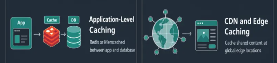
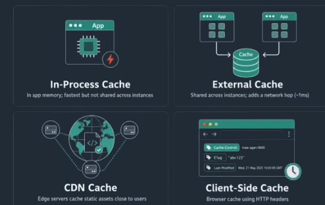

### 1. external (default)
- `redis, memcache`
- **Scale well** because every application server can share the same cache
- ensuring a single source of truth  | simplicity | default

```
                  ┌──────────────┐
                  │    Cache     │
                  └──────▲───────┘
                         │
             1. Check    │ (Read/Write)
              Cache      │
                         │
┌──────────┐       ┌─────┴──────────────┐   2. Fallback:    ┌──────────────┐
│  Client  │ <===> │ Application Server │ ----------------> │   Database   │
└──────────┘       └────────────────────┘    Read on Miss   └──────────────┘
```

[**Distributed caching**](01_01_distributed-caching.md)
- fault-tolerant
- scalable
- serves the response from closest cache-node, thus improved performance
- Also suitable for session management
- **Redis** is beyond just being cache

---
### 2. CDN / [AWS_CloudFront.md](../../CE_02_AWS_SAA/04_network/04_CloudFront.md)
> read through pattern
- [CDN : global caching to optimize network latency](../SD_04_network-essential/02_core_03_latency%2Bregionalization.md#a-cdn)
- CDN caching is different. It's for static assets like images, videos, and JavaScript files served from edge locations close to users. 
- also cache **public API responses, HTML pages**, 
- even run **edge logic** to personalize content or enforce security rules before requests reach your servers
- eg: Cloudflare, Fastly, and Akamai

```
without CDN, adds 250–300 ms of latency per request.
With CDN   , in 20–40 ms. That is a **massive performance difference.**
```
---
### 3. Client side
- data close to the requester to avoid unnecessary network calls
- caching within a client library 
- browser level `redux`
- `Redis clients` cache cluster metadata, that way client can route requests directly to the right node

**tradeoff:**
- Data can go stale and invalidation is harder

---
### 4. in process cache (fast)
> It is great for speed but not a replacement for Redis 
> - optimization layer 
> - fallback layer
=
- As **hardware improves**, servers run on machines with a **lot of memory**. 
- can use that memory to cache data directly inside the application process,
- instead of always calling out to Redis or the database.
- good for:
```
Configuration values ⭐
Feature flags
Small reference datasets
Hot keys
Rate limiting counters
Precomputed values
...
```

---
## Caching arch pattern/s

```
Cache-Aside   → App manages cache
Read-Through  → Cache manages reads
Write-Through → Cache writes DB immediately
Write-Behind  → Cache writes DB later
Refresh-Ahead → Cache refreshes before expiry
```
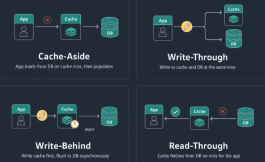

### 1. cache Aside (Lazy Loading)
-  only caches data when needed, which keeps the cache lean.
- a cache miss causes extra latency.

Read
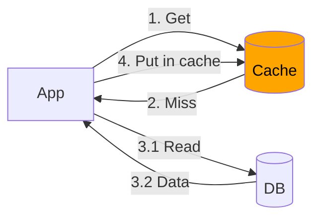

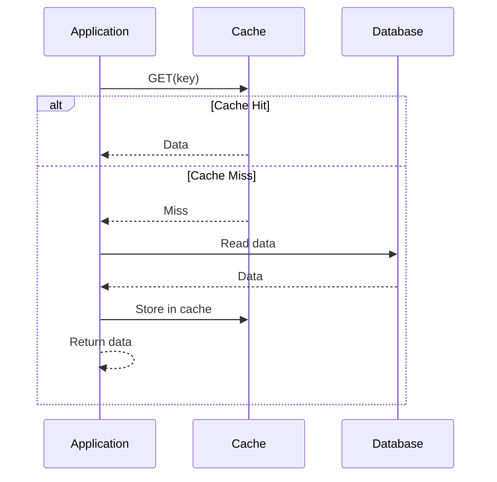

Write
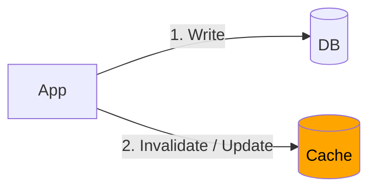

### 2. Write-Through Cache
> - Redis itself does not natively support write-through. We need application code or a framework to implement this pattern.
> - less popular, needs specialized caching infrastructure and still has consistency edge cases.

dual-write
- application writes only to the **cache**. 
- The cache then synchronously writes to the **database**, before returning to the application

Benefit: 
- Consistent | Cache and database are always in **sync**, **provide dual-write happened successfully.** 
- else  the systems can end up inconsistent

Trade off: 
- slower write
- latency  | **Doesn't minimize network calls**, as the database is always hit.
- also **pollute the cache** with data that may never be read again.
- complexity : need retry logic, error handling, etc

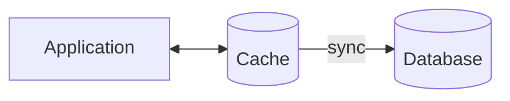


### 3.  Write-Back/behind Cache
> use case: need high write throughput and eventual consistency is acceptable | **Common in analytics and metrics pipelines.**

- The cache **batches** and writes the data to the database **asynchronously** in the background.
- Benefit:  makes writes very fast
- trade off: eventual consistency .

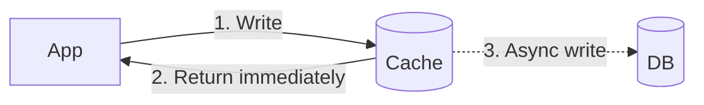
---
### 4. Read-Through (eg: CDN)
> It is less common in practice than **cache-aside.**
- cache acts as a **smart proxy**. 
-  application **never** talks to the database directly. 
- On a cache miss, the **cache itself fetches from the database**, stores the data, and returns it.
- use case:   **CDNs** or similar infrastructure. 👈

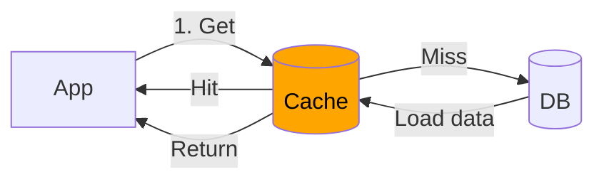
---
> next, cache invalidation 
> - Since cache memory is limited, have to free-up space.
> - For some data, **eventual consistency is unacceptable**.

## Caching Invalidation 1 (CDN)
- For global systems with CDN caching, invalidation becomes even more complex.
- You're not just clearing one cache but potentially hundreds of edge locations worldwide.
- **CDN APIs help**, but propagation takes time. `cache headers`

---
## Caching Invalidation 2 (central cache)
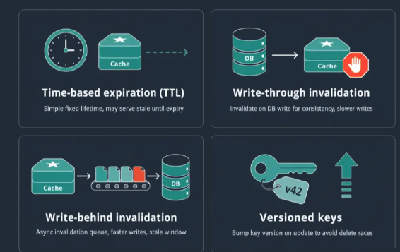
### 1 Auto invalidation:
- Write-Through Cache, invalidate the old data as well, sync 👈🏻
- Write-Back Cache,invalidate the old data as well, Async 👈🏻

### 2 Naive approach is **delete the cache entry after a write**. but:
- which  layers: Redis, CDN edges, and even browser caches ? Invalidating all of these is famously hard
- an invalidation request fails ?
- What if a request comes in right, after you delete the old value ?

### 3. Cache Versioning (Cache Key Versioning) ⭐
- Each record has a version number stored in the database.
- The version is incremented atomically in the same DB transaction.

On Read
- Get the current version from a small version store/cache.
    - On miss, fall back to the database.
- Construct the cache key:`event:123:v42`
- Read from cache.
- On cache miss:
    - Fetch from DB.
    - Write to cache using the current versioned key.

On Write
- Begin DB transaction.
- Update the record.
- Increment version: `version = version + 1`
- Commit transaction.
- Update the version store with the new version.
- Optionally populate the new cache entry:`event:123:v43`

**Key Idea** 👈
- Old cache entries are never explicitly invalidated.
- Once the version changes, new reads use the new cache key.
- Old entries become unreachable and are eventually removed by TTL/eviction.

**pros:**
- no race condition 
- There's no partial invalidation

**tradeoff:**
-  You're making **two cache lookups** per request—one for the version number, another for the actual data
- Old cache versions will accumulate over time. set reasonable TTLs to clean up stale entries.


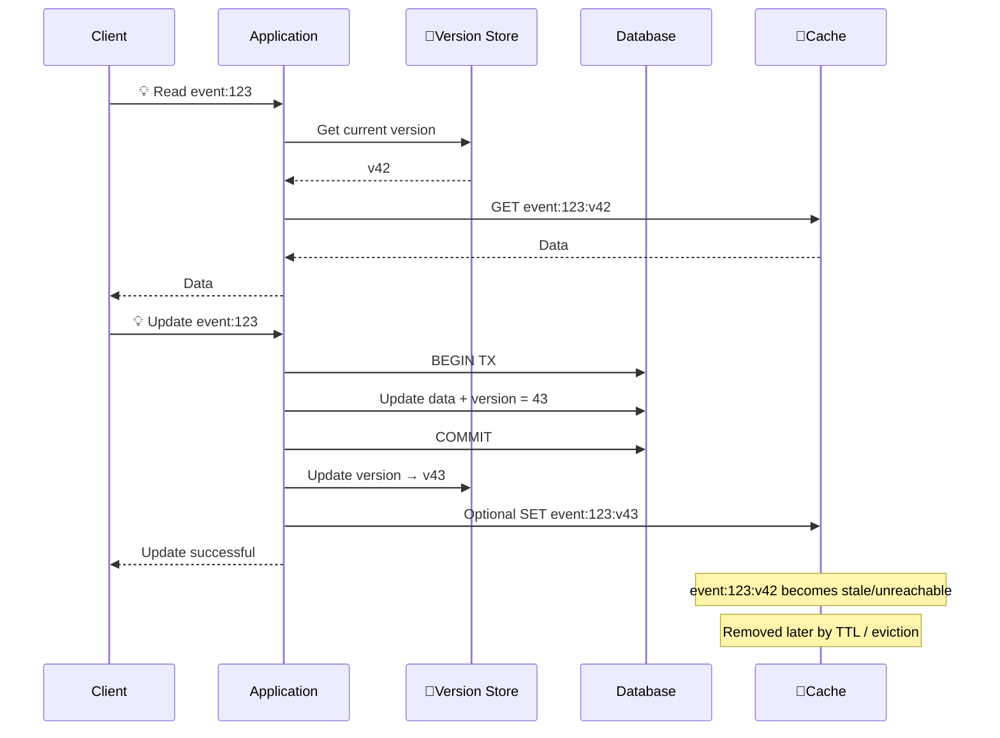
### 4 Explicit / Event-driven invalidation
- Application explicitly removes or invalidates the cache when data changes.

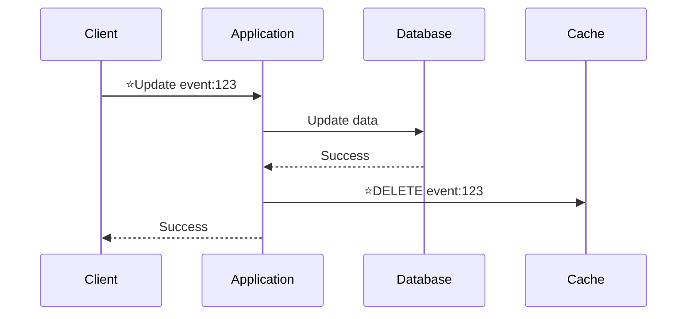

### 5 Pub/Sub-based invalidation
- Application publishes an invalidation event, 
- and multiple application instances remove the corresponding cache entry.
- Key idea: DB update → publish event → all instances invalidate their cache

### 6 Deleted items cache
- use this to filter out from main result.

### 7 TTL based invalidation

---
## Eviction strategy
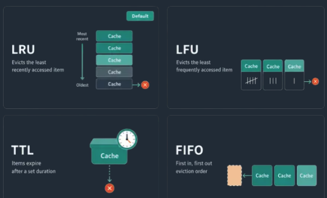
### **Least Recently Used (LRU)⭐:** 
- Removes the data that hasn't been accessed for the longest time
- oldest one

### **Least Frequently Used (LFU):** 
- Removes data that has been accessed the fewest times (4:07).
- rarely used

### **Last-In, First-Out (LIFO)**
### **First-In, First-Out (FIFO)** 
### **random eviction**
### TTL based eviction.

---
## Common Caching Problems
### 1. Cache Stamped (Thundering herd)
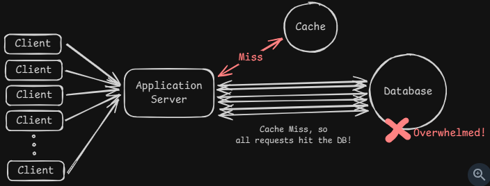

when a popular cache entry expires and many requests try to rebuild it at the same time.
- It's like a **DDOS** attack from your own application.
-  entry expires, requests suddenly see a cache miss in the same instant.
- Every single one tries to fetch from your database

handle:
- **Distributed locking**
  - Only the first request to notice the missing cache entry gets to rebuild it,
  - while everyone else waits for that rebuild to complete
- **Request coalescing** (single flight)
- **Cache warming**: Refresh popular keys proactively before they expire. This only helps when using TTL-based expiration.
- **staggering TTLs** so entries don't all expire at once.
- add resiliency / **Defence**: 
  - small in-process **fallback** cache, 
  - circuit breakers to shed load, 
  - or graceful degradation until Redis recovers

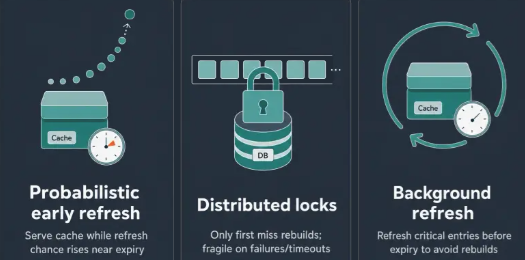

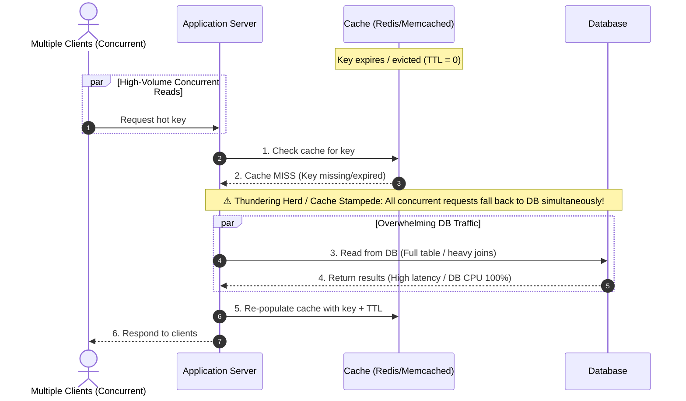
---
### 2. Cache Consistency
- Cached data can fall out of sync with the database.
- complexity around staleness and invalidation
- Cache failures can crush your database

**There is no perfect solution**
- Cache invalidation on writes
- **Short TTLs** for stale tolerance
- Accept eventual consistency: metrics, and analytics, a short delay is usually fine.

---
### 3. Hot Keys
**problem**
-  cache entry that receives a huge amount of traffic compared to everything else.
- a single hot key can overload one cache node
- eg: celebrity post

**handle:**
- Replicate hot keys: Store the same value on multiple cache nodes and load balance reads across them.
- Add a local fallback cache: Keep extremely hot values **in-process cache** to avoid pounding Redis. 👈 👈
- Apply rate limiting: Slow down abusive traffic patterns on specific keys.
- **request coalescing**
- **Cache key fanout spreads** : distribute the load itself, make multiple cache entries
    - EG: Instead of storing the celebrity's post under one key,
    - you store identical copies under ten different keys
  


### 4. Cache failures
- what if cache failed, Will your database get crushed by the sudden traffic spike ?
- **circuit breakers** so we don't overwhelm the database with a stampede

---
## Bring Cache to system
> - need to handle high read traffic. Your database becomes the bottleneck, latency starts creeping up
> - Most importantly, don't cache everything and when a well-indexed database is enough.
> - if **consistency or staleness** of data is not a major concern.

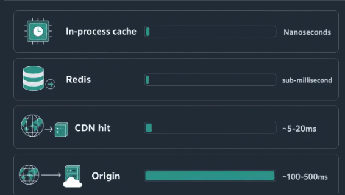

**Delivery Framework**
1. Identify the bottleneck ⭐
   - Read-heavy workload:
   - Expensive queries:
   - Latency requirements:
   - High database CPU:
2. Decide what to cache + cache key
   - Not everything should be cached. Focus on data that is read frequently, and updated rarely
   - eg: cache user profiles since they're read on every page load but only updated when users edit their settings
   - eg:  trending posts feed
3. Choose your cache architecture
4. Set an eviction policy
   -  invalidate on writes or  rely on TTL
5. Address the downsides

---
## Common mistakes
> Profile your system first, then cache the **hot paths.**

- 💥 not prepared for cache failure (biggest issue) 
- 💲 caching everything. 
- 🕑 If you're caching data that changes on every request, you're just **adding latency and complexity for no benefit.** 

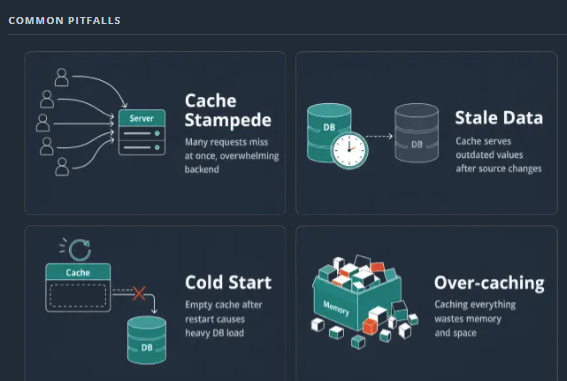


