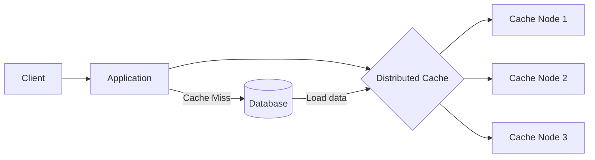

# Distributed Caching
## reference
- [caching :: overview](01_01_caching.md)
- [api_design :: caching](../SD_08_API-Design/06_caching.md)
- [redis-chapter-1](../SD_07_02_key-technologies/04_redis-chapter-1.md)
- https://youtu.be/Gdfj-544AkA?si=zqrjnvAlUstrvRli | bm Distributed Caching

---
## Overview
- 
- behind the scene are **distributed hash table**
- augment the power on the fly

Common technologies
- Redis / AWS ElastiCache Redis
- Memcached
- Redis Cluster

---
## More

