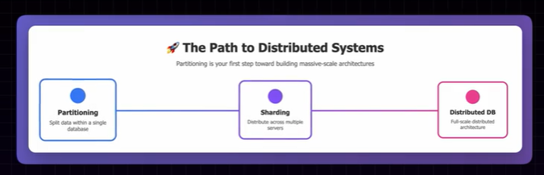
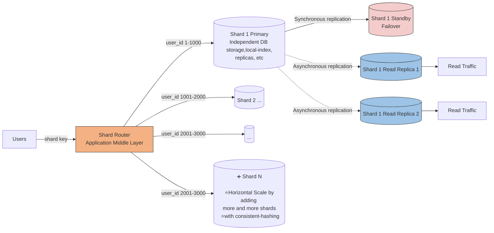
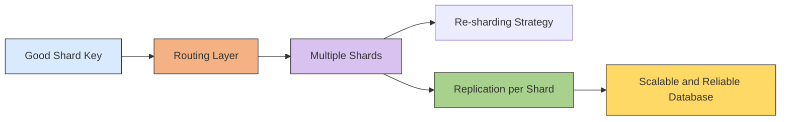
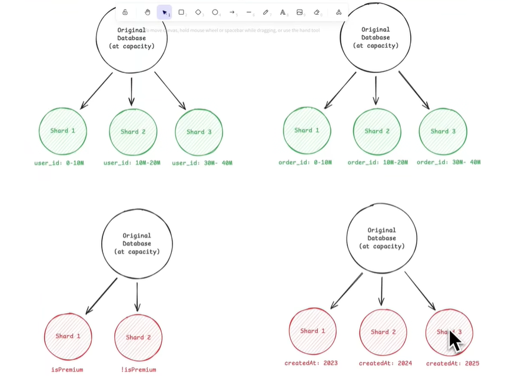
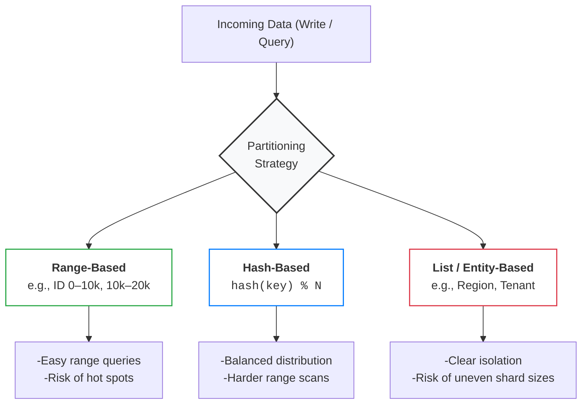
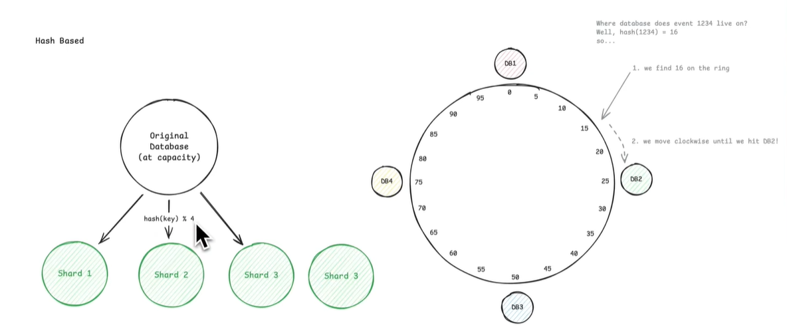
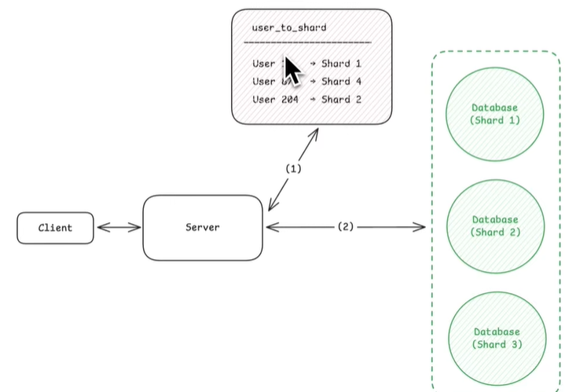
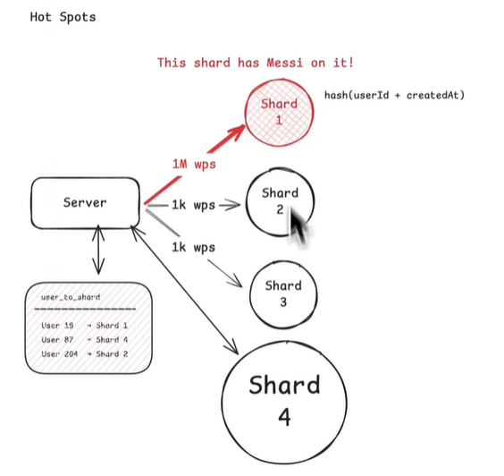
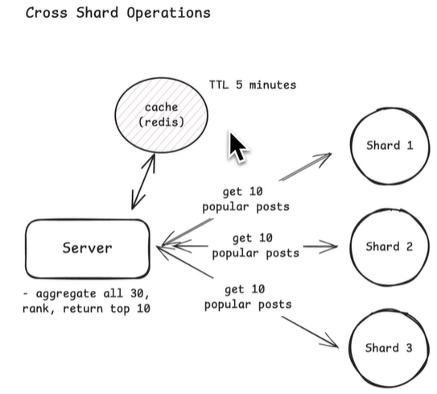

# Sharding
## Reference
- https://www.hellointerview.com/learn/courses/system-design/lesson/thinking-in-scale/sharding
- https://www.hellointerview.com/learn/courses/system-design/lesson/foundations/data-modeling#scaling-and-sharding
- https://www.youtube.com/watch?v=L521gizea4s | hi
- [https://academy.bytemonk.io/products/system-design-mastery-beta/categories/2158360645/posts/2192332143](https://academy.bytemonk.io/products/system-design-mastery-beta/categories/2158360645/posts/2192332143)
- https://www.youtube.com/watch?v=be6PLMKKSto&ab_channel=Exponent
- first component in system who needs scaling is **Database**
---
## Overview
**Scaling database**



| Stage            | Meaning                                                                   |
| ---------------- | ------------------------------------------------------------------------- |
|[partitioning](../SD_05_DataModeling/02_basic_concepts/03_02_database-partitioning.md) | One database splits a large table into smaller logical parts              |
|**sharding**      | Those data partitions are distributed across multiple database servers    |
| **Distributed DB** | Multiple nodes coordinate replication, routing, consistency, and failover |

> Sharding = **horizontal** partitioning across **multiple database servers**.
> - Each shard ===  **independent Database server**
> - with its own replication, index, etc  👈
> - `postgres` Doesn't provide automatic sharding, do manually, **Citus** (PostgreSQL Extension)

**Example:**
- Highly available + fault-tolerant (replicas) + scalable (with consistent-hashing)



---
## Approach for sharding
**When to choose sharding:**
- storage approaches the limit | eg:AWS Aurora max out around `256 TiB.`
- Queries slow down
    - scale Read throughput
    - scale Write throughput
-  So, when single database can’t keep up anymore, you have only one real option: sharding. **hence necessity at scale**

**⭐Approach for sharding**
> Be careful not to make the mistake of prematurely sharding. You need to establish why a single database won't work first.
> - Slow down, do the math, and make sure sharding is actually needed
> - [Numbers-to-know](01_04_Numbers-to-know.md)
> - A well-tuned single database can get you surprisingly far.

- 1 choosing **shard key**
- 2 choosing a **partition strategy** (hashing) that keeps related data together 👈
- 3 call out trade off
- 4 Address how to handle growth (Consistent hashing)

**2 main decisions**
```
What to shard by: 
- The field or column you use to split the data. It defines how the data is grouped.

How to distribute it: 
- The rule for assigning those groups to shards. It defines how the data is distributed across machines.
```

---
## STEP-1. Choosing a good shard key.
> - choice of shard key is **often permanent** and affects every query
> - 💡Golden Rule: Shard by your **primary access pattern** to keep related data collocated on the same shard.

**Good shard key:**
> Should **not change**, else end up moving data across shards.
- **high cardinality**
- **Evenly distributes** data/traffic
- Supports common **query/access patterns** 👈
  - most common queries should ideally **hit just one shard**
  - **Collocation** (Keeping Related Data Together), to Avoid **cross-shard queries** whenever possible 
  - eg: timeline show posts from users you follow. following user-1(shard-1) and user-2(on shard-2), involve cross shard query

**example**
- 🟢 `user_id` for user-centric app: High cardinality (millions of users), even distribution, and most queries are scoped to a single user anyway ("show me this user's data"). Perfect fit.
- 🟢 `order_id` for an e-commerce orders table: High cardinality (millions of orders), queries are usually scoped to a specific order ("get order details", "update order status"), and orders distribute evenly over time.
- 🔴 `created_at` for order app, 
  - almost all your traffic hits the most recent shard because users care about recent orders. 
  - New writes only go to the latest shard.
  - Old shards sit mostly idle.
  


---
## STEP-2. choose distribution Strategies



---
### 1. Range based
- most straightforward/simple. It just groups records by a continuous range of values.
- benefit: efficient for range scans
- in below eg: in early days only shard-1 is active, other 2 were idle

```
good for: Multi-tenant systems | when different users naturally query different ranges.
Think of a SaaS application where each client has a range of user IDs
 
Shard 1 → User IDs 1–1M
Shard 2 → User IDs 1M–2M
Shard 3 → User IDs 2M–3M
```

> ⚠️ Be careful with time-range sharding.
> - This is usually an **anti-pattern for write-heavy systems.** 👈
> - making all current writes hit the same shard (the latest time range), creating a **hot shard.**
> - works better for archival or analytics workloads where **recent data is read-heavy**.

### 2. Hash based ⭐
>  hash-based sharding works great as long as you have a plan for resharding.
- hash function to evenly distribute records across shards
- Instead of assigning ranges, you take a shard key like user_id, hash it, and use the result to pick a shard.
-  hash function scrambles the input keys

**trade off**
- **Rebalancing**: new shared add,  now its mode 4 (before mode 3), resulting into huge re-shuffling
- solution: [consistent-hashing](01_03_consistent-hashing.md)
  -  Instead of simple modulo, 
  - it  minimizes data movement when you add or remove shards

```
shard = hash(user_id) % 4

User 42  → hash(42) % 4 = Shard 2
User 99  → hash(99) % 4 = Shard 3
User 123 → hash(123) % 4 = Shard 1
```



### 3. Directory based
> when you need maximum flexibility and can afford the extra lookup cost.

-  uses a lookup table to decide where each record lives.
- benefit (flexibility)
  - If a particular user generates tons of traffic, you can move them to a dedicated shard
  -  If you need to rebalance load, you just update the mapping table
  -  implement complex sharding logic that would be impossible with a simple hash function.
- `SELECT shard_location FROM shard_map WHERE user_id = 123;`



trade off:
- extra hopping and latency
- SPF | directory service a critical dependency.

### 4. hybrid
- mix of above
- have a routing layer to implement

---
## Challenges 🔺
- While it is a necessity at scale, it also introduces new challenges.
### 1. hot shards
- Even with a good shard key, some shards can end up handling way more traffic than others. This is called a hot spot, and it negates the main benefit of sharding because one overloaded shard becomes your bottleneck.
- Time-based sharding creates a different kind of hot spot. key:`createdAtYear`
  - If you shard by creation date, all new writes go to the most recent shard.
  - That shard handles all the write traffic 
  - while older shards sit mostly idle, handling only reads of historical data.
- eg: celebrity problem
  - Add dedicated shard for celebrity problem 
  - and use **directory sharding strategy** to move their post in shard-4 as shown below.

**handle:**
- Isolate hot keys to dedicated shards
- Use compound shard keys: 
  - combine it with another dimension
  - `hash(user_id + date) vs hash(user_id)`
- Dynamic shard splitting ?



### 2. Cross-shard queries
- Cannot eliminate completely
- eg: get all popular top 10 post, across whole platform 
  - sol-1: **cache expensive** queries in cache with TTl
  - Sol-2: **denormalize data**, repeating data acoss data for some scenarios
  - Sol-3: Accept the hit for rare queries:  Sometimes a query **genuinely needs** to hit all shards and that's okay as long as it's **infrequent**



### 3. maintain consistency
- [distributed-Transaction](02_03_distributed-Transaction.md)
  - textbook solution is two-phase commit (2PC),
  - Use sagas for multi-shard operations
- Design to avoid cross-shard transactions, entirely.
- Accept eventual consistency: For many operations, strict consistency isn't required.

### More
| Challenge                    |                                                                                                                                   |
|------------------------------| -------------------------------------------------------------------------------------------------------------------------------------------- |
| **Cross-shard transactions**🔺 | A transaction touching multiple shards may require distributed protocols such as two-phase commit, increasing latency and failure complexity |
| **Global secondary indexes** | Maintaining one searchable index across all shards requires coordination and can become expensive                                            |
| **Monitoring**               | Every shard must be monitored separately because load, storage, replication lag, and latency can vary                                        |
| **Hot shard**🔺              | One shard receives most requests and becomes the bottleneck           |
| **Cross-shard queries**      | Requires scatter-gather across multiple databases                     |
| **Cross-shard joins**        | Expensive and difficult; often handled in application code            |
| **Rebalancing** 🔺             | Moving data when adding or removing shards is operationally expensive |
| **Failure handling**         | Each shard needs replicas, backups, monitoring, and failover          |
| **Routing complexity**       | Router must always know the correct shard mapping                     |


---
## Modern Distributed Databases 
### overview
- probably won't implement sharding from scratch.  Most modern distributed databases **handle sharding automatically.**
- Common NoSQL databases like` Cassandra, DynamoDB, and MongoDB `
  - all let you specify a **partition key and handle the rest**, 
  - but they do not all use the same distribution mechanism:
    - Cassandra uses a partitioner (e.g., Murmur3Partitioner) | form of consistent hashing
    - MongoDB shards data into range-based chunks
    - DynamoDB hashes the partition key to route items to internal partitions and splits/merges partitions as they grow; | not ring based
  
- SQL databases have also matured and made sharding easier
  - `Vitess` and `Citus` are popular open-source sharding layers that sit in front of PostgreSQL or MySQL
  - `AWS Aurora` and `Google Cloud Spanner` offer distributed SQL with built-in sharding.