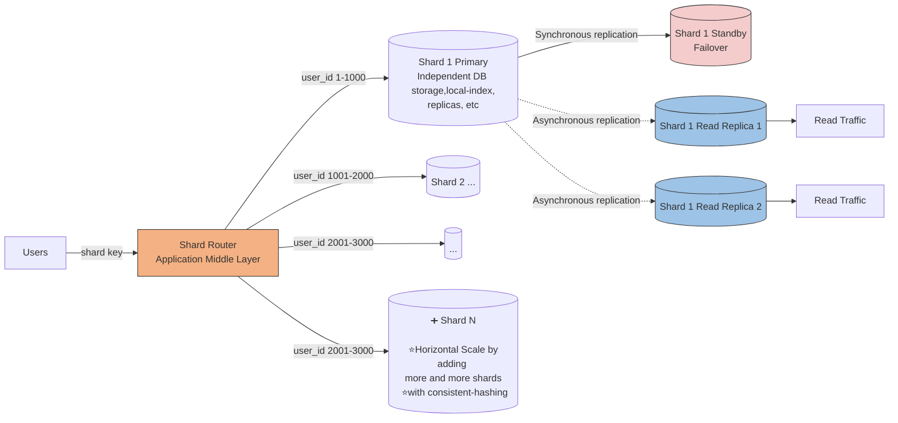
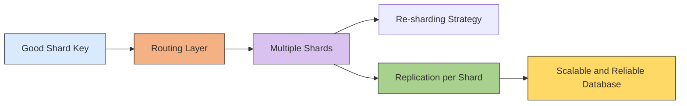
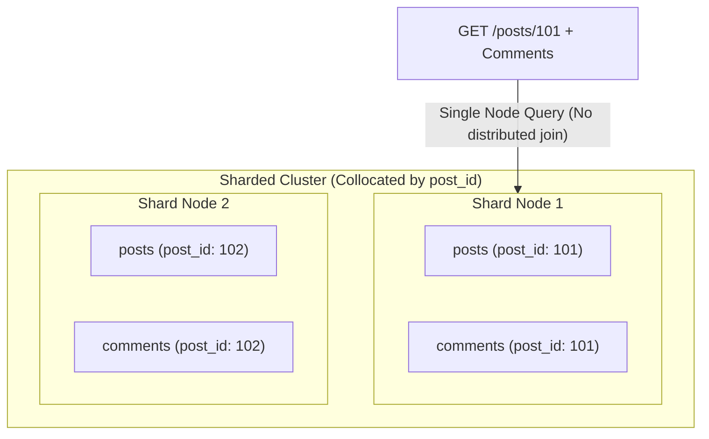
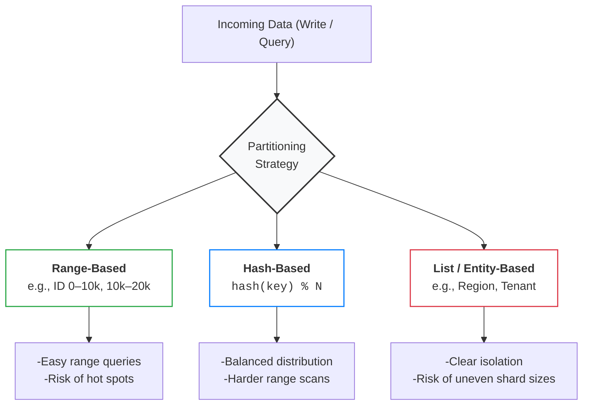
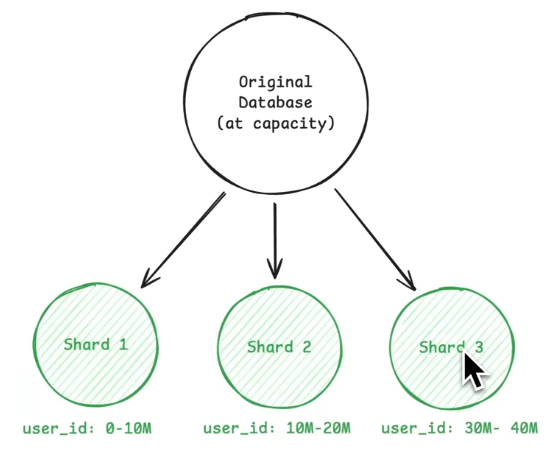
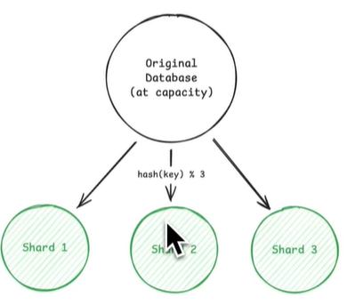

# Sharding
## Reference
- https://www.hellointerview.com/learn/courses/system-design/lesson/thinking-in-scale/sharding
- https://www.hellointerview.com/learn/courses/system-design/lesson/foundations/data-modeling#scaling-and-sharding
- https://www.youtube.com/watch?v=L521gizea4s | hi
- [https://academy.bytemonk.io/products/system-design-mastery-beta/categories/2158360645/posts/2192332143](https://academy.bytemonk.io/products/system-design-mastery-beta/categories/2158360645/posts/2192332143)
- https://www.youtube.com/watch?v=be6PLMKKSto&ab_channel=Exponent
- first component in system who needs scaling is **Database**
---
## Overview
> Sharding = **horizontal** partitioning across **multiple database servers**.

**When to choose sharding:**
- scale storage
- scale Read throughput
- scale Write throughput

**Approach**
- choosing **shard key**
- choosing a **partition strategy** (hashing) that keeps related data together 👈
- call out trade off
- Address how to handle growth (Consistent hashing)

> Each shard is **independent Database server** with its own replication, index, etc | Combine sharding with replication

**Partitioning vs Sharding**
```
Partitioning → split data
Sharding     → place those partitions on different servers
```
- useful for : Multi-tenant SaaS apps (isolate customer data).
- `postgres` Doesn't provide automatic sharding, do manually, **Citus** (PostgreSQL Extension)

**Example:**
- Highly available + fault-tolerant (replicas) + scalable (with consistent-hashing)



---
## STEP-1. Choosing a good shard key.
> - choice of shard key is **often permanent** and affects every query
> - 💡Golden Rule: Shard by your **primary access pattern** to keep related data collocated on the same shard.

**Good shard key:**
- **Evenly distributes** data/traffic | high cardinality
- Should **not change**, else end up moving data across shards.
- Supports common **query/access patterns**
  - **a. Collocation** (Keeping Related Data Together), to Avoid **cross-shard queries** whenever possible 👈
  - eg: timeline show posts from users you follow. following user-1(shard-1) and user-2(on shard-2), involve cross shard query
  - **b. prevent hot shard**
  - eg: `createdAtYear` as key, will bring all recent data in one node and cause hot shard later, if quering recent data



---
## STEP-2. choose distribution Strategies



```
Range-Based Sharding
  - Shard 1: order_id 1-1000
  - Shard 2: order_id 1001-2000
  
Key-Based (Hash) Sharding
  - Shard 1: user_id % 4 = 0
  - Shard 2: user_id % 4 = 1
  
Directory-Based Sharding
  - SELECT shard_location FROM shard_map WHERE user_id = 123;
```

### 1. Range based
- in early days only shard-1 is active, other 2 were idle



> ⚠️ Be careful with time-range sharding.
> - This is usually an **anti-pattern for write-heavy systems.** 👈
> - making all current writes hit the same shard (the latest time range), creating a **hot shard.**
> - works better for archival or analytics workloads where **recent data is read-heavy**.

### 2. Hash based ⭐
- even distribution across shards


**trade off**
- **Rebalancing**: new shared add,  now its mode 4 (before mode 3), resulting into huge re-shuffling
- solution: consistent hashing


### 3. Directory based


trade off:
- extra hopping and latency
- SPF

### 4. hybrid
- mix of above
- have a routing layer to implement

---
## Challenges 🔺
### 1. hot shards
- Add dedicated shard for celebrity problem and use **directory shard** to move their post in shard-4 as shown below.


### 2. Cross-shard queries
- Cannot eliminate completely
- eg: get all popular top 10 post, across whole platform 
  - sol-1: **cache expensive** queries in cache with TTl
  - Sol-2: **denormalize data**, repeating data acoss data for some scenarios


### 3. maintain consistency
- [distributed-Transaction](02_03_distributed-Transaction.md)

### More
| Challenge                    |                                                                                                                                   |
|------------------------------| -------------------------------------------------------------------------------------------------------------------------------------------- |
| **Cross-shard transactions**🔺 | A transaction touching multiple shards may require distributed protocols such as two-phase commit, increasing latency and failure complexity |
| **Global secondary indexes** | Maintaining one searchable index across all shards requires coordination and can become expensive                                            |
| **Monitoring**               | Every shard must be monitored separately because load, storage, replication lag, and latency can vary                                        |
| **Hot shard**🔺              | One shard receives most requests and becomes the bottleneck           |
| **Cross-shard queries**      | Requires scatter-gather across multiple databases                     |
| **Cross-shard joins**        | Expensive and difficult; often handled in application code            |
| **Rebalancing** 🔺             | Moving data when adding or removing shards is operationally expensive |
| **Failure handling**         | Each shard needs replicas, backups, monitoring, and failover          |
| **Routing complexity**       | Router must always know the correct shard mapping                     |


---
## Database scaling


| Stage            | Meaning                                                                   |
| ---------------- | ------------------------------------------------------------------------- |
|[partitioning](../SD_05_DataModeling/02_basic_concepts/03_02_database-partitioning.md) | One database splits a large table into smaller logical parts              |
|**sharding**      | Those data partitions are distributed across multiple database servers    |
| **Distributed DB** | Multiple nodes coordinate replication, routing, consistency, and failover |
