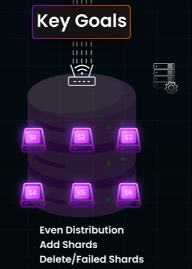
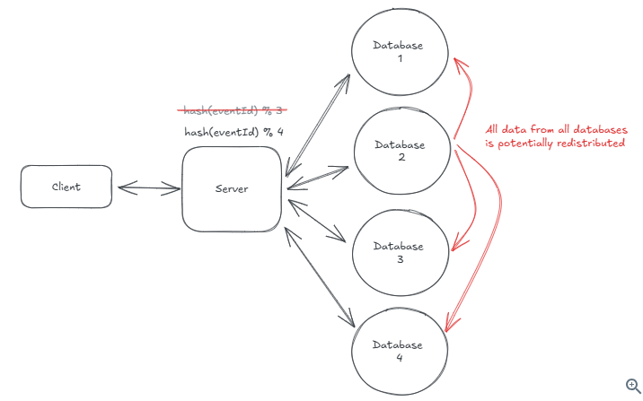
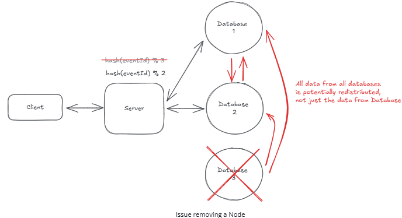
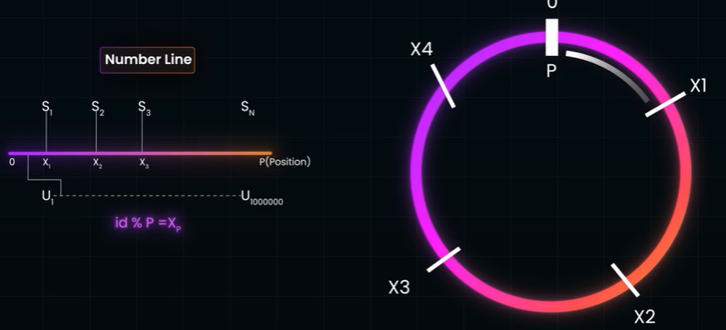
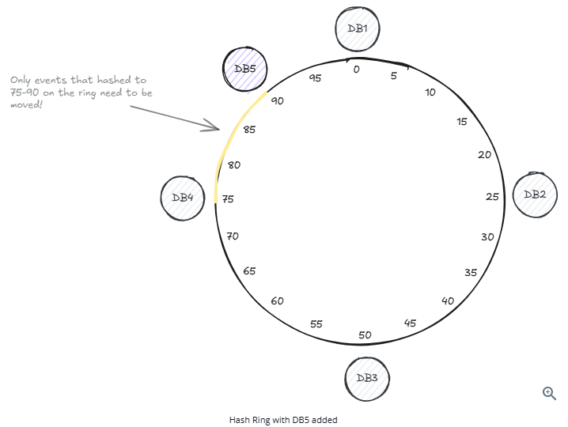
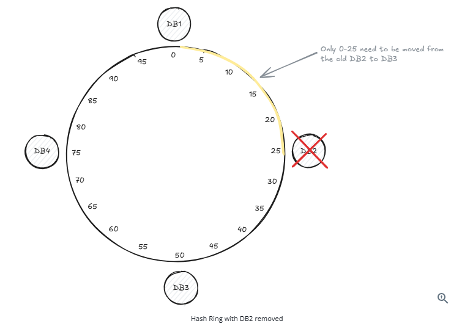
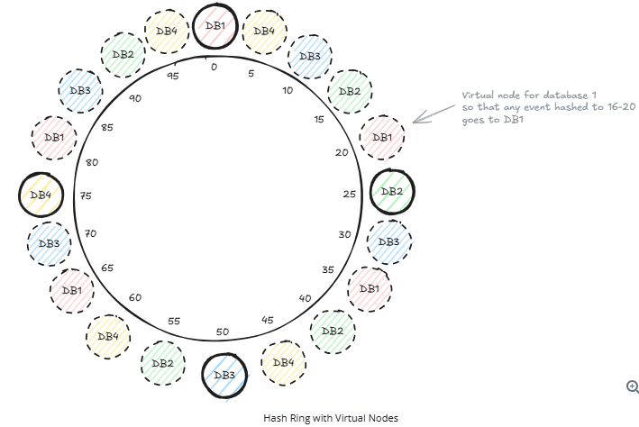

# Consistent hashing
- https://www.hellointerview.com/learn/courses/system-design/lesson/thinking-in-scale/consistent-hashing#consistent-hashing
- https://www.youtube.com/watch?v=vccwdhfqIrI | hi
- https://academy.bytemonk.io/products/system-design-mastery-beta/categories/2158360645/posts/2190592398
- https://www.youtube.com/watch?v=NLMZzElM8Z4 | bm

## overview
- foundational algorithm in distributed systems that is used to **distribute** data across a cluster of servers with new 
  - node added 
  - or **deleted (failed)**
    - **Replication** alongside consistent hashing to **handle failures** without moving data at all. 👈
    - eg: DynamoDB replicates each partition across 3 AZ.
    - replica is promoted via a consensus algorithm and no data needs to move.


## Distribution Scenario
> This cluster could be databases, sure, but they could also be caches, message brokers, or even just a set of application servers.
### Scenario-1: database sharding ⭐
- data is distributed across distributed shard [sharding](01_02_sharding.md)
- shards can be :
  - within same disk, 
  - diff disk/s of same machine 
  - diff disk/s of diff machine/s 



### Scenario-2: stateful traffic is distributed for serving client


### Scenario-3: event/message is distributed for processing
- event/data --> kafka partition-0, 1, or 3 ?
- event/data --> AWS Kinesis shard-0, 1, or 3 ?


---
## 1. Simple Modulo Hashing
- [hashing.md](../SD_01_foundation/05_concept_07_hashing.md)
- `database_id = hash(event_id) % number_of_databases`
- number_of_databases is changed, then rebalance needed.
  - event #1234 used to map to database 1, but now, hash(1234) % 4 = 0 so that data instead needs to be moved to database 0.
  - most of your data needs to be redistributed across all database instances
  - This causes huge spikes in database load and user  experience slow response times.
  - Imagine a database went down

```
Event #1234 → hash(1234) % 3 = 1 → Database 1
Event #5678 → hash(5678) % 3 = 0 → Database 0
Event #9012 → hash(9012) % 3 = 2 → Database 2
```




---
## 2. Consistent hashing --> hashing with Number line
> solves the problem of data redistribution when adding or removing a instance in a distributed system

**hash space/ ring**
- The key insight is to **arrange both our data and our databases in a circular space**, often called a "hash ring."
- just find the **hash value on the ring** and then move **clockwise** until we find a database instance.
-  `0 to 2^32`



### example-1

```
0 -------------------------------- 360
|                                  |
|                                  |
 ----------------------------------

---
 
Node A → hash 50
Node B → hash 150
Node C → hash 300
** industry grade hash function for `MD5`, `SHA-1`, `Bcrypt`

50(A) -------- 150(B) -------- 300(C) -------- back to 50

---

cleint-1 key-1 --> hash 30 --> next clockwise node = 50(A)
cleint-2 key-2 --> hash 70 --> next clockwise node = 150(B)
cleint-3 key-3 --> hash 160 --> next clockwise node = 300(C)
cleint-4 key-4 --> hash 300 --> next clockwise node = 300(C)

Node A gets: k1
Node B gets: k2
Node C gets: k3, k4

---

➕ Node Added : Node D → hash 100

50(A) ---- ✔️100(D) ---- 150(B) ---- 300(C)

cleint-1 key-1 --> hash 30 --> next clockwise node = 50(A)
cleint-2 key-2 --> hash 70 --> next clockwise node = 100(B)  ❗ (was B)
cleint-3 key-3 --> hash 160 --> next clockwise node = 300(C)
cleint-4 key-4 --> hash 300 --> next clockwise node = 300(C)

A: k1
D: k2
B: -
C: k3, k4

✅ Only keys between A → D moved
❌ Not a full reshuffle

```
### example-2 ✔️




**virtual ring**
>  load from the failed database gets distributed much more evenly across all remaining databases
- problem : **prevent structural imbalance**
  - In our example above where we removed database 2, we had to move all events that were stored on database 2 to database 3. 
  - Now database 3 has 2x the load 
  - We'd much prefer if we could spread the load more evenly so database 3 wasn't overloaded.
- solution
  - Instead of putting each database at just one point on the ring,
  - we put it at **multiple points by hashing different variation**s of the database name.


