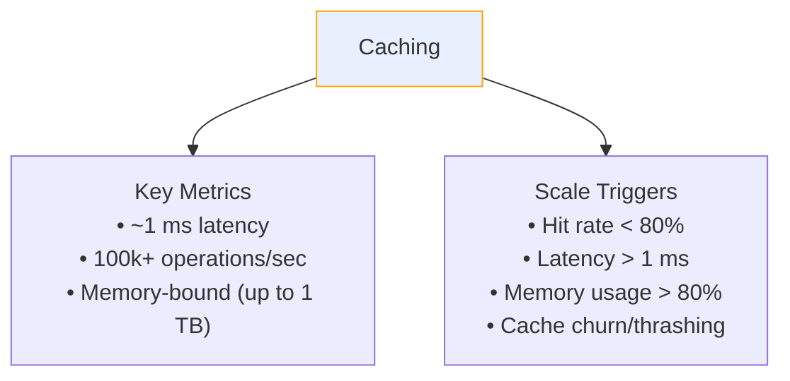
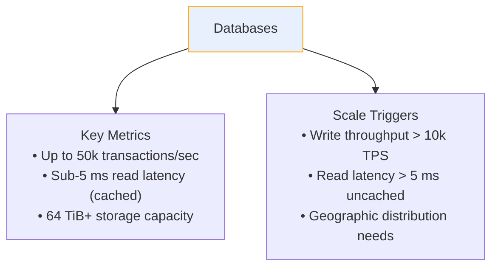
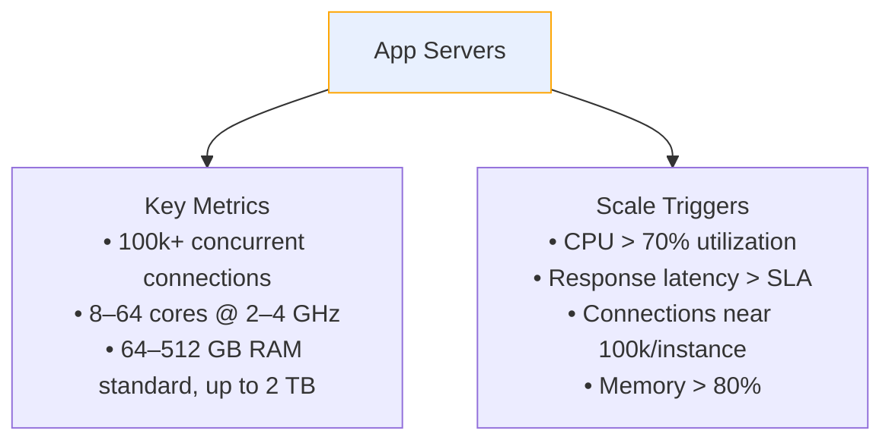
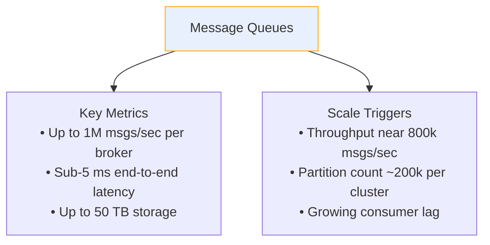

#  think in scale | Numbers to Know
- Read more here: https://www.hellointerview.com/learn/courses/system-design/lesson/thinking-in-scale/numbers-to-know ⭐
- incorrect estimates routinely lead to **over-engineering** 👈
 
## Overview
> many applications that once required distributed systems can now run on a single machine. 
> Modern hardware capabilities fundamentally change how we approach system design.

- Our industry moves fast. The **hardware** we build systems on **evolves constantly**
- understanding modern hardware capabilities is crucial for making good system design decisions
-  having an **accurate sense** of what today's hardware can handle.
- **Modern servers** 
  - pack serious computing power
  - Memory-optimized instances 
  - Storage capacity has seen similar growth,
  - S3 is effectively unlimited
  - Network capabilities, high-performance instances supporting high Gbps
  - many more ...

---

## Physics network limit:
- speed of light: 3,00,000 km/s
- but fibre optic limit : 2,00,000 km/s - operation/processing time

```
  - `sub-1ms` within a single AZ,
  - `1-2ms` across AZs in the same region 
  - `50-150ms` cross-region
```
## 1. Application server

| Category                              | Numbers to Know / Scale Trigger                                        |
| ------------------------------------- | ---------------------------------------------------------------------- |
| **Connections**                       | 100k+ concurrent connections per instance for optimized configurations |
| **CPU**                               | 8–64 cores                                                             |
| **Memory**                            | 64–512 GB standard; up to 2 TB for high-memory instances               |
| **Network**                           | 25 Gbps standard; up to 50–100 Gbps on high-performance instances      |
| **Startup Time**                      | 30–60 seconds for containerized apps                                   |
| **CPU Utilization — Scale Trigger**   | Consistently above 70–80%                                              |
| **Response Latency — Scale Trigger**  | Exceeding SLA or critical thresholds                                   |
| **Memory Usage — Scale Trigger**      | Trending above 70–80%                                                  |
| **Network Bandwidth — Scale Trigger** | Approaching instance limits                                            |

## 2. Database

| Category                                       | Numbers to Know / Scale Trigger                                                   |
|------------------------------------------------| --------------------------------------------------------------------------------- |
| **Storage**   [AWS EBS - iop2,io3,gp2,gp3,hdd,ssd](../../CE_02_AWS_SAA/02_storage/02_EBS.md#ebs-types)                                 | Up to **64 TiB** for most database engines; **Aurora up to 256 TiB**              |
| **Read Latency**                               | **1–5 ms** for cached data; **5–30 ms** for disk-based reads                      |
| **Write Latency**                              | **5–15 ms** commit latency for single-node, high-performance setups               |
| **Read Throughput**                            | Up to **50k TPS** in single-node Aurora/RDS configurations                        |
| **Write Throughput**                           | **10–20k TPS** in single-node Aurora/RDS configurations                           |
| **Connections**                                | **5–20k** concurrent connections, depending on database and instance type         |
| **Dataset Size — Sharding Trigger**            | Approaching or exceeding **50 TiB** may require sharding or distributed solutions |
| **Write Throughput — Sharding Trigger**        | Consistently exceeding **10k TPS** indicates scaling considerations               |
| **Read Latency — Sharding Trigger**            | Requirements below **5 ms for uncached data** may necessitate optimization        |
| **Geographic Distribution — Sharding Trigger** | Cross-region replication or distribution requirements                             |
| **Backup/Recovery — Sharding Trigger**         | Backup windows stretching into hours or becoming operationally impractical        |


## 3. Cache

| Category                         | Numbers to Know / Scale Trigger                                                                                   |
|----------------------------------| ----------------------------------------------------------------------------------------------------------------- |
| **Memory(fast)**                 | Up to **1 TB** on memory-optimized instances; some specialized configurations can exceed this                     |
| **Read Latency**                 | **< 1 ms** within the same region                                                                                 |
| **Write Latency**                | **< 1 ms** same-AZ; **1–2 ms** cross-AZ within the same region                                                    |
| **Throughput**                   | **100k–200k+ ops/sec per instance** for in-memory caches such as ElastiCache Redis on modern Graviton-based nodes |
| **Dataset Size — Scale Trigger** | Approaching **1 TB**                                                                                              |
| **Throughput — Scale Trigger**   | Sustained **100k+ ops/sec**                                                                                       |
| **Read Latency — Scale Trigger** | Consistently requiring **< 0.5 ms**                                                                               |

## 4. message broker

| Category                                     | Numbers to Know / Scale Trigger                                           |
| -------------------------------------------- | ------------------------------------------------------------------------- |
| **Throughput**                               | Up to **1 million messages/sec per broker** in modern configurations      |
| **Latency**                                  | **1–5 ms** end-to-end within a region for optimized setups                |
| **Message Size**                             | **1 KB–10 MB** efficiently handled                                        |
| **Storage**                                  | Up to **50 TB per broker** in advanced configurations                     |
| **Retention**                                | **Weeks to months** of data, depending on disk capacity and configuration |
| **Throughput — Scale Trigger**               | Nearing **800k messages/sec per broker**                                  |
| **Partition Count — Scale Trigger**          | Approaching **200k partitions per cluster**                               |
| **Consumer Lag — Scale Trigger**             | Consistently growing lag that impacts real-time processing                |
| **Cross-Region Replication — Scale Trigger** | Required for geographic redundancy                                        |


---
## Cheatsheet
| Component          | Key Metrics                                                                                     | Scale Triggers                                                                                            |
| ------------------ |-------------------------------------------------------------------------------------------------| --------------------------------------------------------------------------------------------------------- |
| **Caching**        | • ~1 ms latency   • 100k+ operations/sec   • Memory-bound (up to 1 TB)                        | • Hit rate < 80%   • Latency > 1 ms   • Memory usage > 80%   • Cache churn/thrashing                   |
| **Databases**      | • Up to 50k transactions/sec   • Sub-5 ms read latency (cached)   • 64 TiB+ storage capacity  | • Write throughput > 10k TPS   • Read latency > 5 ms uncached   • Geographic distribution needs         |
| **App Servers**    | • 100k+ concurrent connections   • 8–64 cores @ 2–4 GHz   • 64–512 GB RAM standard, up to 2 TB | • CPU > 70% utilization   • Response latency > SLA   • Connections near 100k/instance   • Memory > 80% |
| **Message Queues** | • Up to 1 million msgs/sec per broker   • Sub-5 ms end-to-end latency   • Up to 50 TB storage | • Throughput near 800k msgs/sec   • Partition count ~200k per cluster   • Growing consumer lag          |






---
## Common Mistakes
### 1. Overestimating latency 
- calculate it correctly, before adding a **caching layer** to reduce latency
- eg: read/write latency from database 

> **Random I/O access**
> - Total time ≈ access latency + data size / bandwidth
> - Latency dominates for small reads/writes (e.g. 4 KB)
>
> **Sequential I/O access**
> - Total time ≈ access latency + data size / bandwidth
> - Bandwidth dominates for large data (e.g. 1 MB+)

| Storage            | Access Latency | Good Number |
| ------------------ | -------------: | ----------: |
| **CPU Cache (L1)** | ~1 ns          | **~1 ns**   |
| **RAM**            | ~50–100 ns     | **~100 ns** |
| **NVMe SSD**       | ~50–200 µs     | **~100 µs** |
| **SATA SSD**       | ~100–500 µs    | **~200 µs** |
| **HDD**            | ~5–15 ms       | **~10 ms**  |

**Example: 4 KB Random Read**

| Storage | Approx. Time |
|---|---:|
| **RAM** | ~100 ns |
| **NVMe SSD** | ~100 µs |
| **SATA SSD** | ~200 µs |
| **HDD** | ~10 ms |

**Example: 1 MB Sequential Read**

Assuming approximate bandwidth of RAM **100 GB/s**, NVMe **5 GB/s**, SATA SSD **500 MB/s**, HDD **150 MB/s**:

| Storage | Approx. Time |
|---|---:|
| **RAM** | ~0.01 ms |
| **NVMe SSD** | ~0.2 ms |
| **SATA SSD** | ~2 ms |
| **HDD** | ~7 ms |

### 2. Adding additional infra
Message queues become valuable when:
- guaranteed delivery
- event sourcing patterns, etc
- handling **DB write spikes** that exceed your database's capacity ⭐
    - Also Before reaching for a message queue, consider **simpler optimizations**
    - like batch writes,
    - optimizing your schema and indexes,
    - using connection pooling effectively,
    - or using async commits for non-critical writes.
    - > core point is to understand your actual write patterns and requirements before **adding infrastructure complexity** ⭐

### 3. Premature sharding
