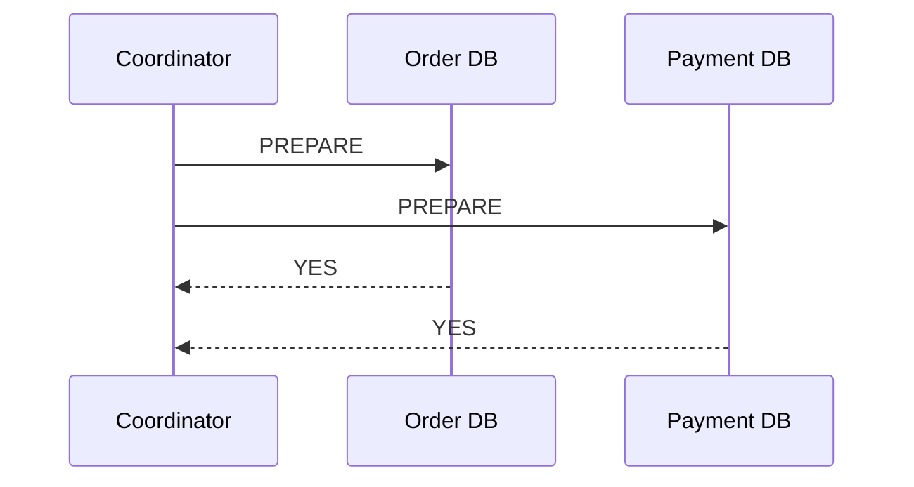
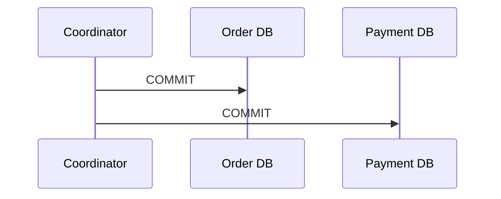
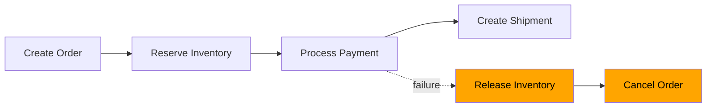
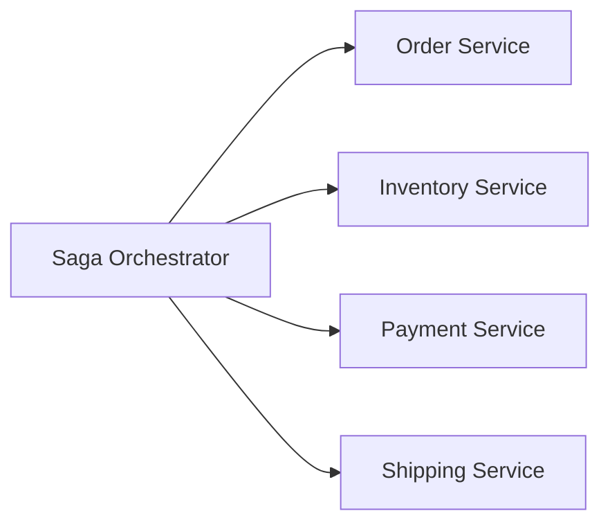
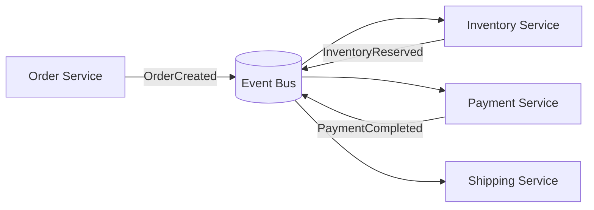

# Distributed Transaction
Reference:
- https://www.youtube.com/watch?v=d2z78guUR4g bm ⭐
- https://www.baeldung.com/cs/saga-pattern-microservices post
- https://github.com/lekhrajdinkar/data-engineer/blob/main/docs/2012-2021/07_ACID%2BLocks.md | ACID
- https://chat.deepseek.com/a/chat/s/81394dc5-20ff-45bb-8fc3-001520d7ef4f
---
## Overview
- monolith system, ACID on single database
- DS: Achieve **data-consistency** across different parts of a system,
  - transaction spans several services/ms
  - participant performs local transactions
  - thus extend the concept of ACID properties to scenarios where transactions span **multiple databases**

---
## 1. Two-Phase Commit (2PC)
- traditional | tight coordination
- Also called - **Blocking Atomic Commit Protocol**

Phase 1 — Prepare / Vote

Phase 2 — Commit (all Yes ) / Rollback (any No)


> use opensource implementation like `Apache Zookeeper`, Dont built from scratch.

**Drawbacks of 2PC:**
- Difficult across independently owned microservices (across organization)
- **Latency and Performance**
  - Additional communication and coordination steps introduce latency
- **SPF** | single point of failure : coordinator node
- inherently **Blocking** 
  - All other services need to wait until the slowest service finishes
  - Services become dependent on each other and the coordinator
- **Deadlock**: 
  - Transactions can deadlock if participants wait for each other to release resources


---
## 2. Transactional Outbox
[02_pattern_12_outbox_pattern.md](../SD_01_Foundation/04_architecture/02_pattern_12_outbox-pattern.md)

---
## 3. SAGA
> Local ACID transactions + eventual consistency + compensating actions


**Overview**
- Concept of a long-running, interconnected sequence of operations, like a "saga" in storytelling
- data consistency without relying on traditional ACID transactions (which are impractical in distributed systems).
- steps:
    - Breaks a large transaction into smaller, local transactions.
    - If one step fails, execute **compensating transactions** to undo previous successful steps.

```

```



| Type              | How it works                                            |
| ----------------- | ------------------------------------------------------- |
| **Choreography**  | Services react to events; no central coordinator        |
| **Orchestration** | Central Saga Orchestrator tells each service what to do |


### 3.1. SAGA :: orchestration 
- Simpler implementation for individual services, 
- clear audit trail
- Single point of failure if the orchestrator fails,...


---
### 3.2. SAGA :: choreography
- Good for simpler workflows,
- but can become hard to trace.
- No central conductor, participants communicate directly **through events**
- Each service listens for events from other services and **acts autonomously**
- **better scalability**




> `Axon Saga` – a lightweight framework and widely used with Spring Boot-based microservices

---
## compare :: 2-phase-commit vs SAGA

| Feature            | Two-Phase Commit (2PC)                                      | Sagas                                                                                                                 |
|--------------------|--------------------------------------------------------------|-----------------------------------------------------------------------------------------------------------------------|
| Control            | Central coordinator orchestrates transactions                | - Can be **choreographed** (participants communicate directly) <br> - or **orchestrated** (central orchestrator manages flow) |
| Communication      | **Synchronous**; participants wait for coordinator               | **Asynchronous**; participants react to events independently                                                          |
| Atomicity          | **Strong atomicity**; all operations succeed or fail             | **Eventual consistency**; <br>temporary inconsistencies until compensation completes                                  |
| Flexibility        | Less flexible; susceptible to coordinator failures           | **More resilient;** <br> compensating transactions for error recovery                                                 |
| Performance        | Slower due to synchronous communication                      | Generally **faster** due to asynchronous communication and concurrent execution                                       |
| Resource Locking   | Involves locking resources; can lead to contention            | Does not require resource locking                                                                                     |
| Suitability        | Strong consistency, limited participants                     | Long-running, <br>complex transactions across multiple services where eventual consistency is acceptable              |
