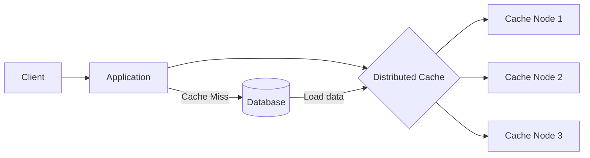

# Distributed Caching
## reference
- [caching :: overview](../01_01_caching.md)
- [api_design :: caching](../../SD_08_API-Design/06_caching.md)
- [redis :: chapter-1](../SD_05_DataLayer%2Bstorage/04_redis-chapter-1.md)

---
## Overview
- https://youtu.be/Gdfj-544AkA?si=zqrjnvAlUstrvRli (can skip)
- behind the scene are **distributed hash table**
- augment the power on the fly

Common technologies
- Redis / AWS ElastiCache Redis
- Memcached
- Redis Cluster

---
## More

