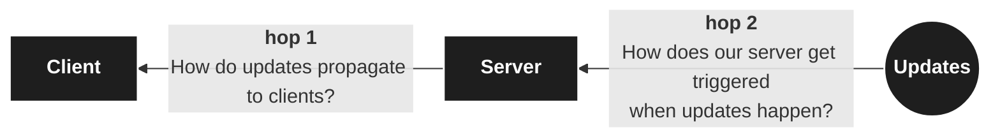
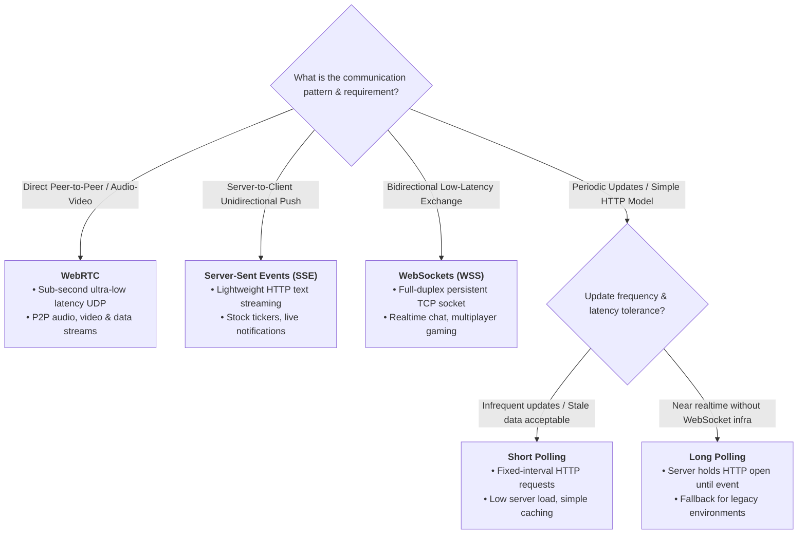

# Real-time Updates / push notifications
- https://www.hellointerview.com/learn/system-design/patterns/realtime-updates
- [network-essential](../SD_04_network-essential)
- https://www.youtube.com/watch?v=EX5uZV3Tzss
> when you need servers to **proactively push updates** to clients.

## The Problem
- in collaborative document editor like `Google Docs`, see that change within `milliseconds`.
- `request-response model`: clients ask for data --> servers respond --> then **connection closes**
- so, core challenge is **establishing efficient, persistent communication channels** between clients and servers

## More use-cases
```
Ticketmaster
Uber
WhatsApp
Robinhood
Google Docs
Strava
Online Auction
FB Live Comments
Online Chess
ChatGPT
```
---
## The Solution
- solution requires two distinct pieces:


---
### hop-1. Client-Server Connection Protocols
> need persistent connections or clever polling strategies

```
Simple Polling: The Baseline
Long Polling: The Easy Solution
---
Server-Sent Events (SSE): The Efficient One-Way Street
Websockets: The Full-Duplex Champion
WebRTC: The Peer-to-Peer Solution
```
- [01_01_request-response.md](../SD_01_Foundation/05_IPC/01_01_request-response.md) ❌
- [01_02_polling.md](../SD_01_Foundation/05_IPC/01_02_polling.md) | `short and long`
- [02_01_streaming-sse.md](../SD_01_Foundation/05_IPC/02_01_streaming-sse.md) | `SSE`
- [02_02_streaming-wss.md](../SD_01_Foundation/05_IPC/02_02_streaming-wss.md) | `WS`
- [02_03_streaming-webRTC.md](../SD_01_Foundation/05_IPC/02_03_streaming-webRTC.md)| `webRTC`



---
### hop-2. Server-Side Push/pull