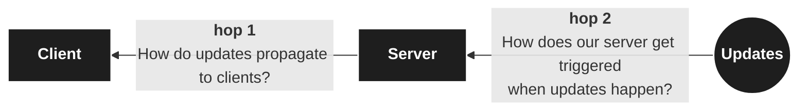
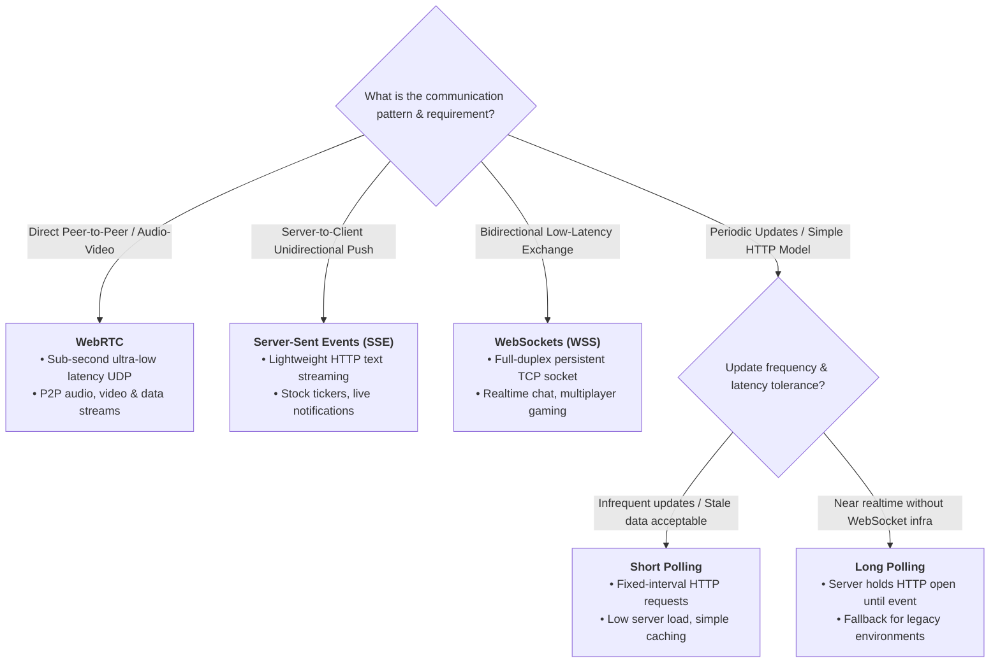
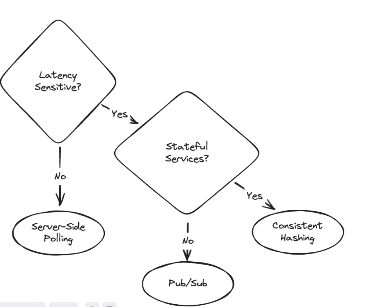
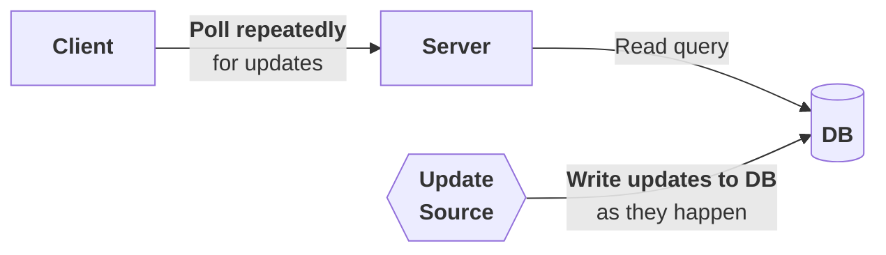
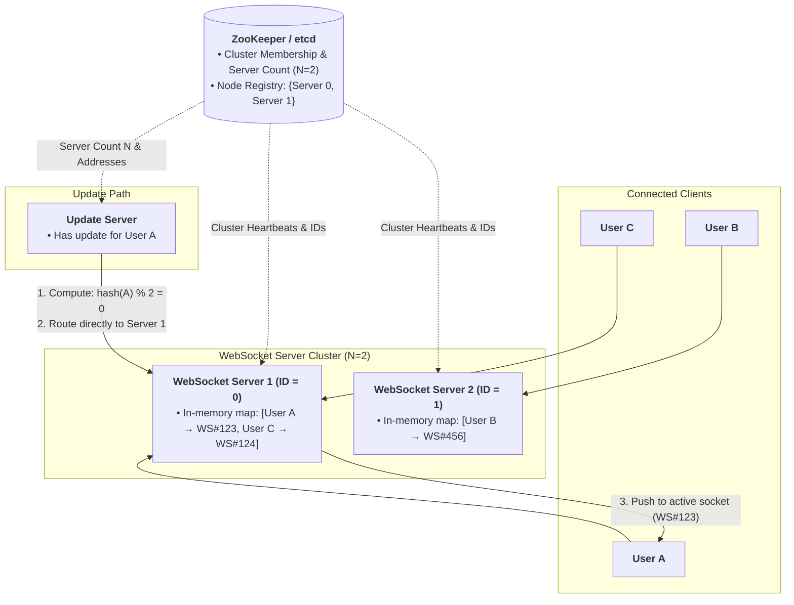
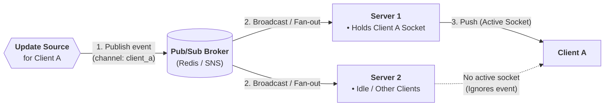
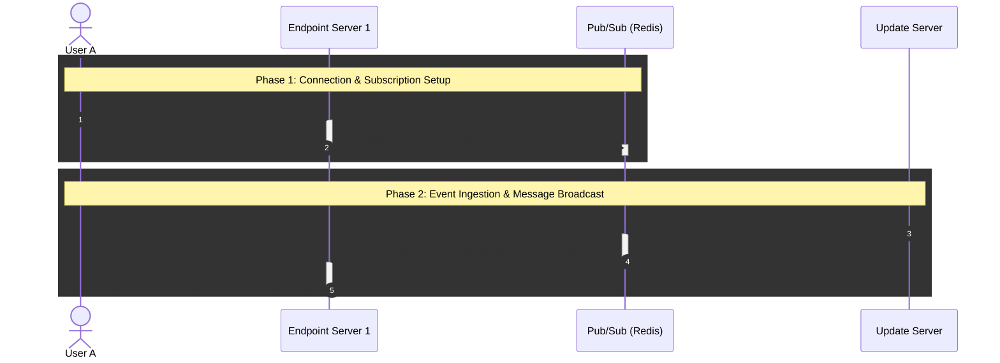
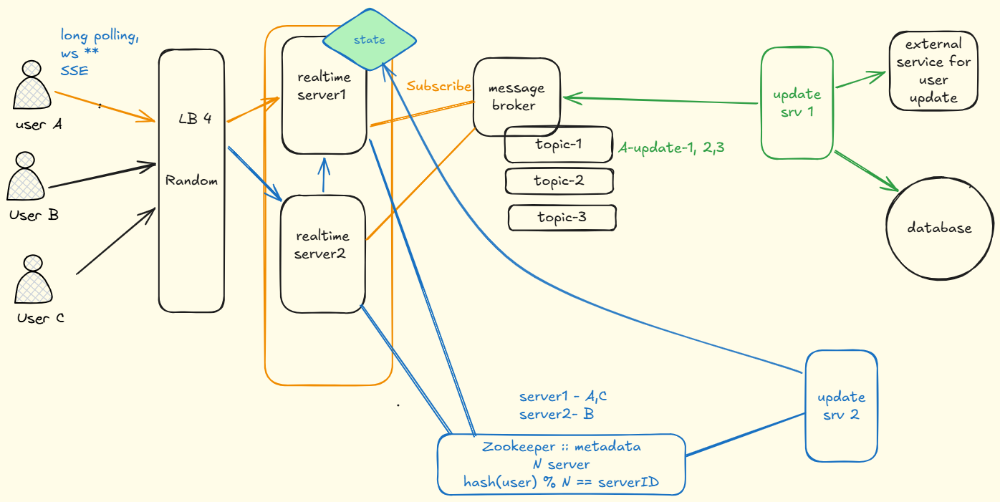
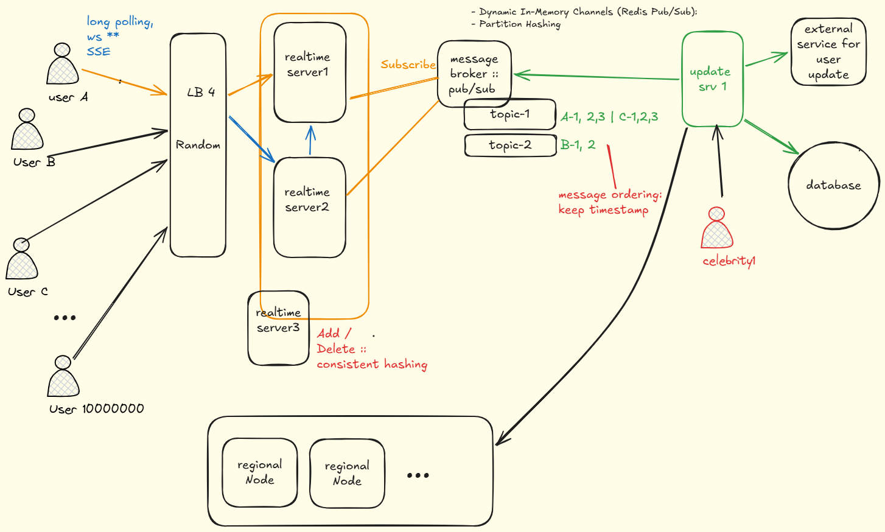
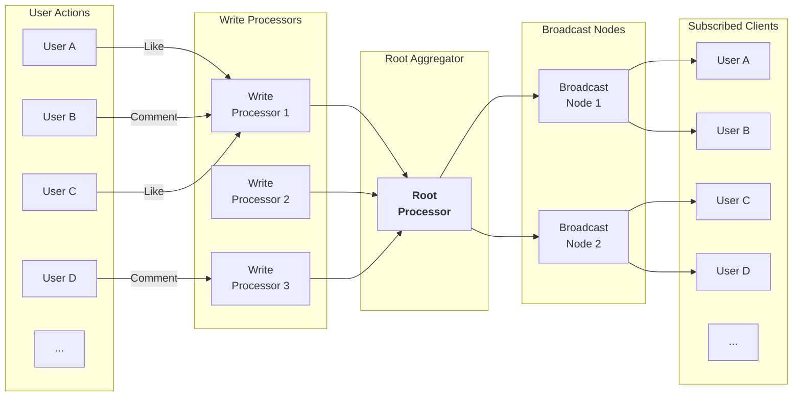

# Real-time Updates / push notifications
## reference
- https://www.hellointerview.com/learn/system-design/patterns/realtime-updates
- https://www.hellointerview.com/learn/system-design/patterns/realtime-updates/quick-reference
- [network-essential](../SD_04_network-essential)
- https://www.youtube.com/watch?v=EX5uZV3Tzss

---
## use-cases / scenario
- https://www.hellointerview.com/learn/system-design/problem-breakdowns/google-docs | ws | h
- https://www.hellointerview.com/learn/system-design/problem-breakdowns/fb-live-comments 
- https://www.hellointerview.com/learn/system-design/problem-breakdowns/whatsapp 
  - hop:1 sse to receive | rest to send 
  - hop:2 p/s

```
More:
    Ticketmaster
    Uber
    Robinhood
    Strava
    Online Auction
    Online Chess
    ChatGPT
---
Live Dashboards and Analytics : | sse | p/s
Gaming and Interactive Applications : we | h
```
---
## Problem
> when you need servers to **proactively push updates** to clients.
- in collaborative document editor like `Google Docs`, see that change within `milliseconds`.
- `request-response model`: clients ask for data --> servers respond --> then **connection closes**
- so, core challenge is **establishing efficient, persistent communication channels** between clients and servers

---
## Solution :: 2 hop framework
- solution requires two distinct pieces:


---
## ✔️hop-1. Client-Server Connection Protocols
> need persistent connections or clever polling strategies

```
Simple Polling: The Baseline
Long Polling: The Easy Solution
---
Server-Sent Events (SSE): The Efficient One-Way Street
Websockets: The Full-Duplex Champion
WebRTC: The Peer-to-Peer Solution
```

### 1. Polling
- [01_01_request-response.md](../SD_01_Foundation/05_IPC/01_01_request-response.md)
- [01_02_polling.md](../SD_01_Foundation/05_IPC/01_02_polling.md) | `short and long polling`

### 2. Streaming
- [02_01_streaming-sse.md](../SD_01_Foundation/05_IPC/02_01_streaming-sse.md) | `SSE`
- [02_02_streaming-wss.md](../SD_01_Foundation/05_IPC/02_02_streaming-wss.md) | `WS`
- [02_03_streaming-webRTC.md](../SD_01_Foundation/05_IPC/02_03_streaming-webRTC.md)| `webRTC`



---
## ✔️hop-2. Server-Side Push/pull
- https://www.hellointerview.com/learn/system-design/patterns/realtime-updates#server-side-push-pull | check this
- how we propagate updates from the **source to the server**.
- we need a **trigger**:
  - Pulling ( via Polling )
  - Pushing ( via Consistent Hashes) 
  - Pushing ( via Pub/Sub )



### 1. Pulling ( via Polling )
- notice arrow sign below, its pull



### 2. Pushing
- the client(say `user A`) has a **persistent connection (ws,sse,long-poll)** to one server 
- and that server is responsible for sending updates to the client.
- from update server, when a message needs to be sent: 
    - Figure out which server, "User A" is connected to. ⭐
    - Send the message to that server. how ? message-Broker/gRPC ?
    - That server will look up which (websocket, SSE, long-polling) request is associated with "User A".
    - The server will then write the message **via the appropriate connection.** 

#### 2.1. Pushing (Simple Hashing)
>  we'll have a **central Zookeeper / Etcd service** with metadata
> - there are N server, can assign them each a number 0 through N-1.
> - allows the servers to keep in sync as it updates.

```
serverIndex = hash(userId) % N | N = 2

    User A → hash(A) % 2 → 0 → Server 1
    User B → hash(B) % 2 → 1 → Server 2
    User C → hash(C) % 2 → 0 → Server 1
```

```
When a client connects, the following happens:
- The client connects to a random server.
- The server uses Zookeeper's server list to compute which server is responsible 
  for the client (by hashing their ID and applying modulo N).
- The server redirects the client to the appropriate server.
- The client connects to the correct server.
- The server adds that client to a map of connections.

update server:
- has update for A
- uses Zookeeper's server list to compute which server is responsible user A
- publish reponse to realtime server
- That server will look up which (websocket, SSE, long-polling) request is associated with "User A".
- The server will then write the message via the appropriate connection.
```


---
#### 2.2. Pushing (Consistent Hashing)

```
serverIndex = hash(userId) % R | R,ring = 360

    User A → hash(A) % 360 → move clockwise --> 0 → Server 1
    User B → hash(B) % 360 → move clockwise --> 1 → Server 2
    User C → hash(C) % 360 → move clockwise --> 0 → Server 1

```
- The hashing approach works great when N is fixed, but becomes problematic when we need to scale our service up or down
- It maps both servers and users onto a hash ring,
- and each user connects to the next server they encounter when moving clockwise around the ring.
- use, when system needs to scale dynamically.

---
#### 2.3 Pushing :: via Pub/Sub




- Q1: 
  - When consuming messages from a shared Kafka topic/partition,
  - what do we do with messages intended for **clients that are offline** 
  - or do not currently have an active socket connection?
- Q2:
  - If 50,000 users share 250 partitions (shards) in a single Kafka topic
  - and updates arrive simultaneously, how is m**essage ordering preserved for each user?**
- q3: if we create **1 topic per user**, how do we handle millions of users without overloading the broker?

---
## Summary 💡
> [realtime-update](draw/01_realtime-update.excalidraw) | [read-link](https://excalidraw.com/#json=tp6lsIiuKf6HzfHl6WwoW,YpgunMqS_OrMo51UXEz1pQ)


> [realtime-update-problems](draw/01_02_realtime-update-problems.excalidraw)  | [read-link](https://excalidraw.com/#json=r0O3ZBV9zOMqGjw5BqWSi,CNtqqb5pP3ErlnjTKKaQrA)


---
## Common Deep Dives ⭐
### 1. handle connection failures and reconnection
- Real-world networks are unreliable: Wi-Fi/mobile connections drop, clients lose connectivity, and servers can restart.

| **Problem**                               | **Solution**                                                            |
| ----------------------------------------- | ----------------------------------------------------------------------- |
| Detect a dead/zombie connection           | **Heartbeat / ping-pong** mechanism                                     |
| Client reconnects after disconnect        | **Automatic reconnection with backoff**                                 |
| Avoid overwhelming the server             | **Exponential backoff + jitter**                                        |
| Client missed messages while disconnected | **Sequence numbers / offsets**                                          |
| Resume from where client stopped          | Client sends **last received sequence number**                          |
| Prevent data loss                         | Server retains messages/events for a **replay window**                  |
| Multiple server instances                 | Use **shared durable state / message broker** rather than server memory |
| Duplicate messages after reconnect        | Use **message IDs / sequence numbers + idempotent processing**          |


```
Client                         Server
  │                               │
  │──── WebSocket Connect ───────►│
  │                               │
  │◄──── Event #101 ──────────────│
  │◄──── Event #102 ──────────────│
  │                               │
  │──── Ping ────────────────────►│
  │◄──── Pong ────────────────────│
  │                               │
  X──── Connection Lost ──────────X
  │
  │     reconnect with backoff
  │
  │──── Reconnect ────────────────►│
  │    ⭐last_received = 102      │
  │                               │
  │          replay event         │
  │◄──── Event #103 ──────────────│
  │◄──── Event #104 ──────────────│
  │◄──── Event #105 ──────────────│
```

---
### 2. A single user has millions of followers who all need the same update
"celebrity problem" 
- Instead of writing the update to millions of individual user feeds, 
- cache the update once and distribute through multiple layers and fanout pattern
- Regional servers can pull the update and push to their local clients, reducing the load on any single component.

**Batching and Hierarchical Aggregation (write scale pattern)**


### 3. maintain message ordering across distributed servers
- Each server maintains its own vector clock, 
- and messages **include timestamp information** 
- that helps recipients determine the correct order.

