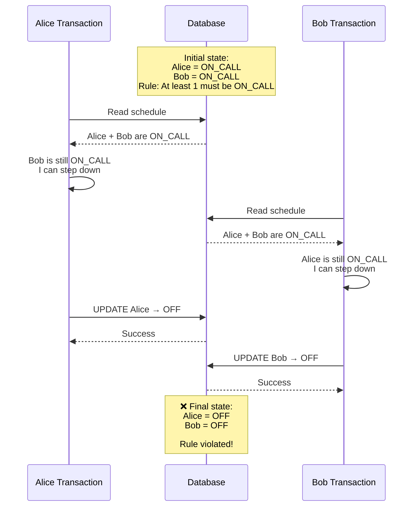
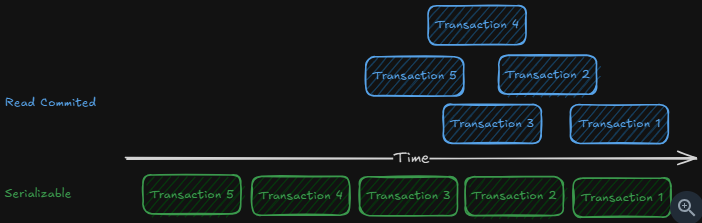
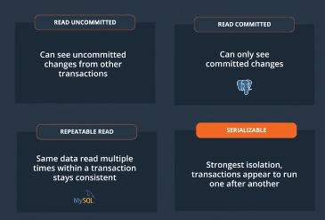
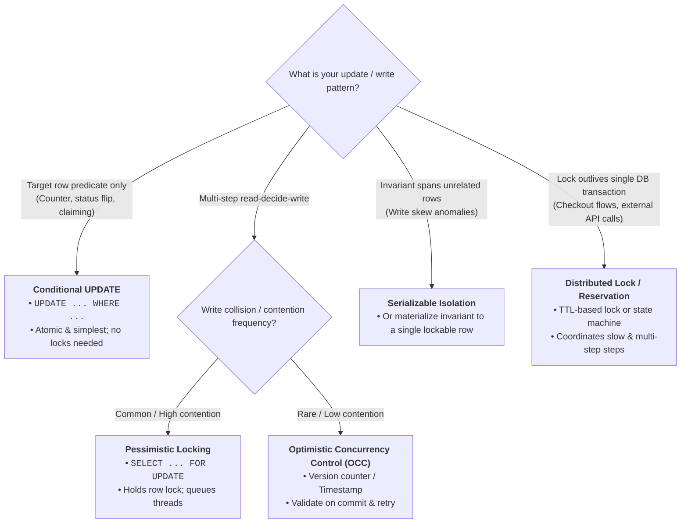
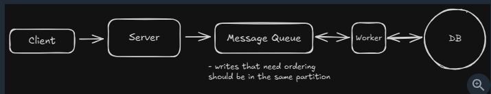

# Pattern 2: Dealing with Contention
## Reference
- https://www.hellointerview.com/learn/system-design/patterns/dealing-with-contention
- [08_Locks.md](../SD_05_DataModeling/01_SQL_fundamental/08_Locks.md) | [07_ACID.md](../SD_05_DataModeling/01_SQL_fundamental/07_ACID.md)
- [03_03_distributed-Locking.md](../SD_05_DataModeling/02_basic_concepts/03_03_distributed-Locking.md)
- https://excalidraw.com/#json=_866ThOx0ZEJcOZUEbhmR,anllVmGioyvZnNsUnAs2Yg | contention summary

---
## Overview 
- Every contended resource has a single source of truth, the one place that owns the real value, and that's where correctness gets enforced
- `Conditional writes`, `pessimistic locking`, `isolation levels`, and `optimistic concurrency` are just different ways of coordinating access at that source of truth
- when it outgrows a single transaction, stretching across a wait or a call to another system, a `distributed lock` holds the exclusivity

**key terms**
- **Contention** : it occurs when multiple processes compete for the same resource at the same time
- race conditions,                             
- deadlocks,
- locks(tied with txn) ,
- distributed locks (leased lock with TTl, outside DB)

---
## 1. Conditional Writes
### problem🔺 : `lost update`
buying concert tickets online. user1 and user2
- last 1 ticket scenario, `A15`
- decrementing a counter, flipping a status

### First solution 
- non-atomic and no conditional write

```sqlite-psql
-- STEP-1 Read the current count
SELECT available_seats FROM concerts WHERE concert_id = 'weeknd_tour';

-- below must be atomic ?
    -- STEP-2 The app checks available_seats > 0, then writes the new value back
    UPDATE concerts
    SET available_seats = available_seats - 1
    WHERE concert_id = 'weeknd_tour';
    
    -- STEP-3 
    INSERT INTO booking (user_id, concert_id, seat_number, purchase_time) 
    values ('user-1', 'weeknd_tour', 'A15', 'xxxx-xx-xx:xx:xx:xxxx')
```
both user-1/2 will end up buying same ticket with solution-1
- read and write aren't atomic, are two separate steps, and in between them the world can change
- The window is tiny, microseconds in memory and milliseconds over a network
- problem only gets worse when you scale. even small race condition windows create massive conflicts

### Next, Add Conditional Writes + wrap with transaction
- Decrement the count, but only if a seat is left
- database won't let two updates change the same row at the same time.
-  two writes that need to stick together, so wrap the both operations in BEGIN and COMMIT

```sqlite-psql
BEGIN TRANSACTION; -- 👈

    WITH reservation AS (
      -- STEP-1
      UPDATE concerts
      SET available_seats = available_seats - 1
      WHERE concert_id = 'weeknd_tour'
        AND available_seats > 0 -- 👈
      RETURNING concert_id
    )
    
    -- STEP-2 : INSERT only if got available seat -- 👈
    INSERT INTO booking (user_id, concert_id, seat_number, purchase_time)
    SELECT 'user123', concert_id, 'A15', NOW()
    FROM reservation;

COMMIT;
```

### next, Guarding the "resource", with conditional Write
> - **counter** can answer "is there a ticket left."
> - **Only the ticket** row can answer "is this ticket left."

- Assuming, last 10 ticket scenario, `A15-A25`are last 10.
- with above conditional logic `available_seats > 0`, both user could still endup buying same `A15`
- **fix is to guard the resource/seat**
- Give every ticket its own row, and **aim the exact same conditional write**


```sqlite-psql
UPDATE tickets
SET status = 'sold', user_id = 'user123'
WHERE concert_id = 'weeknd_tour'
  AND seat_number = 'A15' -- 👈
  AND status = 'available';-- 👈
```
> As long as the database can **evaluate your guard**, as part of the write, you're done. `WHERE clause` === compare-and-set

---
## 2. Pessimistic Locking
> Pessimistic locking prevents conflicts by acquiring locks upfront.

### problem🔺 : `read-decide-write`
multi-row Lock
- Say a group of four wants to sit together.
- find four open seats in a row,
- and only then claim them.
- **read** all seat > **decide** : app logic to find consecutive seats  > **write**: then book them


```sqlite-psql
-- The catch is that **you've locked every open seat** , just to claim four.

BEGIN TRANSACTION;

    -- Lock the open seats in this section while we pick a block
    SELECT seat_number FROM seats
    WHERE concert_id = 'weeknd_tour'
      AND section = 'floor'
      AND status = 'available'
    FOR UPDATE;
    
    -- App scans the result, finds A15-A18 open and adjacent, then claims them
    UPDATE seats
    SET status = 'sold', user_id = 'user123'
    WHERE concert_id = 'weeknd_tour'
      AND seat_number IN ('A15', 'A16', 'A17', 'A18');

COMMIT;
```

---
## 3. Optimistic Concurrency Control
### problem🔺 : `read-decide-write` (but care collisions)

| Approach                | What happens                                                                 |
| ----------------------- | ---------------------------------------------------------------------------- |
| **Pessimistic locking** | "I'll lock it now so nobody else can touch it."                              |
| **OCC**                 | "Everyone can proceed; I'll check at write time whether someone changed it." |


```sqlite-psql
-- Both Alice and Bob read: 1 seat, version 42 --👈

-- Alice writes first:
BEGIN TRANSACTION;
UPDATE concerts
SET available_seats = available_seats - 1, version = version + 1 
WHERE concert_id = 'weeknd_tour'
  AND version = 42;  -- the version Alice read --👈

INSERT INTO tickets (user_id, concert_id, seat_number, price, purchase_time)
VALUES ('alice', 'weeknd_tour', 'A15', 750.00, NOW());
COMMIT;
-- Succeeds. seats = 0, version = 43

-- Bob writes against the version he read:
BEGIN TRANSACTION;
UPDATE concerts
SET available_seats = available_seats - 1, version = version + 1
WHERE concert_id = 'weeknd_tour'
  AND version = 42;  -- stale, the row is on 43 now --👈

-- Bob's UPDATE matches 0 rows. Check the count, roll back, skip the insert.
ROLLBACK;
```
---
### ABA problem with OCC 🔺
-  occurs when a value changes from A to B and back to A between your read and write. 
- Your optimistic check sees the same value and assumes nothing changed, but important **state transitions happened**.

**example:**
- restaurant tracks a review_count and you reuse it as your version
- You read it at 100. 
- Between your read and your write, one review is deleted (dropping it to 99)
- and a new one lands (bringing it back to 100). 
- Your write checks "is the version still 100, but state transitions happened, if not aware of.

**Better approach**
- `review_count` = 100
- `version`      = 42 | Use a dedicated version:

```sqlite-psql
-- Use a dedicated version column for safety
UPDATE restaurants
SET avg_rating = 4.1, 
    review_count = review_count + 1, 
    version = version + 1 --👈
WHERE restaurant_id = 'pizza_palace'
  AND version = 42;  -- Expected current version
```

> Core Idea : Read some value that **represents the state you observed** (like `version` here), then require that it hasn't changed when you write.
>
| OCC mechanism                | Example                                           |
| ---------------------------- | ------------------------------------------------- |
| **Version field**            | `WHERE version = 42` → increment to `43`          |
| **Timestamp**                | `WHERE updated_at = '...'`                        |
| **Revision number**          | `WHERE revision = 42`                             |
| **ETag**                     | HTTP `If-Match: "abc123"`                         |
| **Conditional state**        | `WHERE status = 'PENDING'`                        |
| **Compare entire row/state** | `WHERE name = old_name AND price = old_price ...` |


---
## 4. Isolation Levels
### problem🔺 : `write skew`
> Write skew is a concurrency problem where two transactions read the same state, then update different rows, causing a business rule to be violated.

```
>  business rule:: At least one of two accounts must have money.
---
Account A: $100
Account B: $100
---

Transaction 1                     Transaction 2
(User-1 withdraws A)              (User-2 withdraws B)

Read A = $100                     Read A = $100
Read B = $100                     Read B = $100

"I can withdraw from A"           "I can withdraw from B"

UPDATE A → $0                     UPDATE B → $0

---

Both transactions think:
"The other account still has $100, so we're safe."

---
but  Final state:
Account A: $0
Account B: $0

```



- [isolation level](../SD_05_DataModeling/01_SQL_fundamental/07_ACID.md)
- They control how much one transaction can see(**READ**) of another's in-flight work.
- SERIALIZABLE is the one that does catch skew write.
- `BEGIN TRANSACTION ISOLATION LEVEL SERIALIZABLE; ...`

| Isolation Level      | What you can see                                    | Key point                               |
| -------------------- | --------------------------------------------------- | --------------------------------------- |
| **READ UNCOMMITTED** | Can see uncommitted changes                         | Rarely used; allows dirty reads         |
| **READ COMMITTED**   | Only committed changes                              | Default in **PostgreSQL**               |
| **REPEATABLE READ**  | Same data read multiple times within a transaction stays consistent | Default in **MySQL (InnoDB)**           |
| **SERIALIZABLE**     | Transactions behave as if executed one at a time    | Strongest isolation; lowest concurrency |





---
## 5. Distributed Locks
### problem🔺: Exclusive locks
- temporary reservations | 10-minute TTL using a distributed lock
- [03_03_distributed-Locking.md](../SD_05_DataModeling/02_basic_concepts/03_03_distributed-Locking.md)

---
## ✔️Equivalents outside SQL database

| Technique                  | In SQL                                    | The same move elsewhere                                                                            |
| -------------------------- | ----------------------------------------- | -------------------------------------------------------------------------------------------------- |
| **Conditional write**      | `WHERE` predicate on the write            | DynamoDB `ConditionExpression`, Redis `SET NX`, Cassandra lightweight transaction, HTTP `If-Match` |
| **Optimistic concurrency** | Version column with `WHERE version = ...` | HTTP ETags / `If-Match`, etcd revision, DynamoDB version attribute                                 |
| **Pessimistic locking**    | `SELECT ... FOR UPDATE`                   | A mutex or distributed lock held while you decide                                                  |
| **Serializable isolation** | `ISOLATION LEVEL SERIALIZABLE`            | Mostly relational only                           |
| **Distributed lock**       | Reservation row with a TTL                | Redis `SET NX EX`, ZooKeeper or etcd lease                                                         |

---
## ✔️Approach /summary
> Like with much of system design, there isn't always a clear-cut answer. You'll need to consider the tradeoffs of each approach based on your specific use case

**single-home assumption**
  - If you need strong consistency under high contention, 
  - keep the contended resource in **one authoritative store**
  - do everything you can to keep the relevant data in a **single database first.**
  - **Two situations** break the single-home assumption
    - 1 distributed transaction
    - 2 same record is writable in multiple places at once,  and you're into conflict resolution:
    - like last-write-wins, vector clocks, or CRDTs

| Approach                   | Use When                                                                      | Avoid When                                                   | Typical Latency                                    | Complexity |
| -------------------------- | ----------------------------------------------------------------------------- | ------------------------------------------------------------ | -------------------------------------------------- | ---------- |
| **Conditional Write**      | Your check is a predicate on the row you're writing (counter, status, claim)  | The decision needs app logic or spans other rows             | Low — one atomic statement                         | Low        |
| **Pessimistic Locking**    | Read-decide-write where the check isn't a `WHERE` predicate; high contention  | Low contention, or a conditional write already covers it     | Low per operation, but holds a lock others wait on | Low        |
| **Optimistic Concurrency** | Same read-decide-write, but collisions are rare; high read/write ratio        | High contention where retries pile up                        | Low when no conflict; retry cost on conflict       | Medium     |
| **Serializable Isolation** | Write skew or a cross-row invariant with no single row to lock                | Hot, high-contention paths where abort/retry cost is high    | Medium — conflict tracking                         | Medium     |
| **Distributed Locks**      | Exclusivity must span a wait, external call, or multiple steps (reservations) | A single-row guard inside one transaction already handles it | Low for simple status writes                       | Medium     |



---
## ✔️Deep Dive topics
### 1. Handle DeadLock
**Scenario**: Alice wants to transfer `$100` to Bob, while Bob simultaneously wants to transfer `$50` to Alice.

**cause**: transactions acquire locks in different orders. The business logic doesn't care about order.

**Solution:** 

1. standard solution is **ordered locking,**
  - always acquiring locks in a consistent order regardless of your business logic flow.
  - lock by some deterministic key
  - This prevents circular waiting 
  - because all transactions follow the same acquisition order.
  
2. Every major database runs **automatic deadlock detection**:
  - when it spots a cycle,
  - it aborts one of the transactions with a deadlock error and lets the other proceed
  - so your job is catching that error and retrying the loser

3. **lock-wait timeout**
  
### 2. Performance
- let consider scenario :  **hot partition or celebrity problem**
- **fundamental issue** : normal scaling strategies break down when the **contention lands** on one specific item.

Fight here is over contentional writes, so below **infra change** makes no sense:
- `Sharding` splits load across rows, but everyone here wants the same row, so there's nothing to split. 
- `Load balancing` just spreads the requests across servers that then queue up on that same row. 
- `Read` replicas take read load off the primary
- ...
- ...

Change Approach,**turned a contention problem into other problem:**
- Maybe instead of one auction item, you actually have 10 identical items and can run separate auctions for each.
- Maybe instead of requiring immediate consistency for social media interactions, you can make likes and follows eventually consistent 
- For cases where you need strong consistency on a hot resource, implement **queue-based serialization**. The tradeoff is throughput, not just latency


---
## Interview
### use-cases / scenario 🎯
Top scenarios
- https://www.hellointerview.com/learn/system-design/problem-breakdowns/online-auction
  - optimistic concurrency control because multiple bidders **compete for the same item.** 
  - You can use the current high bid as the "version" | `OCC`
- https://www.hellointerview.com/learn/system-design/problem-breakdowns/ticketmaster
  - classic `pessimistic locking` scenario for seat selection
  - 10-minute TTL using a `distributed lock` for temp reservation
- https://www.hellointerview.com/learn/system-design/problem-breakdowns/uber
  - set driver status to "pending_request" when sending ride requests,
  - which prevents multiple simultaneous requests to the same driver.
  - Use either a cache with TTL for automatic cleanup when drivers don't respond within 10 seconds
  - `distributed lock`
- https://www.hellointerview.com/learn/system-design/problem-breakdowns/yelp
  - When users submit reviews, you need to update the business's average rating. 
  - Multiple concurrent reviews for the same restaurant create contention,
  - use `OCC`, to prevents **rating calculations** from getting corrupted when reviews arrive simultaneously

### more scenarios
- **Banking/Payment Systems**
  -  stays within a single database, this is a `pessimistic-locking` or `OCC` problem and lives right here
  -  Once a transfer has to span multiple services or shards, it stops being a contention problem and becomes a **distributed-transaction one.🔺**
- **Flash Sale/Inventory Systems**
  - Perfect for demonstrating a mix of approaches.
  - `OCC` with a dedicated version column for inventory updates,
  - combined with temporary cart "holds" (using `distributed locks` with TTL)
- https://www.hellointerview.com/learn/system-design/in-the-wild/shopify-inventory-reservations
- https://www.hellointerview.com/learn/system-design/in-the-wild/discord-messages-scylladb
- https://www.hellointerview.com/learn/system-design/in-the-wild/figma-multiplayer

### Signal
- **competing for limited resources** 
  - > tickets, auction bidding, flash sale inventory, or matching drivers with riders
- **Prevent double-booking or double-charging** 
  - > payment processing, seat reservations, or meeting room scheduling
- **Ensure data consistency under high concurrency** 
  - > account balance updates, inventory management, or collaborative editing
- **Handle race conditions in distributed systems**

### Dont over complicate
> Don't reach for complex coordination mechanisms when simpler solutions work.

- Low contention scenarios :  where conflicts are rare, use `OCC`
- Single-user operations:  so no coordination is needed.
- Read-heavy workloads : where most operations are reads with occasional writes, use `OCC`

---
## Summary/conclusion 💡
- `Pessimistic locking` handles **high** contention predictably,
- `optimistic concurrenc`y delivers **excellent performance** when conflicts are rare,
-  `modern database like PostgreSQL` can absorb far more contention at a single source of truth than people assume.
- Reach for `external locks` and reservations when **traffic or user experience demands it, not by default.**
- And the first move is always to make sure the **contended thing actually exists** as a single cell the store can guard,
  - whether that's a row, a key, or an item, depending on where it lives.
-  moment an operation has to span **multiple sources of truth**, 
  - you've left contention behind and **entered distributed-transaction territory.**

- [02_01_contention.excalidraw](draw/02_contention/02_01_contention.excalidraw)
