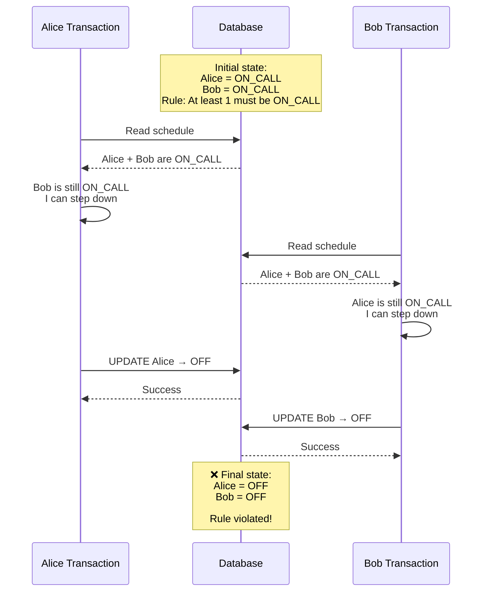

# Dealing with Contention
- https://www.hellointerview.com/learn/system-design/patterns/dealing-with-contention
- **Contention** occurs when multiple processes compete for the same resource at the same time

## 1. Conditional Writes
### problem : `lost update`
Single row locking :: buying concert tickets online. user1 and user2
- last 1 ticket scenario, `A15`
- decrementing a counter, flipping a status

### First solution 
```sqlite-psql
-- STEP-1 Read the current count
SELECT available_seats FROM concerts WHERE concert_id = 'weeknd_tour';

-- STEP-2 The app checks available_seats > 0, then writes the new value back
UPDATE concerts
SET available_seats = available_seats - 1
WHERE concert_id = 'weeknd_tour';

-- STEP-3 
INSERT INTO booking (user_id, concert_id, seat_number, purchase_time) 
values ('user-1', 'weeknd_tour', 'A15', 'xxxx-xx-xx:xx:xx:xxxx')
```
both user-1/2 will end up buying same ticket with solution-1
- read and write aren't atomic, are two separate steps, and in between them the world can change
- The window is tiny, microseconds in memory and milliseconds over a network
- problem only gets worse when you scale. even small race condition windows create massive conflicts

### Add Conditional Writes + wrap with transaction
- Decrement the count, but only if a seat is left
- database won't let two updates change the same row at the same time.
-  two writes that need to stick together, so wrap the both operations in BEGIN and COMMIT

```sqlite-psql
BEGIN TRANSACTION;

    WITH reservation AS (
      -- STEP-1
      UPDATE concerts
      SET available_seats = available_seats - 1
      WHERE concert_id = 'weeknd_tour'
        AND available_seats > 0 -- 👈
      RETURNING concert_id
    )
    
    -- STEP-2
    INSERT INTO booking (user_id, concert_id, seat_number, purchase_time)
    SELECT 'user123', concert_id, 'A15', NOW()
    FROM reservation;

COMMIT;
```

### Guarding the "resource", with conditional Write
> - **counter** can answer "is there a ticket left."
> - **Only the ticket** row can answer "is this ticket left."

- Assuming, last 10 ticket scenario, `A15-A25`are last 10.
- with above conditional logic `available_seats > 0`, both user could still endup buying same `A15`
- **fix is to guard the resource/seat**
- Give every ticket its own row, and **aim the exact same conditional write**


```sqlite-psql
UPDATE tickets
SET status = 'sold', user_id = 'user123'
WHERE concert_id = 'weeknd_tour'
  AND seat_number = 'A15' -- 👈
  AND status = 'available';-- 👈
```

---
### Summary

> 💡As long as the database **can evaluate your guard as part of the write**, you're done.
> - The `WHERE clause` === compare-and-set, provides **optimistic concurrency check**
> - the same move, DynamoDB makes with a ConditionExpression, 
> - Redis with SET NX, 
> - Cassandra with a lightweight transaction, 
> - or, an HTTP API with an If-Match header.

---
## 2. Pessimistic Locking
> Pessimistic locking prevents conflicts by acquiring locks upfront.

### problem : For a multi-row reservation
- Say a group of four wants to sit together.
- find four open seats in a row, and only then claim them.

### Solution
- The catch is that **you've locked every open seat** , just to claim four.

```sqlite-psql

BEGIN TRANSACTION;

    -- Lock the open seats in this section while we pick a block
    SELECT seat_number FROM seats
    WHERE concert_id = 'weeknd_tour'
      AND section = 'floor'
      AND status = 'available'
    FOR UPDATE;
    
    -- App scans the result, finds A15-A18 open and adjacent, then claims them
    UPDATE seats
    SET status = 'sold', user_id = 'user123'
    WHERE concert_id = 'weeknd_tour'
      AND seat_number IN ('A15', 'A16', 'A17', 'A18');

COMMIT;
```

---
## 3. Optimistic Concurrency Control
> OCC = don't lock while reading; detect conflict when writing.

| Approach                | What happens                                                                 |
| ----------------------- | ---------------------------------------------------------------------------- |
| **Pessimistic locking** | "I'll lock it now so nobody else can touch it."                              |
| **OCC**                 | "Everyone can proceed; I'll check at write time whether someone changed it." |

```
SQL       → version column
HTTP      → ETag + If-Match
etcd      → revision
DynamoDB  → version attribute
```

```sqlite-psql
-- Both Alice and Bob read: 1 seat, version 42 --👈

-- Alice writes first:
BEGIN TRANSACTION;
UPDATE concerts
SET available_seats = available_seats - 1, version = version + 1 
WHERE concert_id = 'weeknd_tour'
  AND version = 42;  -- the version Alice read --👈

INSERT INTO tickets (user_id, concert_id, seat_number, price, purchase_time)
VALUES ('alice', 'weeknd_tour', 'A15', 750.00, NOW());
COMMIT;
-- Succeeds. seats = 0, version = 43

-- Bob writes against the version he read:
BEGIN TRANSACTION;
UPDATE concerts
SET available_seats = available_seats - 1, version = version + 1
WHERE concert_id = 'weeknd_tour'
  AND version = 42;  -- stale, the row is on 43 now --👈

-- Bob's UPDATE matches 0 rows. Check the count, roll back, skip the insert.
ROLLBACK;
```

---
## 4. Isolation Levels
### problem : `write skew`
> Write skew is a concurrency problem where two transactions read the same state, then update different rows, causing a business rule to be violated.

```
>  business rule:: At least one of two accounts must have money.
---
Account A: $100
Account B: $100
---

Transaction 1                     Transaction 2
(User-1 withdraws A)              (User-2 withdraws B)

Read A = $100                     Read A = $100
Read B = $100                     Read B = $100

"I can withdraw from A"           "I can withdraw from B"

UPDATE A → $0                     UPDATE B → $0

---

Both transactions think:
"The other account still has $100, so we're safe."

---
but  Final state:
Account A: $0
Account B: $0

```




### Solution
- [isolation level](../SD_05_DataModeling/01_SQL_fundamental/07_ACID.md)
- They control how much one transaction can see of another's in-flight work.
- SERIALIZABLE is the one that does catch skew write.
- `BEGIN TRANSACTION ISOLATION LEVEL SERIALIZABLE; ...`

| Isolation Level      | What you can see                                    | Key point                               |
| -------------------- | --------------------------------------------------- | --------------------------------------- |
| **READ UNCOMMITTED** | Can see uncommitted changes                         | Rarely used; allows dirty reads         |
| **READ COMMITTED**   | Only committed changes                              | Default in **PostgreSQL**               |
| **REPEATABLE READ**  | Same data read multiple times within a transaction stays consistent | Default in **MySQL (InnoDB)**           |
| **SERIALIZABLE**     | Transactions behave as if executed one at a time    | Strongest isolation; lowest concurrency |


---
## 5. Distributed Locks
- [03_03_distributed-Locking.md](../SD_05_DataModeling/02_basic_concepts/03_03_distributed-Locking.md)

---
## Approach
* **Pessimistic Locking**
  * **When to use:** When write collisions and data contention are **common** (frequent concurrent writes to the same record).
  * **Mechanism:** Obtains an exclusive lock up front, forcing subsequent threads to queue and wait.

* **Optimistic Concurrency Control (OCC)**
  * **When to use:** When write collisions are **rare** (mostly reads, infrequent concurrent updates).
  * **Mechanism:** Allows concurrent updates without upfront locks; validates version numbers/timestamps upon commit and rolls back or retries if a conflict occurs.

---
## Deep Dive
### ABA problem

### handle deadlock

### performance 
> performance when everyone wants the same resource

---
## interview