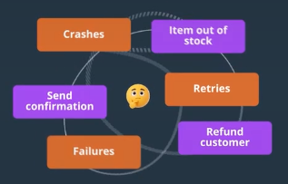
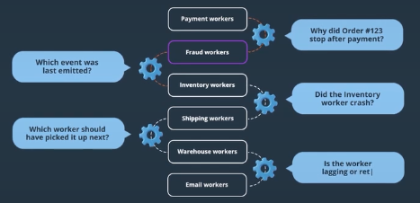

# Pattern 3: multi-step-processes
## reference
- https://www.hellointerview.com/learn/system-design/patterns/multi-step-processes
- [03_04_distributed-Transaction.md](../SD_05_DataModeling/02_basic_concepts/03_04_distributed-Transaction.md)
- https://www.youtube.com/watch?v=VvUdvte1V3s | "Six Little Lines of Fail"
- https://www.linkedin.com/blog/engineering/distributed-systems/log-what-every-software-engineer-should-know-about-real-time-datas-unifying

--- 
## Problem
Real applications often need to **coordinate** dozens of (flaky) services and systems. eg: **e-commerce order** fulfillment workflow: 
[e-commerce-workflow :: edge-cases](draw/03_multi-process/01_02_e-commerce-workflow-edge-cases.excalidraw)

[e-commerce order :: failure-scenarios](draw/03_multi-process/01_04_order-processing-system-failure-scenarios.excalidraw)
- **Crashes and Failures**:
    - eg: server crashes after charging payment but before reserving inventory
    - if server dies and new comes. it has to know exactly where last one left off.
- **Callback Routing**: eg: If we've scaled out to several API servers behind a load balancer, that callback can land on a completely different host

--- 
## Naive solution/s
### Patch-1
- distributed lock
- persist the order's state to a **database** after each step so no single host has to remember it,
- route callbacks through a **pub/sub layer**
[e-commerce order :: patch-1](draw/03_multi-process/01_03_order-processing-system-architecture.excalidraw)

### Still having issues
- **Error handler**:
  - Database remembers our progress, but it doesn't act on it.  If a server dies mid-order, the row just sits there.
  - Something has to notice the stalled order, decide which step is safe to retry,
  - That's a poller, a locking scheme, and retry logic,
- haven't solved **compensation**
- ...
- The never-ending patching list is indicative of a **structural problem**

> complex and brittle :: The diagram actually doesn't look that bad, but a real world implementation is a **tangled ball of wires and spaghetti code.**
>  - **business-level concerns** : The messy **complexity** of business needs.
>  - **system-level concerns** (crashes, retries, failures, hooks to handle waits,etc)



---
## Solution 1. The Saga Pattern
> Wrap all the steps in one big **distributed transaction**

[02_02_saga-choreography-vs-orchestration.excalidraw](draw/03_multi-process/02_02_saga-choreography-vs-orchestration.excalidraw)

**Overview**
- [SAGA](../SD_05_DataModeling/02_basic_concepts/03_04_distributed-Transaction.md) is sequence of local steps, where each step has a matching compensating action.
- You run the steps one at a time, 
- and if a later one fails, you walk backwards, firing those **compensations**
- Each step commits on its own, so nothing **holds a lock across services**
- each compensations action, could also fail, and needs their own retries and idempotency
- They guarantee that **whatever did happen can be undone.** 👈
- note: 2 Phase commit : guaranteeing that all the steps happen together or not at all, like in.

**SAGA::orchestration**
- where a **single coordinator** owns the flow and tells workers what to do.
    - that coordination has to survive crashes 👈
    - bookkeeping
    - state outlives crashes, retries, and all the compensation logic
- Because the whole **sequence lives in one place**,
- orchestration works best for **very complex workflows** where you need central control and **visibility**.

**SAGA::choreography**
- there is no coordinator at all. 
- Each worker:
  - **subscribes to the `events`** it cares about, 
  - does its piece, 
  - and emits new events for the **next worker** to react to.
  - **scalability** comes from adding more workers 👈
- The overall flow isn't written down anywhere; it emerges from those reactions
- Choreography works great for :
  - **fully independent services**  (e.g. those owned by **independent teams** that are not tightly coupled) 
  - and for **mid-complexity workflows.** 👈

---
## Solution 2. Event-Driven Choreography
### Overview
it's a close cousin of `event sourcing`
- same as **Single Server Primitives Approach**, but with one evolution step:
- stop storing the **current state** and instead store the **stream of events**, that got us there.
- workers react to those events to **drive the process forward** for coordination
> - `Event-sourcing` treats this event log as the **source of truth** and **derives state** from it. 
> - `Eent-Driven Choreography` mainly using the log to **coordinate work**
- Our API service is now just a thin initiating **wrapper around the event store** | they are now just workers who consume events :)

**event Store:** `Kafka`,  `Redis Streams`
- it holds the entire history of the system
- Workers (ordinary service processes **subscribed** to the log) consume events, perform their work, and emit new events.
[02_06_current-state-vs-event-history.excalidraw](draw/03_multi-process/02_06_current-state-vs-event-history.excalidraw)

### Benefit
> choreography is a good solution for mid-complexity processes
- Fault tolerance:
  - Workers consume the log as a **consumer group**
  - If a worker dies, its **partitions are reassigned** and the next worker resumes from the last committed position
  -  workers need to be  workers need to be idempotent
- Scalability:  add more workers to handle higher load
- Flexibility: Appending a new reaction is easy | but Inserting a step into the middle of the chain is harder
- Observability: 
  - log itself is a complete audit trail of everything that happened
  - The audit trail is real, but the hard part is making sense of it at scale, 
  - tooling on top of the log is needed

### happy path
[02_07_event-store-choreography-email-workers.excalidraw](draw/03_multi-process/02_07_event-store-choreography-email-workers.excalidraw)

### handling error
- worker dies, new consumer comes up, kafka handles.
- Subscribe to failed event and sent compensating action
[saga-choreography-event-flow.excalidraw](draw/03_multi-process/02_01_saga-choreography-event-flow.excalidraw)

### Cons
- debugging not easy
- adding new step in middle



### Example - Fund of fund service
[fund-allocation-outbound-high-level.excalidraw](draw/03_multi-process/fof/fund-allocation-outbound-high-level.excalidraw)

---
## Solution 3. Workflow Orchestration
> - These give you the **event-driven benefits** + **durable saga coordinator** ⭐
> - The big difference from **choreography** is that, the **flow lives explicitly in one piece of code, deterministic workflow code**.
### Overview
- build reliable distributed systems by centralizing state management, retry logic, and error handling in a **purpose-built engine.**
- workflow is a reliable, long-running **process** that can survive failures and continue where it left off
- it shouldn't require us to hand-roll the infrastructure to make it work.
- key terms
  - `Workflow` and `workflow-worker`
  - `activity` and `activity-worker`
  - `Durable execution engine`

```
== Durable execution ==
- just concept
- way to write long-running code (workflow) that can move between machines 
- and survive system failures and restarts.
- automatically resume workflows from their last successful step on a new, running host.
```

actual implementation / Durable execution : `Temporal`, `AWS Step Functions`, `Apache Airflow`, `harness`

| Component            | Role                     | Key Point                                                                              |
| -------------------- | ------------------------ | -------------------------------------------------------------------------------------- |
| **Temporal Server**  | Bookkeeper / coordinator | Assigns tasks, tracks timeouts & progress; **does not run your code**                  |
| **History Database** | Event log                | Stores workflow decisions and **Activity results** in an append-only history           |
| **Worker Pools**     | Execute your code        | **Workflow Workers** decide what happens next; **Activity Workers** execute Activities |

[05_03_temporal-cluster-architecture.excalidraw](draw/03_multi-process/05_03_temporal-cluster-architecture.excalidraw)

### Working
**Workflow deterministic code eg:**

```javascript
== difference is how this code is run on engine ==

async function myWorkflow(input: Order): Promise<OrderResult> {
    const paymentResult = await processPayment(input);

    if(paymentResult.success) {
        const inventoryResult = await reserveInventory(input);

        if(inventoryResult.success) {
            await shipOrder(input);
            await sendConfirmationEmail(input);
            return { success: true };
        } else {
            await refundPayment(input);
            return { success: false, error: "Inventory reservation failed" };
        }
    } else {
        return { success: false, error: "Payment failed" };
    }
}
```
**workflow Worker**
  - workflow described by **deterministic code**
  -  the workflow worker doesn't call service define in above code.
  - it tells the Temporal Server to **schedule** this activity
  - server **queues** the task(activity) for an **activity worker**,
  - which makes the **actual call** and reports the result back.

**Activity Worker**
  - Anything **non-deterministic**, _like a network call or a database read_, belongs in an `Activity` 
  - Activity, need to be idempotent, making retry harmless.
  - Every Activity worker's result is recorded into a **history database**

**Signal**
- Workflows  use signals to wait for **external events**
- While it waits, the workflow isn't **holding** a thread or burning CPU
- The engine persists its state and frees the worker to do other work.
- then **rehydrates** the workflow when the signal arrives
-  can "wait" 30 days, without costing you anything 👈
- this all to handle human in loop ,etc

**Replay**
- if replay hits an Activity that already ran,
- the history **hands back the recorded result**, instead of running it again.
- replay is side-effect free.

[05_02_temporal-replay-visual-flow.excalidraw](draw/03_multi-process/05_02_temporal-replay-visual-flow.excalidraw)

### Managed workflow systems ✔️
- take a more declarative approach
- generate the **state machine** from real code
- you describe the workflow as `DAG` (directed acyclic graph) in JSON, YAML
- pros: workflows can be **visualized** as diagrams, which makes for a much nicer UI.

| Option                      | Model                        | Strength                                                   | Trade-off / Limitation                                |
| --------------------------- | ---------------------------- | ---------------------------------------------------------- |-------------------------------------------------------|
| **Temporal**                | Open-source, code-based      | Long-running, crash-resistant, full history, complex logic | Must operate it or use Temporal Cloud                 |
| **AWS Step Functions**      | Managed, JSON state machines | Serverless, no cluster management                          | Less expressive than code; 1-year max, 256 KB payload |
| **Azure Durable Functions** | Managed, cloud-native        | Easier Azure operations                                    | Less flexible than Temporal                           |
| **Google Cloud Workflows**  | Managed, cloud-native        | Easy to operate on GCP                                     | Less flexible than Temporal                           |
| **Apache Airflow**          | Python DAGs                  | Excellent for scheduled ETL/batch pipelines                | Less suited to event-driven ⚠️, user-facing workflows |

--- 
## Interview
- Dont use for **Simple async processing** + **Synchronous operations**
- Only introduce workflows when you identify specific problems they solve:
    - stateful process
    - partial failure handling, 
    - long-running processes, 
    - implementing distributed sagas 👈
    - complex orchestration - sequence of steps that require a flow chart
    - or audit requirements
    - ...
- Workflows add overhead.
  - Every activity costs round trips through the engine 
  - plus a handful of history writes, 
  - so for millions of simple operations the cost and complexity aren't justified.
- clear signal:
  -  listen for phrases like "if step X fails, we need to undo step Y" or
  - "we need to ensure all steps complete or none do.

---
## Deep dives
https://www.hellointerview.com/learn/system-design/patterns/multi-step-processes#what-happens-if-the-process-running-your-saga-crashes-partway-through

What happens if the process running your saga **crashes partway** through ?
```
- fix is durable progress | durable bookkeeping | completed step in history and resumes
- so on restart the coordinator reads that record and knows exactly where it left of
- coordinator might re-run a step it isn't sure finished, 
- those steps and their compensations need to be idempotent 
 
```

How do you update the workflow without , breaking existing executions ?
- The challenge is that workflows can run for days or weeks.
- can't just deploy new code and expect running workflows to handle it correctly
- **Workflow Versioning** : simple, v1 for old and v2 for new runs
- **Workflow Migrations** 
  -  If in-flight executions need the new step added in version.
  -  "patch" to decide deterministically which path a given workflow should take.

How do we keep the workflow **state size** in check ?
```
- we should try to minimize the size of the activity input and results. 
    use identifier, rather than a huge payload
- periodically snapshot a long-running workflow 
    Temporal calls this "Continue-as-New"
```

How do we deal with **external events** ?
```
- Workflows excel at waiting without consuming resources, using signals for external events.
- External systems deliver signals through the workflow engine's API. | webhook callback
```

How can we ensure **X step runs exactly once** ?
```
- The solution is to make the activity idempotent.
- store  idempotency key in databse
    - key-1 , activity1, IN_PROGRESS
    - key-1 , activity1, COMPLETED
```

---
## 🎯 use case / scenario
> particularly when there is a **lot of state** and a lot of **failure handling**

```
- human in loop, eg: Uber
- Payment System
- Notification System
- agent AI workflow, are long chains of exactly these flaky, stateful steps
```
- https://www.hellointerview.com/learn/system-design/problem-breakdowns/uber#multi-step-processes | `uber`
- https://www.hellointerview.com/learn/system-design/problem-breakdowns/payment-system#multi-step-processes
- https://www.hellointerview.com/learn/system-design/problem-breakdowns/notification-system#multi-step-processes

---

Drawings
- https://excalidraw.com/#json=TQ-kHabdMDaCbCp2p2lzk,R_1RoTN1tcfPXrh5m-FX-A
- https://excalidraw.com/#json=BC-2X_o_NaL1PP309r618,wLeY0o5z_aT6zUXXqaynpQ | saga c vs o
- https://excalidraw.com/#json=-RoJZyCzxS0n8BrUq1LPD,oZDOegrFu_8wPLOlgv0dYg | naive sol
- https://excalidraw.com/#json=-zvUQiyMcOtkskLN6EcPn,rnR8GcF4Ex1iPWry1KsTPQ | state vs event


