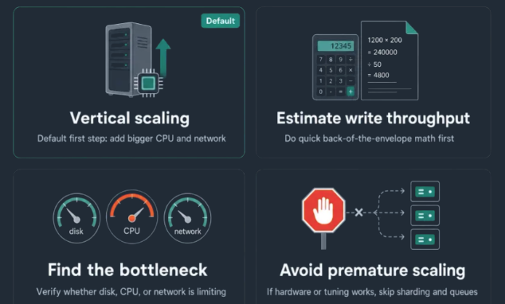
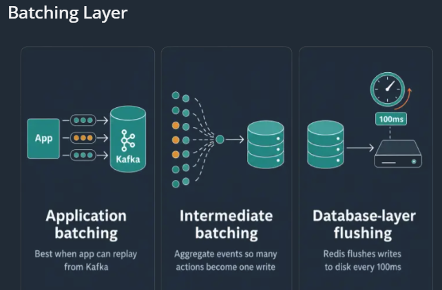
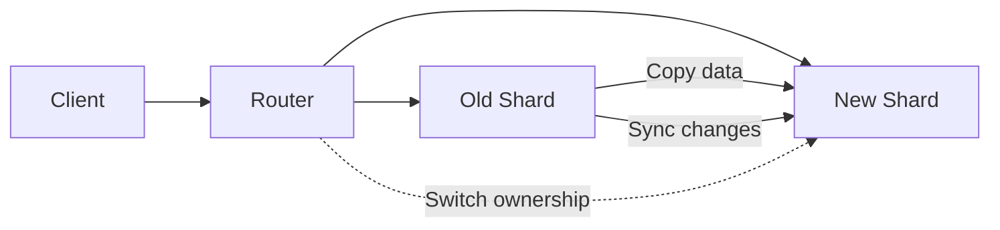
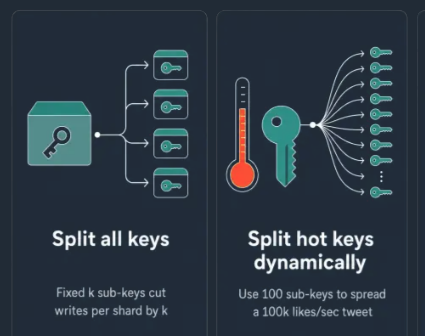
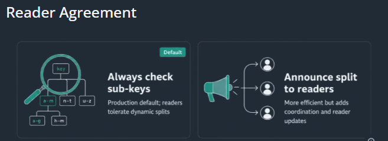

# pattern : scaling-writes
## Reference
- https://www.hellointerview.com/learn/system-design/patterns/scaling-writes
- [02_NFR_06_Read-Write-ratio.md](../SD_02_Non-functional-req/02_NFR_06_Read-Write-ratio.md)
- [02_NFR_03_Scaling.md](../SD_02_Non-functional-req/02_NFR_03_Scaling.md)
- https://excalidraw.com/#json=hNSipogaNj3Zk_8zmDGlk,3_B5MZBz1MsXhef9B3LhWg | Summary drawing

--- 
## Problem
bottleneck: 
- individual components **hit hard limits** on disk I/O, CPU, network bandwidth,etc
- **Bursty**, **high-throughput writes** with lots of **contention**  🔺
- eg: application grows from `100 w/s` to `1000000 w/s` of writes per second,

> **Write vs. Read Tension**
> - Optimizing for write performance often degrades read performance, and vice versa.
> - Different parts of your system may require different approaches.
> - the write side is often a much bigger challenge than read side

--- 
## Solution/s
> Applying the same principle : write scaling is about **reducing throughput per component**

Part-1: Survive with single-database, first
- **Vertical Scaling**
- **Database Choices**

Part-2: Then, throwing more hardware/complexity:
- **sharding and partitioning**
- Handling Bursts with **Queues and Load Shedding**
- **Batching and Hierarchical Aggregation**

> Do due diligence to confirm **bottleneck**, before prematurely adding hardware complexity:
> - back-of-the-envelope math : calculate actual write throughput  
> - next, check if it fits within our hardware capabilities. [Numbers-to-know](../SD_06_think-in-scale/01_04_Numbers-to-know.md#2-database)

---
## Part-1 Survive with single-database
### A1. vertical scaling
- cloud providers and data center operators offer substantially **more powerful hardware**, we can use before, we need to re-architect our application
- good chance hardware can go further, than you think
- [Numbers-to-know](../SD_06_think-in-scale/01_04_Numbers-to-know.md#2-database)



---
### A2. Database Choices
choose underlying data stores are already **optimized for the writes**

| Database type      | Examples              | Write/storage strategy                                                        | Best suited for                      |
| ------------------ | --------------------- |-------------------------------------------------------------------------------| ------------------------------------ |
| **Wide-column**    | Cassandra             | Append-only commit log; sequential disk writes; high write throughput `10k w/s` | High-volume distributed writes       |
| **Time-series**    | InfluxDB, TimescaleDB | Optimized for timestamped sequential writes; delta encoding/compression       | Metrics, telemetry, events           |
| **Log-structured** | LevelDB               | Appends new data rather than updating data in place                           | Fast writes and key-value workloads  |
| **Columnar**       | ClickHouse            | Efficient batch writes and column-oriented storage                            | High-throughput analytical workloads |

 Next, Further **optimize** database for writes

| Optimization                       | How it helps writes                                                                                                                                   | Trade-off / Consideration                                                           |
| ---------------------------------- | ----------------------------------------------------------------------------------------------------------------------------------------------------- | ----------------------------------------------------------------------------------- |
| **Disable expensive features**     | Temporarily disable foreign key constraints, complex triggers, or full-text search indexing during high-write periods to **reduce per-write processing**. | Can reduce data integrity or search freshness; should be used carefully.            |
| **Tune write-ahead logging (WAL)** | Configure WAL so multiple transactions can be batched before flushing to disk, reducing I/O overhead.                                                 | May increase the amount of data at risk if a failure occurs before data is flushed. |
| **Reduce index overhead**          | Remove unnecessary indexes so each write requires fewer index updates.                                                                                | Reads may become slower, especially for queries that depended on those indexes.     |

> General-purpose databases are designed to handle mixed workloads reasonably well, but they're not optimized for the extremes.

More references
- [AWS databases offerings](../../CE_02_AWS_SAA/03_database)
- [Data modelling :: choose-database](../SD_05_DataModeling/01_01_choose-database.md)

---
### A3. partitioning ⭐⭐
[partitioning](../SD_05_DataModeling/02_basic_concepts/03_02_database-partitioning.md)

---
## Part-2 throwing more hardware/complexity
### B1. Horizontal Sharding ⭐⭐
[horizonal sharding](../SD_06_think-in-scale/01_02_sharding.md)
- select a partition key that minimizes variance, in the number of **writes per shard**
- Keep in mind, that we need to also consider how the data might be **read**

---
### B2. Handling Bursts 
- partitioning and sharding will get you 80% of the way to scale and deal with steady traffic
- Real-world write traffic **isn't steady**
- some bursts are common
- but some scenario like `4x` spike on black friday (`25%` capacity working)
- solution is **Auto-scale** on system metric, **but Scaling up and down takes time.**
- so we either need to:
  - **buffer** the writes --> Queue
  - **get rid** of writes in a way , that is acceptable to the business --> Load shedding


#### Handling Bursts with Queues
benefit: most important is **burst absorption**

Challenge
- queues are inherently **async**, so clients will also often need a way to **call back to check** the write was eventually made.
- can have : **unbounded growth of our queue**.
  - app server continues to write to the queue **faster**, than records can be written to the database
  - Until the **backlog** drains, users are still waiting on writes

> Use queues when you expect to have bursts that are short-lived,

#### Handling Bursts with Load Shedding
- actually a powerful tool
- if system is overwhelmed, you need to **decide which writes to accept** and which to reject.
  - drop the less important writes
  - downside: suboptimal experience for some users.
  - it's better than letting everything fail

example:  Uber where users are reporting their locations at regular intervals. can shed call some.

>  putting some release valves in place shows, we can keep a **bad situation** (too much load) from **turning into a disaster** (system failure),

---
### B3. Batching 

- write operations have **overhead** like network round trips, transaction setup, index updates
-  most databases process batches more efficiently than individual writes
- batching writes together.
- done at the application layer 
  - application itself isn't the source of truth, 
  - no need to handle the potential for data loss.
- intermediate-processing: we can look upstream to see how we can make the incoming data easier to process.
- on Database configure `flush to disk` in ms



### B4. Hierarchical Aggregation
- benefits to **all-to-all problem**
- For high-volume data like analytics and stream processing, you often don't need to store individual events and instead need aggregated views
-  important insight is that these views can be **built up incrementally**. 
  - Hierarchical aggregation, processes data in stages, **reducing volume** at each step

---


**example**: In live video streams
- creates an ugly situation if there are millions of viewers, millions of users are writing 👈 | 
- they want to see all the latest comments and the counts

Broadcast Nodes 
- instead of writing to N viewers, we only have to write to M broadcast nodes
- Assign the users to broadcast node, using a consistent hashing scheme.
- nodes can forward updates to their respective viewers.

write processor Node
- write processor we call out to can be chosen based on the ID of the comment
- The write processors can then aggregate the likes,comment
-  forward a batch of updates to the root processor

--- 
## interview
### when to use
- proactively identify bottlenecks, validate them, and propose solutions as deep dive

understand tradeoffs: 
- Queues mean eventual consistency and delay, 
- partitioning means the read path may be compromised, cross shard joins, etc
- batching adds latency and moving pieces. 

### Use case / scenario
- https://www.hellointerview.com/learn/system-design/problem-breakdowns/instagram
- https://www.hellointerview.com/learn/system-design/problem-breakdowns/fb-news-feed
- https://www.hellointerview.com/learn/system-design/problem-breakdowns/fb-post-search
- https://www.hellointerview.com/learn/system-design/problem-breakdowns/fb-live-comments

```scenario
YouTube Top K
Strava
Rate Limiter
Ad Click Aggregator
Metrics Monitoring
Notification System

---

Instagram/Social Media
- new post
  - push: need to be written to millions of followers
  - pull ?
  - to many likes/comment, makes it write heavy ?
- sharding by user ID for posts, 
- vertical partitioning for different data types (user profiles, posts, analytics)
- hierarchical storage for older posts ?
- Live Comments, can benefit from hierarchical aggregation
- Post Search: 
    - Search applications are often write-heavy 
    - with substantial preprocessing required in order to make the search results quick to retrieve.
```

--- 
## Deep dives
💡 How do you handle **resharding** when you need to add more shards

dual-write
- Production systems use **gradual migration** which targets writes to both locations
- shard we're migrating from and the shard we're migrating to
- This allows us to migrate data gradually while **maintaining availability.**
- dual-write phase ensures **no data is lost during migration**

| Step                            | What happens                                                                                                                                                 |
| ------------------------------- | ------------------------------------------------------------------------------------------------------------------------------------------------------------ |
| **1. Add new shards**           | Provision the additional database nodes.                                                                                                                     |
| **2. Change shard mapping**     | Update the routing logic so the key space is divided across more shards.                                                                                     |
| **3. Move data**                | Copy/migrate keys from old shards to their new owners.                                                                                                       |
| **4. Keep writes synchronized** | During migration, make sure new writes reach the correct destination, often using **dual-write**, replication, or a migration mechanism built into the database. |
| **5. Switch reads**             | Once the destination shard is caught up, route reads to it.                                                                                                  |
| **6. Clean up**                 | Remove old copies after verification.                                                                                                                        |


Consistent hashing or virtual shards, 
  - **minimize** the amount of data that needs to move 
  - and allow the process to happen with minimal downtime
---

💡 What happens when you have a hot key that's too popular for even a single shard?
- eg: viral tweet that receives `100,000 likes per second`
- below 2 approaches, work for metrics that can be **aggregated** (**likes, views, counts**)



1 Split **All** Keys (fixed) : Simple
- Instead of having each tweet's likes be stored on a single shard, we can instead store them across multiple shards.
- split all keys a fixed ` k ` number of times
  - `post1Likes key --> post1Likes-0, post1Likes-1, post1Likes-2, ...,  post1Likes-k-1`
  - When reading, you aggregate the counts from all `k` keys
  - in order to get the number of likes for a given `post1Likes`, we need to reach all `k` keys

2 Split **hot** Keys (dynamically)
- breaking the hot key into multiple sub-keys dynamically, based on whether the key is hot or not
- split the like count across `100 sub-keys`, each handling `1,000` likes per second.
- both readers and writers need to be able to agree **on which keys** are hot for this to work
  - If writers are spreading writes across multiple sub-keys,
  - but readers aren't reading from all sub-keys, we have a problem!
  - sol-1:  readers always check all the sub-keys. default and best/simple ⭐
  - sol-2:  writers announce the split to the readers, more complex to implement

  

--- 
## Conclusion
https://www.hellointerview.com/learn/system-design/patterns/scaling-writes/quick-reference

- Sharding and partitioning is a great place to **start** when you're trying to scale your system
- If you're dealing with high volume analytics or numeric data, **batching and hierarchical aggregation** can give you immediate 5-10x improvements
- Finally, queues and load shedding are great tools when requirements allow for **async processing or even dropping requests**

