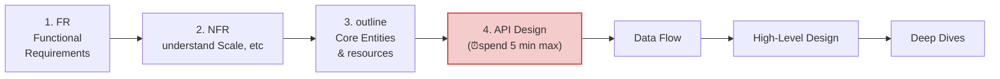

# API Design : start
- https://academy.bytemonk.io/products/system-design-mastery-beta/categories/2160312222/posts/2198424024
- https://www.youtube.com/watch?v=Ch_IBiQvZ-c
- https://www.hellointerview.com/learn/courses/system-design/lesson/foundations/api-design
- **API-first design** is essential

---
## API Overview
- API = Contract between systems
- A released API is very difficult to change because many clients depend on it.
- Even small changes can break clients:
    - endpoint names
    - request parameters
    - response fields
    - path structure
    - authentication model
---
## Interview Evaluation
Interviewers are checking:
-  Can you clarify ambiguity?
-  Can you identify resources?
-  Can you create intuitive endpoints?
-  Can you explain trade-offs?


## Design Review Mindset
```
Explain -> Discuss -> Improve -> Move on.
```

## fastest ways to improve API design skills:
```
Choose a popular product. YouTube , Twitter, Uber, etc
Design API yourself
Open official documentation
Compare
Understand why their design differs
```

## API Design Delivery Framework
- Keep API design concise in a system design interview, so you have time for dataflow, HLD and deep-dive
- API design sits in the middle, act as bridge between:
  - function req  (left)
  - system implementation (right)

> Unless explicitly asked:
> - you won't typically outline your internal APIs during the API step of the interview.
> - Instead, focus on just the user facing APIs here.
> - At most, you'll call out that internal services communicate over like RPC during your high-level design.




| Step                     | Goal                                             | Deliverable                                            |
|--------------------------|--------------------------------------------------|--------------------------------------------------------|
| **1. Requirements**      | Clarify the scope and assumptions                | Functional    Requirements                                         |
| **2. NFR**               | Scale, etc                                       | Non-Functional Requirements                            |
| **3. Core Entities**     | Identify the business objects                    | User, Tweet, Order, Driver, Ride, etc.                 |
| **4. API Design**  ⭐     | Define the contract between client and server    | REST/GraphQL/gRPC endpoints, request & response models |
| **5. Data Flow**         | Explain how a request travels through the system | Sequence diagram, component interaction                |
| **6. High-Level Design** | Design the architecture                          | Services, databases, cache, queues, load balancer      |
| **7. Deep Dives**        | Optimize and discuss trade-offs                  | Scaling, consistency, caching, partitioning, security  |


### 1. Clarifying functional requirement
- Determine the domain/scope, 
- functionalities, 
- target consumers of the API.
- open to feedback from other engineer

### 2. Understand NFR 
- number of users, 
- geographical regions, 
- data exchange payloads
- Read-heavy or write-heavy?
- Latency expectations?

**Scale affects:**
Pagination,
Rate limiting,
Response size,
Protocol choice,
Caching

### 3. outline Resources (Entities)
- Before endpoints, identify the core nouns.


