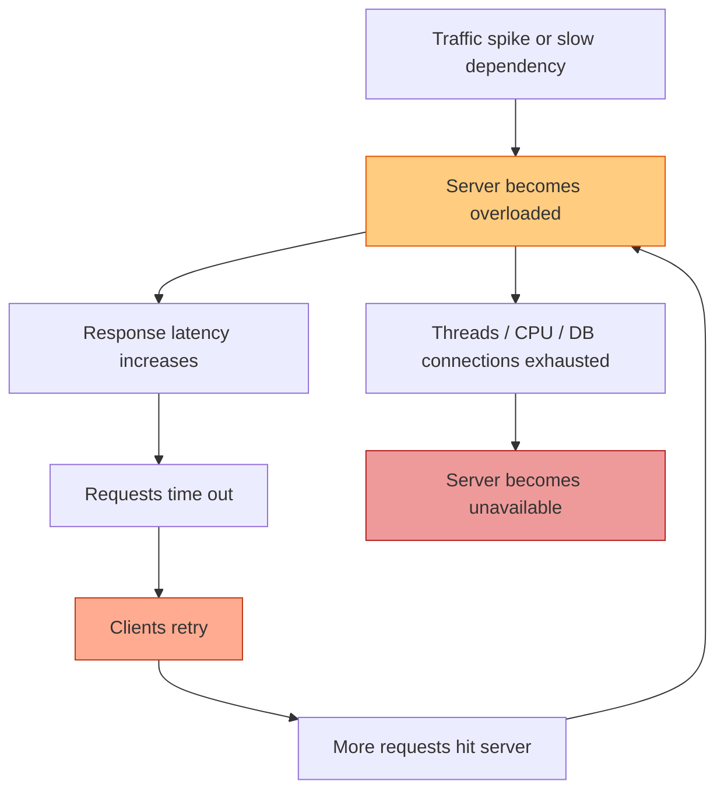
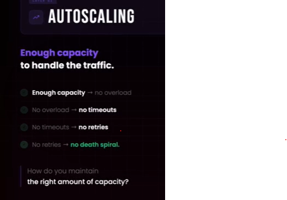

# Death spiral (cascaded failure)
- https://academy.bytemonk.io/products/system-design-mastery-beta/categories/2159577489/posts/2195511828
## Overview
- A death spiral happens when an **overloaded server becomes slower**, 
- causing clients to retry, which creates even more traffic and pushes the server toward complete failure.


```
Normal traffic:      1,000 requests/sec
Server capacity:     1,200 requests/sec

Traffic spike:       1,300 requests/sec
Timeouts occur:        300 requests retry
New traffic:         1,600 requests/sec

More timeouts → more retries → complete failure
```
---
## Causes
| Cause                            | Effect                                                     |
| -------------------------------- | ---------------------------------------------------------- |
| Immediate retries                | Multiplies traffic                                         |
| No retry limit                   | Requests retry indefinitely                                |
| Fixed retry interval             | All clients retry together                                 |
| Long request queues              | Server spends resources on requests that already timed out |
| Slow database/downstream service | Application threads remain blocked                         |

---
## Protections from "Death-spiral"
### 1. Auto-scaling 
- [check here for more detail](../SD_02_Non-functional-req/02_NFR_03_Scaling.md#protect-server-from---death-spiral-)
- Dynamically add capacity to match demand. thus prevent system from overload and thus from  death-spiral


### 2. Load shedding
[01_core_04_Load-Shedding.md](../SD_03_Core-building-blocks/01_core_04_Load-Shedding.md)

### 3. Rate limiting
[01_core_04_RateLimiting.md](../SD_03_Core-building-blocks/01_core_04_RateLimiting.md)

### N. More
- Circuit breaker + Timeouts
- Bulkheads + Random jitter
- **Retries best practice**:
  - Exponential backoff Retry
  - set Maximum retry count
  - Retry only idempotent operations
  - Return Retry-After with 429 or 503