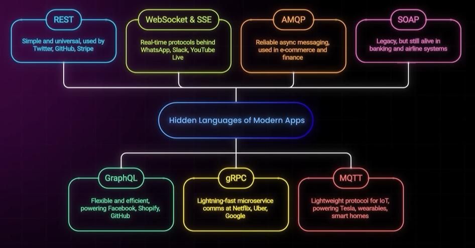

# API protocol
- https://www.youtube.com/watch?v=oyYnRVQvxv4

---
## Overview

## REST (Representational State Transfer)*
- It's simple and widely understood 
- stable, supported everywhere.
- but can sometimes lead to **excessive data transfer**
- or require **multiple requests** to gather necessary information 

## GraphQL 
- Developed by Facebook,
- GraphQL offers **flexible data fetching**, 
- allowing clients to request exactly what they need in a single query 
- This makes it efficient for mobile apps and scenarios with limited bandwidth 
- runs on top of HTTP

## WebSocket & SSE (Server-Sent Events)
- crucial for real-time communication.
- WebSockets 
  - full duplex
- SSE
  - provides one-way server-to-client streaming, 
  - efficient for continuous feeds from server
  - eg: live comments on YouTube 
  - eg: stock tickers

## gRPC / RPC (Google Remote Procedure Call)
- Built on HTTP/2 
- using Protocol Buffers (compact binary format) | lighter than json
- gRPC is designed for fast, low-latency communication between microservices 
- streaming capabilities:
  - stream of request
  - stream of response

## SOAP ⚠️
- old and heavier legacy protocol
> Still prevalent in industries requiring high security 
> and transactional integrity, such as banking and airline reservation systems

## AMQP (Advanced Message Queuing Protocol)
-  messaging protocols for asynchronous communication.
-  decouples services
- allowing messages to be reliably delivered 
  - even if a service is temporarily offline

## MQTT (Message Queuing Telemetry Transport)
-  **lightweight** publish-subscribe protocol 
- ideal for tiny **IoT devices** like smart homes and connected cars, chatting with each others