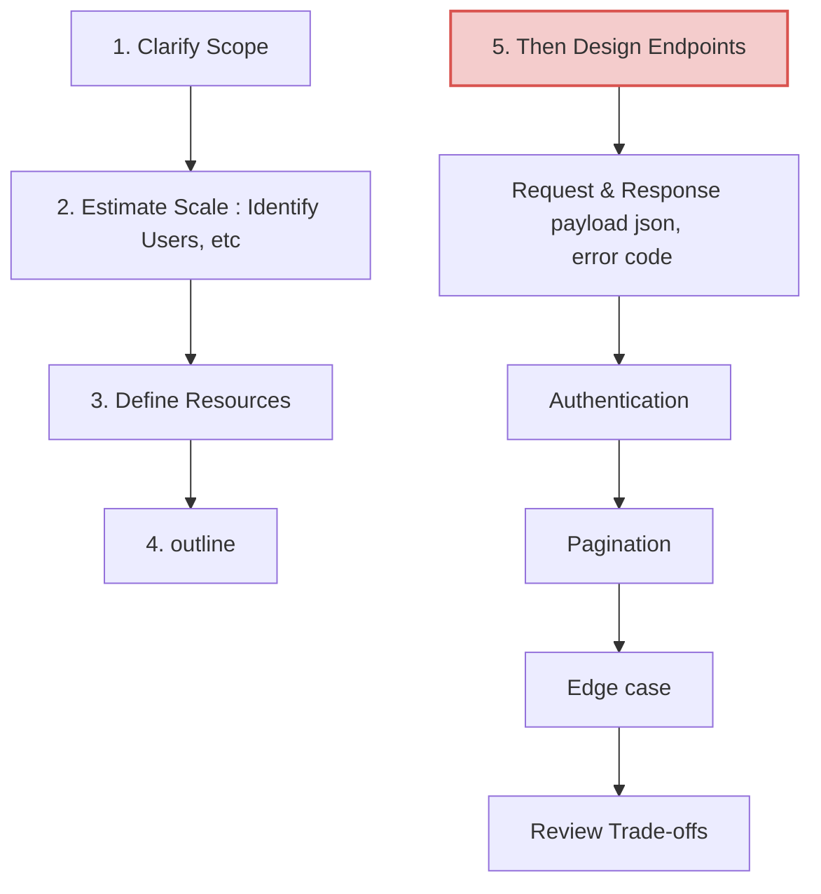

# API Design

## reference
- Java https://github.com/lekhrajdinkar/microservice-java/tree/main/docs/2012-2024/02_web
- py https://github.com/lekhrajdinkar/microservice-python/tree/main/src/webApp1
- [https_tls.md](../SD_24_security/03_protocol_https_tls.md)
- https://chatgpt.com/c/685dd143-0840-800d-8660-0f9cb8afb117
-  https://www.youtube.com/watch?v=PwNJXUdMkVY | localhost

---
## API Design Checklist



## API testing
- http://youtube.com/post/Ugkxkd6FqO2-xfvy9j0iQoXzPz1d59uxVi7_?feature=shared
- http://youtube.com/post/UgkxtozRpn2THAPQia4HrwlIUy5Ln86HTEiM?feature=shared

---
## Topics
```
Separation of Concerns
API-first Development
Service-Oriented Architecture
Event-Driven Architecture
Serverless Architecture

- use diff language for diff usecase

- more type:
    - WebSocket Pattern (for real-time)
    - gRPC for internal services
    - GraphQL Gateway

- AREA-1 :: microservice in k8s (Building modular, independently deployable services.)
    comm / network :
        - service mesh
        - Latency-based Routing (Route 53)
        - B2C : Content Delivery Pattern + AWS global acc
        - Service Registry & Discovery  
        - Event-Driven + async comm + outbox pattern
        - Strangler Fig Pattern :: Rewriting monoliths incrementally.
        - expose service
        - gateway pattern > load-balancer ALB+ACM > pod/task/app
            -  Need unified entry point, rate limiting, authentication
    
    resilient
        - Bulkhead patern
        - Circuit Breaker Pattern
        - Isolate failures with Kubernetes pod resource limits and HPA.
        
        Retry with Backoff
        Circuit Breaker
        Timeouts
        Fail-Fast Pattern
        Graceful Degradation
        Fallback Pattern
   
    performance
        - Fan-out/Fan-in Pattern :: for parallel proecssing
        - Autoscale
        - Backpressure 
            - SQS (request count) --> count metric --> HPA --> more pods
            - add ddq
            - Backpressure retries + circuit breaker
        - Rate Limiting

AREA-2 :: Kubernetes & Container Orchestration

    Sidecar Pattern (log/metrics/agent alongside app)
    Adapter Pattern (use containers to wrap legacy services)
    Ambassador Pattern (for ingress/proxy)
    
    Init Container Pattern (prep work before main container)
    
    Operator Pattern (custom CRD and controllers)
    Controller Pattern (custom automation logic in cluster)
    
    Autoscaling Pattern (HPA, VPA, Karpenter)
    
    Blue-Green Deployments
    Canary Deployments 
    
✅ Area 4: Observability & Monitoring
    Centralized Logging (Fluentd/Bit → OpenSearch/CloudWatch)
    Structured Logging
    log forwarding
    
    Distributed Tracing (OpenTelemetry → Datadog,   AWS SDK --> X-Ray)
    
    Metrics Aggregation (otel/micrometer → Prometheus/Datadog → Grafana)
    
    k8s:
        Health Check 
        Readiness Probes
        resourceLimit
        resourceQuota
        
    Alerting/Alarm/serviceNow on SLOs (SLI/SLO/SLAs with CloudWatch/Grafana)    
    partner bus (datadog)

✅ Area 5 : Security

    Zero Trust Architecture
    Token-Based Authentication (OAuth2/JWT)
    mTLS
    IAM Role-based Access Control
    Secret Management Pattern (AWS Secrets Manager, Vault)
    Audit Logging
```

## MindMap

``` mermaid
graph TD
    %% Base Web & Security Fundamentals
    subgraph Web_Fundamentals [Web & Security Fundamentals]
        HTTPS[HTTPS Security] -->|Uses| SSL[SSL Handshake]
        HTTPS -->|Creates| Tunnel[Secure Data Tunnel]
        HTML[HTML Structure] -->|Enables| Links[Hyperlinks]
    end

    %% Software Architectural Styles & Layers
    subgraph Architecture_Styles [Software Architectural Styles]
        direction TB
        style Architecture_Styles fill:#f9f9f9,stroke:#333,stroke-width:1px
        
        subgraph Layered_Architecture [Layered n-tier Architecture]
            PL[Presentation Layer] --> BL[Business Layer]
            BL --> PE[Persistence Layer]
            PE --> DL[Database Layer]
        end

        subgraph Architectural_Patterns [Key Architecture Patterns]
            MVP[MVP Architecture: Model-View-Presenter]
            Orch[Orchestration: Central Coordinator]
            Chor[Choreography]
            CQRS[CQRS: Separate Read/Write Workloads]
            Microkernel[Microkernel: Core + Plug-ins]
            MS[Microservices: Independently Deployable Modules]
            EDA[Event-Driven Architecture: Event Production & Consumption]
            DDD[Domain-Driven Design: Domain Logic Focus]
            SBA[Space-Based: Scalability & Consistency]
        end
    end

    %% Network Infrastructure Components
    subgraph Network_Infrastructure [Network Infrastructure Components]
        LB[Load Balancers] -->|Use Cases| Traffic[Traffic Distribution]
        LB -->|Use Cases| HA[High Availability]
        LB -->|Use Cases| SSLTerm[SSL Termination]
        LB -->|Use Cases| Session[Session Persistence]
        LB -->|Use Cases| Scale[Horizontal Scalability]
        LB -->|Use Cases| Health[Health Monitoring]

        FW[Firewalls] -->|Use Cases| PortRules[Port-Based Rules]
        FW -->|Use Cases| IPFilter[IP Address Filtering]
        FW -->|Use Cases| ProtoRules[Protocol-Based Rules]
        FW -->|Use Cases| TimeRules[Time-Based Rules]
        FW -->|Use Cases| StateInsp[Stateful Inspection]
        FW -->|Use Cases| AppRules[Application-Based Rules]
    end

    %% Memory Hierarchy
    subgraph Memory_Layer [Memory Hierarchy]
        direction BT
        HDD[Hard Disk Drives: Slower, Bigger, Long-term] --> SSD[Solid-State Drives: Fast Persistent]
        SSD --> RAM[Main Memory RAM: Primary App Storage]
        RAM --> Caches[Caches: Close to CPU]
        Caches --> Registers[Registers: Ultra-fast CPU Storage]
    end

    %% Links between components to show relationships
    PL --> LB
    DL --> CQRS
    DL --> Memory_Layer

```

