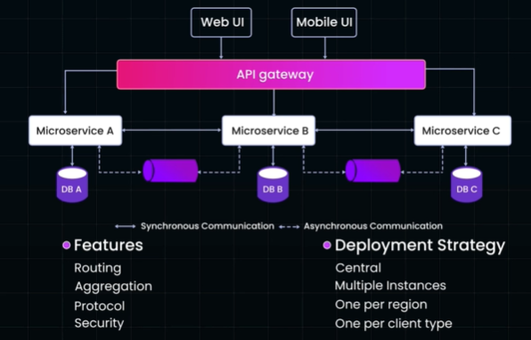

# API gateway
## Overview
- reverse proxy | [05_concept_03_proxy.md](../SD_03_Core-building-blocks/05_concept_03_proxy.md)
- acts as a **middleman** between 
  - a client (like your phone) 
  - and various backend computer programs
- protect backend programs from external attacks 

- **single entry point** for clients accessing APIs 👈🏻
  - Authentication and Authorization
  - load balancing + routing
  - Throttling/Rate Limiting
  
- **Analytics and Monitoring**
  - log usage and collect metrics on API calls
  - understand traffic trends
  - monitor response times.

---
## Cloud offering
- google's apiGee
- Azure gateway
- AWS api gateway, check their offerings here:
  - [05_1_API_gateway_SAA.md](../../CE_02_AWS_SAA/04_network/05_1_API_gateway_SAA.md)
  - [05_2_API_gateway_DVA.md](../../CE_02_AWS_SAA/04_network/05_2_API_gateway_DVA.md)

---
## Overview 2
- **single entry point** for client requests
- consolidates the **responsibilities**
    - data transformation, response aggregation, security, and routing

---
## Example
- AWS
    - [05_1_API_gateway_SAA.md](../../CE_02_AWS_SAA/04_network/05_1_API_gateway_SAA.md)
    - [05_2_API_gateway_DVA.md](../../CE_02_AWS_SAA/04_network/05_2_API_gateway_DVA.md)

- **Spring Cloud gateway**,
    - build your own
    - more maintenance and development effort

-  modern approaches using **GraphQL as API gateway** 👈🏻
