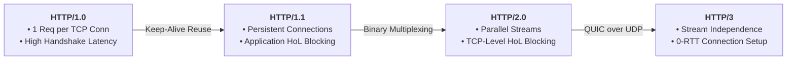

# HTTP evolution

## Overview

| HTTP Version | Underlying Transport | Connection & Request Model                                     | Key Improvements                                                                                | Core Bottleneck / Trade-off                                                                                                              |
| ------------ | -------------------- | -------------------------------------------------------------- | ----------------------------------------------------------------------------------------------- | ---------------------------------------------------------------------------------------------------------------------------------------- |
| **1.0** | TCP                  | Typically **1 TCP connection → 1 request → close**             | Simple request-response model                                                                   | High latency from repeated TCP + TLS handshakes                                                                                          |
| **1.1** | TCP                  | **1 persistent TCP connection → multiple sequential requests** | `keep-alive`, pipelining support, chunked transfer, better caching                              | **Application-level HoL blocking:** pipelined responses must maintain order; browsers often use multiple TCP connections as a workaround |
| **2**   | TCP                  | **1 TCP connection → multiple concurrent streams**             | **Multiplexing**, binary framing, HPACK header compression, stream prioritization               | **TCP-level HoL blocking:** one lost TCP packet can temporarily block delivery across all streams                                        |
| **3**   | **QUIC over UDP**    | **1 QUIC connection → multiple independent streams**           | Eliminates TCP-level HoL blocking, QPACK, faster connection establishment, connection migration | More complex transport implementation; UDP/QUIC processing can require more CPU                                                          |

---
## Http 1

---
## Http 1.1

---
## Http 2.0

---
## Http 3