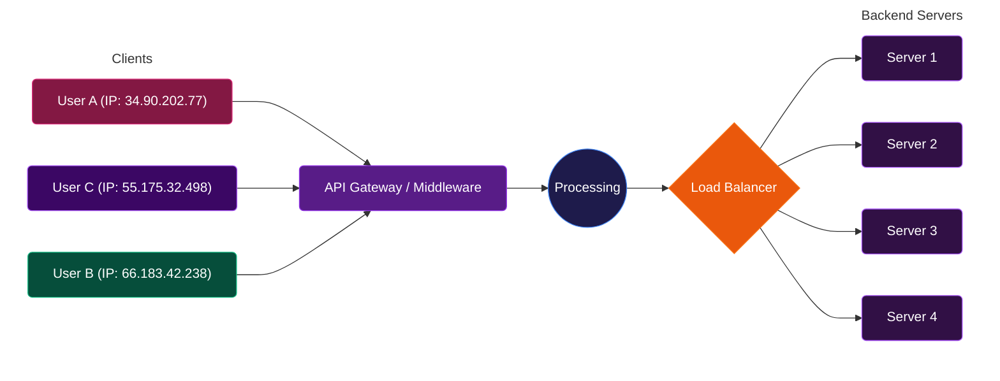

# API gateway
- https://youtube.com/watch?v=JNmiOw26PGg
- https://youtube.com/watch?v=BWB-S0awDnA | API gateway vs Load balancer

---
## Overview
> GraphQL as API-gateway

**Reverse proxy** act as **single entry point** between a client and various backend ms/API
  - data transformation, response aggregation
  - **load balancing and routing**
  - Security: Authn and Authz, TLS termination, Throttling, Rate Limiting
  - caching  
  - **Analytics and Monitoring**
    - log usage and collect metrics on API calls
    - understand traffic trends
    - monitor response times.

## Options
**cloud provided**
- [05_1_API_gateway_SAA.md](../../../CE_02_AWS_SAA/04_network/05_1_API_gateway_SAA.md)
- [05_2_API_gateway_DVA.md](../../../CE_02_AWS_SAA/04_network/05_2_API_gateway_DVA.md)

**Custom build**
- build your own with Spring Cloud gateway,etc
- more maintenance and development effort

---
## API gateway in front of LB

