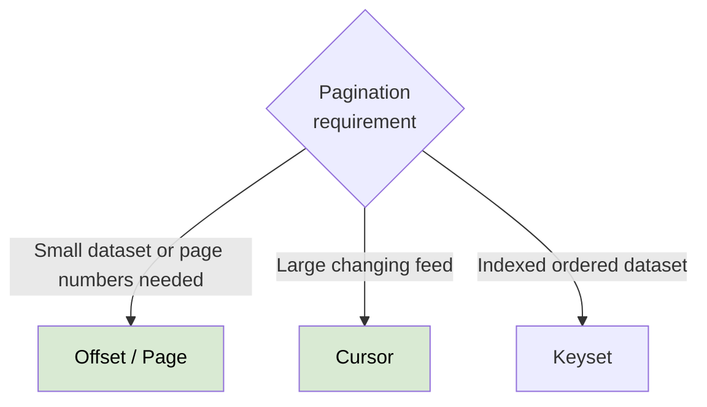

# Pagination
- https://academy.bytemonk.io/products/system-design-mastery-beta/categories/2160312224/posts/2198424019
## Overview
- Pagination prevents an API from returning an entire large dataset in one response.
- It improves:
```
response latency
memory usage
network cost
database load
client rendering performance
```
## Type

| Type             | Example                   | Best for                             | Main problem                                         |
| ---------------- | ------------------------- | ------------------------------------ | ---------------------------------------------------- |
| **Offset-based** | `?limit=20&offset=40`     | Admin screens, small/stable datasets | Slow for deep pages; duplicates/skips during updates |
| **Page-based**   | `?page=3&pageSize=20`     | Human-friendly UI pages              | Same limitations as offset                           |
| **Cursor-based** | `?limit=20&cursor=abc123` | Feeds, timelines, large datasets     | Cannot easily jump to page 50                        |
| **Keyset-based** | `?limit=20&afterId=500`   | High-scale ordered data              | Requires stable indexed sort columns                 |

### 1. Offset-based
- GET /posts?limit=20&offset=40

```sqlite-psql
SELECT * FROM posts ORDER BY created_at DESC
LIMIT 20 OFFSET 40; -- 👈
```

**Problems**
- For a large offset, the database may scan and discard (skip/offset) many rows.
- Also, when new posts are inserted between requests, clients may see:
duplicate records,
skipped records, due to shift up/down effect.

### 2. Cursor Pagination
cursor:
-  solves this by using a **pointer to a specific record**, instead of counting from the beginning.
-  cursor is typically an **encoded reference** to a specific record (like an ID or timestamp)
-  more stable because it's not affected by new records being added


- first request : GET /posts?limit=20
- response:
```json
{
  "data": [
    {
      "id": "post-101",
      "title": "API Design"
    }
  ],
  "pagination": {
    "nextCursor": "eyJjcmVhdGVkQXQiOiIyMDI2LTA4LTA1In0=",
    "hasMore": true
  }
}
```
- next response: 
  - GET /posts?limit=20&cursor=eyJjcmVhdGVkQXQiOiIyMDI2LTA4LTA1In0=
  - The cursor normally contains or references the last item's 👈

```sqlite-psql
SELECT *
FROM posts
WHERE (created_at, id) < (:last_created_at, :last_id)
ORDER BY created_at DESC, id DESC
LIMIT 20;
```

Downside:
- cursor pagination is designed for sequential navigation, not random page jumping.
- but it's harder to implement features like "jump to page 3."


you can maintain a cursor map:

```
Page 1 → cursor A
Page 2 → cursor B
Page 3 → cursor C
...
Page 50 → cursor X
```

---
### Summary


> Interview rule: 
> - Use offset pagination for simple administrative interfaces; 
> - use cursor/keyset pagination for large, frequently changing feeds.