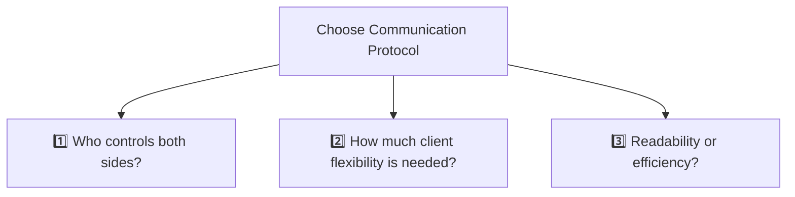
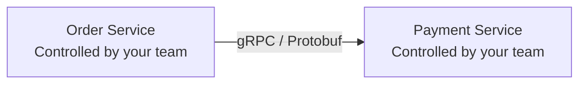
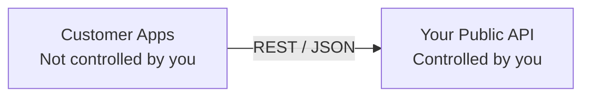

# API Design : choose protocol
- https://academy.bytemonk.io/products/system-design-mastery-beta/categories/2160312223/posts/2198424022
- https://www.youtube.com/watch?v=oyYnRVQvxv4
- [Communication-pattern ⭐](../SD_03_Core-building-blocks/SD_03_54_Communication-pattern)
---
## Choose right Protocols 


### 1. Answer Three Questions


| Question                                         | If Yes                                  | Choose              | Why                                  |
|--------------------------------------------------| --------------------------------------- | ------------------- | ------------------------------------ |
| **1 Who controls both API-client & API-server?** | Same organization (microservices)       | **gRPC / RPC**      | Maximum performance and type safety  |
| **2 Does the client need flexible data?**        | Different screens need different fields | **GraphQL**         | Client fetches exactly what it needs |
| **3 Need a simple, public, readable API?**       | External clients or CRUD APIs           | **REST**            | Standard, cacheable, easy to adopt   |

**Explanation: Who controls both sides**
- Both services are developed by your organization.
- You can coordinate changes:
  - Update the server contract
  - Regenerate client code
  - Deploy both services
  - Enforce Protobuf schemas
  - Use binary communication

So gRPC/RPC becomes a strong choice.




---
### 2. Check scenario
1. Sync request-response scenario
2. live-streaming scenario
3. Async messaging scenario

check below for detail:

---
## A. Protocol: sync request-response

> SOAP ⚠️
> - Old and heavier legacy protocol
> - Still prevalent in industries requiring high security
    > and transactional integrity, such as banking , airline reservation systems

| Protocol                        | Best for                                  | Strength                                        | Limitation                                        |
|---------------------------------| ----------------------------------------- | ----------------------------------------------- | ------------------------------------------------- |
| **REST**  for Simplicity        | Public APIs, CRUD, web/mobile clients     | Simple, cacheable, widely supported             | Over-fetching and multiple requests               |
| **GraphQL**  for Flexibility    | UI-heavy apps with flexible data needs    | Client requests exactly required fields         | Complex caching, security, and query-cost control |
| **RPC / gRPC**  for Performance | Internal service-to-service communication | Fast, strongly typed, efficient binary protocol | Less browser-friendly and tightly coupled         |


### 1. REST (Representational State Transfer)
- [REST Done right.md](03_rest_01_best-principles.md#a-rest-done-right)
- It's simple and widely understood
- stable, supported everywhere.
- but can sometimes lead to **excessive data transfer**
- or require **multiple requests** to gather necessary information

### 2. GraphQL
- https://academy.bytemonk.io/products/system-design-mastery-beta/categories/2160312223/posts/2198424021
- Developed by Facebook,
- GraphQL offers **flexible data fetching**,
- allowing clients to request exactly what they need in a single query
- This makes it efficient for mobile apps and scenarios with limited bandwidth
- runs on top of HTTP

### 3. gRPC / RPC (Google Remote Procedure Call)
> RPC treats a remote service call like calling a local function
- Built on HTTP/2
- Fast binary payload with gRPC/Protobuf + Generated client/server code
- Good for low-latency service-to-service calls
- Both services are controlled by the same organization

- Unlike REST, RPC endpoints usually describe actions, not resources.
```
CreatePost
IndexPost
RankPost
GetRecommendations
```
> - REST: What resource do you want?
> - RPC: What operation do you want the service to execute?

| REST                   | RPC                          |
| ---------------------- | ---------------------------- |
| Resource-oriented      | Action-oriented              |
| `GET /posts/123`       | `GetPost(123)`               |
| Usually JSON/HTTP      | Often Protobuf/HTTP2         |
| Better for public APIs | Better for internal services |
| Looser coupling        | Tighter contract             |


---
## B. Protocol: live Streaming
### 1. WebSocket
- crucial for real-time persistent communication.
- full duplex

### 2. SSE (Server-Sent Events)
- provides one-way server-to-client streaming
- efficient for continuous feeds from server
- eg: live comments on YouTube
- eg: stock tickers

### 3. gRPC streaming

---
## C. Protocol: Async messaging
### 1. AMQP (Advanced Message Queuing Protocol)
-  messaging protocols for asynchronous communication.
-  decouples services
- allowing messages to be reliably delivered
    - even if a service is temporarily offline

### 2. MQTT (Message Queuing Telemetry Transport)
-  **lightweight** publish-subscribe protocol
- ideal for tiny **IoT devices** like smart homes and connected cars, chatting with each others