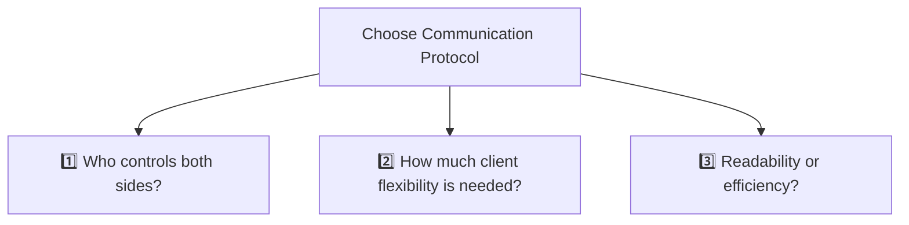
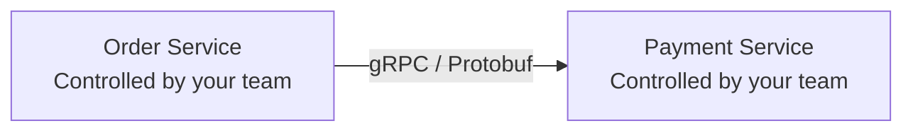
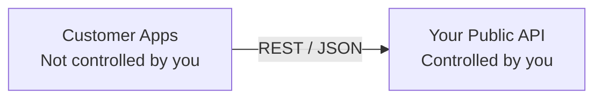

# API Design : choose protocol
- https://academy.bytemonk.io/products/system-design-mastery-beta/categories/2160312223/posts/2198424022 | choose protocol
- https://www.youtube.com/watch?v=oyYnRVQvxv4 | all protocol - overview
- https://youtu.be/AMNWLz_f6qM?si=4XOhFrP3EwsTYrpB | REST vs gRPC in Microservices ... ⭐
- [service Communication pattern (4) ⭐](../SD_03_Core-building-blocks/SD_03_54_Communication-pattern)
---
## Choose right Protocols 

### 1. Answer Three Questions

| Question                                         | If Yes                                  | Choose              | Why                                  |
|--------------------------------------------------| --------------------------------------- | ------------------- | ------------------------------------ |
| **1 Who controls both API-client & API-server?** | Same organization (microservices)       | **gRPC / RPC**      | Maximum performance and type safety  |
| **2 Does the client need flexible data?**        | Different screens need different fields | **GraphQL**         | Client fetches exactly what it needs |
| **3 Need a simple, public, readable API?**       | External clients or CRUD APIs           | **REST**            | Standard, cacheable, easy to adopt   |

**Explanation: Who controls both sides**
- Both services are developed by your organization.
- You can coordinate changes:
  - Update the server contract
  - Regenerate client code
  - Deploy both services
  - Enforce Protobuf schemas
  - Use binary communication

So gRPC/RPC becomes a strong choice.

---
### 2. Check scenario
1. Sync request-response scenario
2. live-streaming scenario
3. Async messaging scenario

check below for detail:

---
## A. Protocol for :: request-response (sync)
[synchronous comm pattern](../SD_03_Core-building-blocks/SD_03_54_Communication-pattern/01_synchronous.md)

> SOAP ⚠️
> - Old and heavier legacy protocol
> - Still prevalent in industries requiring high security
    > and transactional integrity, such as banking , airline reservation systems

| Protocol                        | Best for                                  | Strength                                        | Limitation                                        |
|---------------------------------| ----------------------------------------- | ----------------------------------------------- | ------------------------------------------------- |
| **REST**  for Simplicity        | Public APIs, CRUD, web/mobile clients     | Simple, cacheable, widely supported             | Over-fetching and multiple requests               |
| **GraphQL**  for Flexibility    | UI-heavy apps with flexible data needs    | Client requests exactly required fields         | Complex caching, security, and query-cost control |
| **RPC / gRPC**  for Performance | Internal service-to-service communication | Fast, strongly typed, efficient binary protocol | Less browser-friendly and tightly coupled         |

### 1. REST (Representational State Transfer)
- [03_rest_01_best-principles.md](11_rest_01_best-principles.md)
- [03_rest_02_http-headers.md](11_rest_02_http-headers.md)
- [03_rest_03_http-evolution.md](11_rest_03_http-evolution.md)

### 2. GraphQL
[13_graphQL_01_overview.md](13_graphQL_01_overview.md)

### 3. gRPC / RPC (Google Remote Procedure Call)
[12_grpc_01_overview.md](12_grpc_01_overview.md)

---
## B. Protocol for :: Streaming
SEE, WS, gRPC-stream:
[streaming comm pattern](../SD_03_Core-building-blocks/SD_03_54_Communication-pattern/03_streaming.md#2-websocket--wss)

---
## C. Protocol for :: messaging (async)
Kafka, AMQP, MQTT
- [Messaging protocols](../../PE_03_message-broker/02_Messaging-protocols.md) 
- [asynchronous comm pattern](../SD_03_Core-building-blocks/SD_03_54_Communication-pattern/02_asynchronous.md)