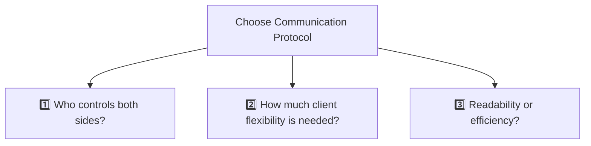
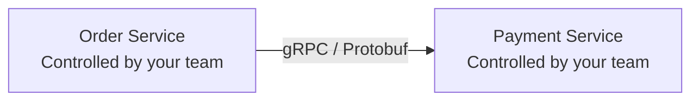
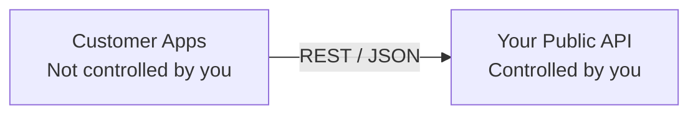

# API Design : choose protocol
- [API network-protocol](01_concept_01_network-protocols.md)
- https://academy.bytemonk.io/products/system-design-mastery-beta/categories/2160312223/posts/2198424022

---
## Protocols 
### 1. request-response scenario

| Protocol       | Best for                                  | Strength                                        | Limitation                                        |
| -------------- | ----------------------------------------- | ----------------------------------------------- | ------------------------------------------------- |
| **REST**       | Public APIs, CRUD, web/mobile clients     | Simple, cacheable, widely supported             | Over-fetching and multiple requests               |
| **GraphQL**    | UI-heavy apps with flexible data needs    | Client requests exactly required fields         | Complex caching, security, and query-cost control |
| **RPC / gRPC** | Internal service-to-service communication | Fast, strongly typed, efficient binary protocol | Less browser-friendly and tightly coupled         |

> - REST = Simplicity
> - GraphQL = Flexibility
> - gRPC = Performance

### 2. live-streaming scenario
- websocket
- SSE
- gRPC-streaming

---
## Three Questions

| Question                                         | If Yes                                  | Choose              | Why                                  |
|--------------------------------------------------| --------------------------------------- | ------------------- | ------------------------------------ |
| **1 Who controls both API-client & API-server?** | Same organization (microservices)       | **gRPC / RPC**      | Maximum performance and type safety  |
| **2 Does the client need flexible data?**        | Different screens need different fields | **GraphQL**         | Client fetches exactly what it needs |
| **3 Need a simple, public, readable API?**       | External clients or CRUD APIs           | **REST**            | Standard, cacheable, easy to adopt   |

### 1. Who controls both sides
- Both services are developed by your organization.
- You can coordinate changes:
  - Update the server contract
  - Regenerate client code
  - Deploy both services
  - Enforce Protobuf schemas
  - Use binary communication

So gRPC/RPC becomes a strong choice.

