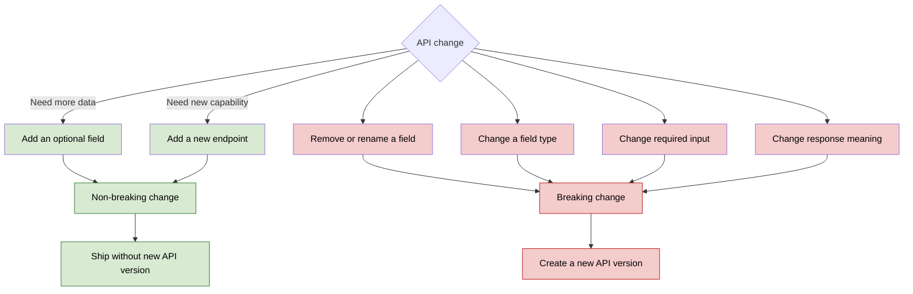
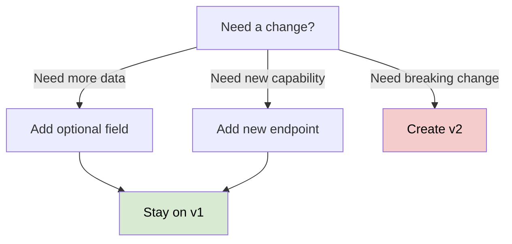
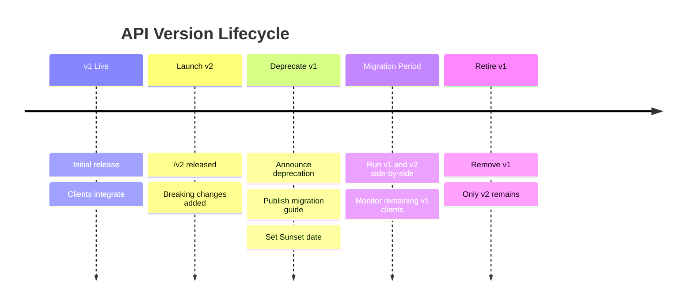

# API Versioning
## Overview
- API versioning allows you to **introduce breaking changes** without breaking existing clients.
```
Breaking changes include:

    Removing or renaming fields
    Changing field types
    Changing response structure
    Changing endpoint behavior
    Making an optional field required

```
```
Non-Breaking changes include:

    Adding a new optional response field is usually backward compatible
    Adding new capbility (new endpoint)
```


---
## Design API to Evolve
Goal of API Evolution
- The goal is not to become good at versioning.
- The goal is to avoid needing new versions.
>Design your API so that it grows through additive changes.


## Common Versioning Strategies
### 1. URL Path Versioning
```
GET /v1/users/123
GET /v2/users/123
```
> Most common and interview-friendly.

Advantages:
- Explicit and easy to understand
- Easy to route, document, and monitor
- Different versions can run independently

Disadvantage:
- Version becomes part of the resource URL
- Run old and new versions **side-by-side** until clients have migrated, then retire the old version.



### 2. Header Versioning
```
GET /users/123
Accept: application/vnd.company.v2+json
---
Custom header:
    App-version : 2
    X-Version : 2
```
Advantages:
- Clean resource URL
- Supports content negotiation


### 3. param Versioning
```
GET /users/123?version=2
```
- Simple, but usually less preferred because versioning is mixed with filtering parameters and may complicate caching.