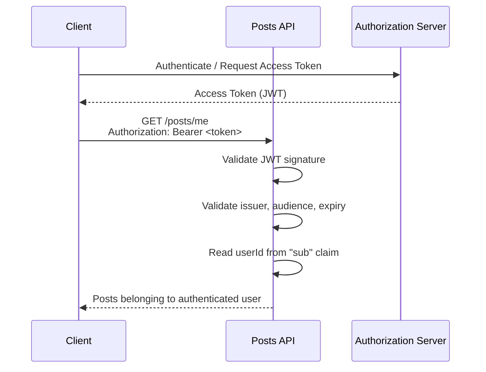

# API Security
- https://academy.bytemonk.io/products/system-design-mastery-beta/categories/2160312224/posts/2198424023
- security section :[SD_03_security](../SD_24_security)
- https://www.youtube.com/watch?v=4bQeGUzHpOE | Security headers

> token exchange must happen over HTTPS

## JWT vs Session Token
- JWT = self-contained, stateless, easy to scale.
- Session = server-controlled, easy to revoke.

|                   | **JWT**  ✔️               | **Session Token**              |
| ----------------- |---------------------------| ------------------------------ |
| Stored            | Client                    | Client                         |
| User/session data | Inside token (claims)     | On server                      |
| Server state      | **Stateless**             | **Stateful**                   |
| Validation        | Verify signature + expiry | Lookup session in server store |
| **Revocation**        | Harder                    | Easy                           |
| Scaling           | Easier across servers     | Requires shared session store  |
| Typical use       | APIs, microservices       | Traditional web apps           |

--- 
## API Authn
- basic Auth
- API Key
- oidc (id token) ✔️

## API Authz
- OAuth2.1  (access token )✔️
- RBAC, method level access
- `401` : not authenticated
- `403` : authenticated, but not allowed

## API Key
- long, randomly generated strings that act like passwords for applications rather than humans.
- API keys don't expire or carry user context.
- working:
    - you generate a unique API key for each client (like sk_live_abc123def456...),
    - store it in your database along with any permissions or rate limits for that client,
    - and then verify each incoming request by looking up the key.
- use case:
    - perfect for server-to-server communication |  straightforward and effective.
    - exposing your endpoints to 3rd party developers who need programmatic access to your system.
  
---
## Security headers
- `Strict-Transport-Security: max-age=63072000; includeSubDomains; preload` Forces HTTPS
- `Content-Security-Policy: default-src 'self'; script-src 'self'` Controls allowed resources
- `X-Content-Type-Options: nosniff` Prevents MIME sniffing
- `X-Frame-Options: DENY` Prevents clickjacking
- `Referrer-Policy: strict-origin-when-cross-origin` Controls referrer leakage
- `Permissions-Policy: geolocation=(), camera=(), microphone=()` Restricts browser features
- `Cache-Control: no-store` Disables caching

**Recommended Secure Baseline**
```
Strict-Transport-Security: max-age=63072000; includeSubDomains; preload
Content-Security-Policy: default-src 'self'
X-Content-Type-Options: nosniff
X-Frame-Options: DENY
Referrer-Policy: strict-origin-when-cross-origin
Permissions-Policy: geolocation=(), camera=(), microphone=()
```

## rate limiting
- implement rate limiting at the API gateway level
- [SD_04_protecting-servers](../SD_04_protecting-servers)

Common strategies include:
- **Per-user limits**: 1000 requests per hour per authenticated user
- **Per-IP limits**: 100 requests per hour for unauthenticated requests
- **Endpoint-specific limits**: 10 booking attempts per minute to prevent ticket scalping
---
## Interview
### Tip-1
- Authentication: Identity Comes From the Token
- Do not trust a user identity sent by the client in the URL or body. 👈
```
=== bad ===
GET /posts?userId=42
or 
{    "userId": 42   }

Both can be modified by the caller.
```
- The backend validates the token and reads the authenticated identity from its claims:




