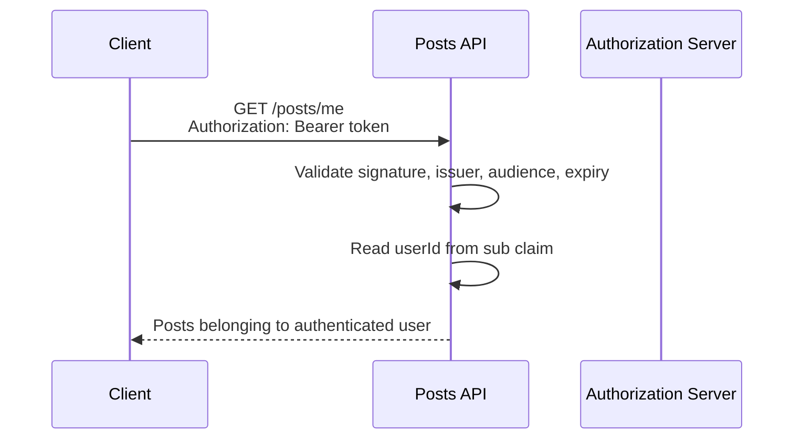

# API Security
- https://academy.bytemonk.io/products/system-design-mastery-beta/categories/2160312224/posts/2198424023
- security section :[SD_03_security](../SD_24_security)
- https://www.youtube.com/watch?v=4bQeGUzHpOE | Security headers

> token exchange must happen over HTTPS
--- 
## API Authn
- basic Auth
- API Key
- oidc (id token) ✔️

## API Authz
- OAuth2.1  (access token )✔️
- RBAC, method level access
- `401` : not authenticated
- `402` : authenticated, but not allowed

---
## Security headers
- `Strict-Transport-Security: max-age=63072000; includeSubDomains; preload` Forces HTTPS
- `Content-Security-Policy: default-src 'self'; script-src 'self'` Controls allowed resources
- `X-Content-Type-Options: nosniff` Prevents MIME sniffing
- `X-Frame-Options: DENY` Prevents clickjacking
- `Referrer-Policy: strict-origin-when-cross-origin` Controls referrer leakage
- `Permissions-Policy: geolocation=(), camera=(), microphone=()` Restricts browser features
- `Cache-Control: no-store` Disables caching

**Recommended Secure Baseline**
```
Strict-Transport-Security: max-age=63072000; includeSubDomains; preload
Content-Security-Policy: default-src 'self'
X-Content-Type-Options: nosniff
X-Frame-Options: DENY
Referrer-Policy: strict-origin-when-cross-origin
Permissions-Policy: geolocation=(), camera=(), microphone=()
```
---
## Interview
### Tip-1
- Authentication: Identity Comes From the Token
- Do not trust a user identity sent by the client in the URL or body.
```
=== bad ===
GET /posts?userId=42
or 
{    "userId": 42   }

Both can be modified by the caller.
```
- The backend validates the token and reads the authenticated identity from its claims:




