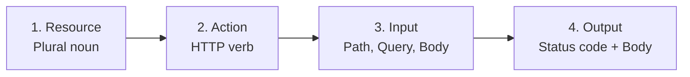

# Best principles for designing REST APIs
- https://www.youtube.com/watch?v=pJ83mmqcvoQ
- http://youtube.com/post/UgkxLxv7GwjfLpkPlyy-j3FaW5BBdVIXJAcc?feature=shared
- https://academy.bytemonk.io/products/system-design-mastery-beta/categories/2160312222/posts/2198424017

## Overview
> lightweight, scalable, and user-friendly
- It's simple and widely understood
- stable, supported everywhere.
- but can sometimes lead to **excessive data transfer**
- or require **multiple requests** to gather necessary information

---
## A. REST Done right


### 1. Resource:
- **Use nouns, not actions**, for URIs to identify resources 
  - GET /customers - good
  - GET /pull-customers - bad
- use plurals
  - GET /customers
  - GET /customers/{id}
- Use hierarchical URIs for **nested resources** 
  - e.g. /customers/123/orders

### 2. HTTP Verbs
- HEAD get with header response
- OPTION, check allowed option, CORS-preflight request
```
example:
OPTIONS /posts/123
    HTTP/1.1 204 No Content
    Allow: GET, PUT, PATCH, DELETE, OPTIONS
```

| Verb     | Purpose                        |       Usually idempotent? |
| -------- | ------------------------------ | ------------------------: |
| `GET`    | Read resource                  |                       Yes |
| `POST`   | Create or trigger an operation |                        No |
| `PUT`    | Replace entire resource        |                       Yes |
| `PATCH`  | Partially update resource      | Depends on implementation |
| `DELETE` | Remove resource                |                       Yes |

### 3. input
#### 3.1 Path parameter
- identify a required resource
```
GET /posts/123
GET /users/42
```
- Nested path — show resource relationship
```
// Use nesting when the child logically belongs to the parent.
GET /users/42/posts
GET /posts/123/comments

// Avoid excessive nesting:
GET /users/42/posts/123/comments/9/replies
GET /comments/9/replies  is better :)
```

#### 3.2 Query parameter
- optional filtering or modification
```
GET /posts?limit=25&sort=top
GET /posts?authorId=42&status=published
GET /posts?cursor=abc123
```
Common uses:
- filtering
- sorting
- searching
- pagination
- field selection

#### 3.3 Request body 
- send structured data for resource

```
POST /posts
Content-Type: application/json

{
  "title": "API Design",
  "body": "REST principles"
}
```
---
### 4. output
#### 4.1 HTTP Status Codes
- 2XX
- 4XX
- 5XX

|                        Code | Meaning                           |
| -------------------------- | --------------------------------- |
|                    `200 OK` | Successful read or update         |
|               `201 Created` | Resource created                  |
|              `202 Accepted` | Async processing started          |
|            `204 No Content` | Success without response body     |
|           `400 Bad Request` | Invalid request                   |
|          `401 Unauthorized` | Authentication missing or invalid |
|             `403 Forbidden` | Authenticated but not allowed     |
|             `404 Not Found` | Resource does not exist           |
|              `409 Conflict` | State conflict or duplicate       |
| `422 Unprocessable Content` | Validation failed                 |
|     `429 Too Many Requests` | Rate limit exceeded               |
| `500 Internal Server Error` | Unexpected server failure         |


#### 4.2 response body
Error body
```
{
  "error": {
    "code": "INVALID_TITLE",
    "message": "Title must be between 1 and 200 characters",
    "requestId": "req-789"
  }
}
```

#### 4.3 response headers when relevant


---
## B. More
### Error Handling :
- Provide clear, consistent, and descriptive error messages,
- often using global exception handling in frameworks like Spring.

### Validation :
- Validate incoming request data using frameworks
- like Hibernate Validator to ensure data integrity.

### API Versioning :
- Implement versioning, to manage API changes without breaking existing applications.
    - URI versioning like /v1/customers
    - header versioning like Accept-Version: V1)

### Pagination, Filtering, Sorting :
- Manage large datasets efficiently by implementing pagination,
- filtering (using query parameters),
- and sorting options to enhance usability.

### HATEOAS
- (Hypermedia as the Engine of Application State)
- Enhance API discoverability by including hypermedia links in responses,
- guiding clients on possible next actions.

### Security :
- Ensure API security by using HTTPS for encrypted communication
- and implementing authentication (e.g., OAuth 2.0, JWT)
- and authorization mechanisms, often with tools like Spring Security.
- Rate Limiting and throttling