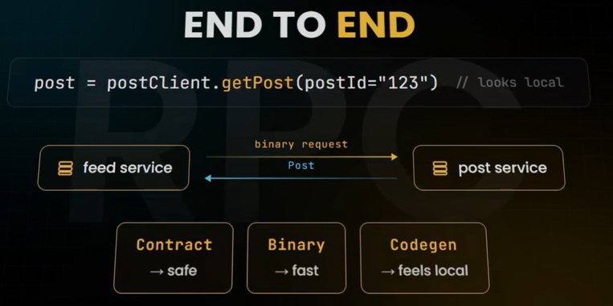

# RPC
- https://youtube.com/watch?v=4w8pEyJMpvo
- https://www.hellointerview.com/learn/courses/system-design/lesson/foundations/api-design
> Apache Thrift, gRPC, etc

---
## Overview
> - RPC treats a remote service call like calling a local function
> - ecosystem is not matured as REST (simple JSON over HTTP. )



- Built on:
  - **HTTP/2** for transport
  - protocol buffer for  serialization
    - binary serialization
    - Fast compact/small  
- contract:
  - `.proto` file that describes your service methods and data structures
  - From this single definition, gRPC generates client and server code in multiple programming languages.
  - hence, **compile-time type safety**

```
=== sample .proto file ===

service TicketService {
  rpc GetEvent(GetEventRequest) returns (Event);
  rpc CreateBooking(CreateBookingRequest) returns (Booking);
  rpc GetAvailableTickets(GetTicketsRequest) returns (TicketList);
}

message GetEventRequest {
  string event_id = 1;
}

message Event {
  string id = 1;
  string name = 2;
  int64 date = 3;
  Venue venue = 4;
}
```

---
## use case
Good for:
- Both services are controlled by the **same organization**
- **Performance** is critical: Binary serialization and HTTP/2 make RPC significantly faster than JSON REST
- **Type safety** matters: Generated client code prevents many runtime errors
- **Service-to-service communication**: Internal APIs between your own services don't need REST's resource semantics
- **Streaming** is needed: gRPC supports bidirectional streaming for real-time features

not good for:
- limited browser support, hence hard for UI developer to work with.

---
## REST vs GRPC
- Unlike REST's resource-oriented approach, RPC is action-oriented
```
CreatePost
IndexPost
RankPost
GetRecommendations
```
> - REST: What resource do you want?
> - RPC: What operation do you want the service to execute?

| REST                   | RPC                              |
| ---------------------- |----------------------------------|
| Resource-oriented      | Action-oriented                  |
| `GET /posts/123`       | `GetPost(123)`                   |
| Usually JSON/HTTP      | Often Protobuf/HTTP2             |
| Better for public APIs | Better for internal services     |
| Looser coupling        | Tighter contract / strong typing |

