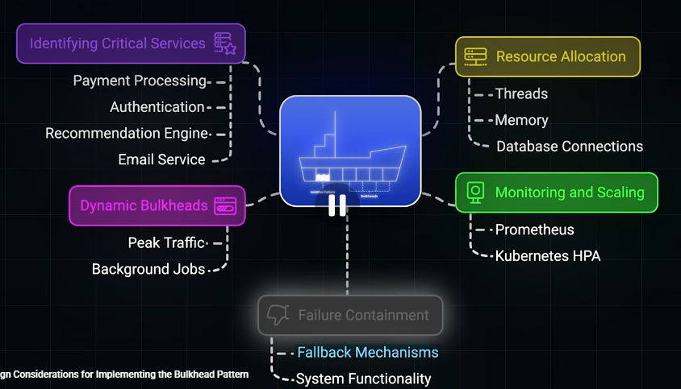
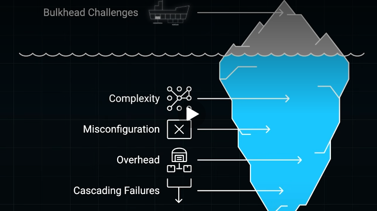
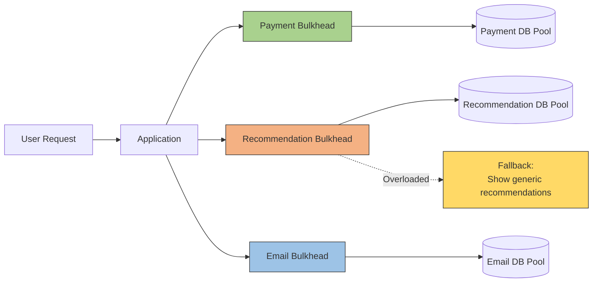

# Bulk head
- https://youtube.com/watch?v=2I3-lbnMXec
> Bulkhead = partition limited resources into independent pools so exhaustion or failure in one workload cannot starve the whole system.
---
## Overview
- Inspired by ship construction, 👈
- a crucial resilience strategy for microservices architecture designed to prevent cascading failures in a system.
- isolates system components so that if one part fails (e.g., due to a surge in background tasks), it does not crash the entire platform (0:23-0:31).




---
## 1. Identify Critical Services
Not every service should get the same resource priority.
```
Critical:
- Payment Processing
- Authentication

Less critical:
- Recommendation Engine
- Email Service
```

---
## 2. Resource Allocation

| Resource       | Bulkhead isolation example           |
| -------------- | ------------------------------------ |
| Threads        | Separate thread pools                |
| Memory         | Separate container/pod memory limits |
| DB connections | Separate connection pools            |
| CPU            | Kubernetes CPU requests/limits       |
| Workers        | Dedicated worker pools               |

```
Payment Service
 └── Thread Pool: 50
 └── DB Connections: 30

Email Service
 └── Thread Pool: 10
 └── DB Connections: 5
```

---
## 3. Dynamic Bulkhead
- Resource allocation can change based on workload.
- This is useful when traffic patterns vary significantly.

```
Normal traffic
    Payment → 30 workers
    Background jobs → 20 workers

Peak traffic
    Payment → 45 workers
    Background jobs → 5 workers
```

---
## 4. Monitoring + Scaling
Bulkheads need monitoring; otherwise an isolated pool can still become exhausted.
```
Monitor:
    thread-pool utilization
    connection-pool utilization
    CPU / memory
    queue depth
    latency
    error / rejection rate
```

---
## 6. Failure Containment
When one bulkhead reaches capacity: **Reject / Queue / Degrade / Fallback** ?




