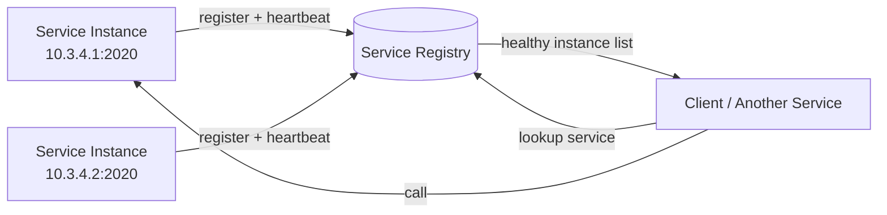
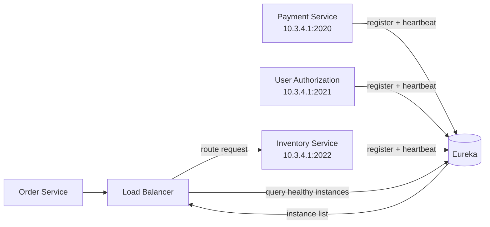

# Service Discovery 
- https://youtube.com/watch?v=ecuEkmFs5Vk

## Overview

> Dynamically find healthy service instances without hardcoding IP addresses.

In microservices, service instances can **start, stop, scale, or change IP addresses**. 
Service discovery lets one service find the current network location of another service.

**Service Registry**
- Service instances must be registered with and deregistered from the service registry.
- Self-Registration Pattern
- heartbeat mechanism: It sends heartbeat requests to prevent registration from expiring.
- eg:
    - Consul, Eureka
    - K8s, coreDNS, etcd
    - AWS Cloud Map
  
**Self registration pattern**
- microservice/s to automatically discover each other on the network.
- Instead of hardcoding IP addresses or URLs,  **uses service name** or other identifier 



---
## Types
| Model                     | How it works                                               |
| ------------------------- | ---------------------------------------------------------- |
| **Client-side discovery** | Client asks registry, picks an instance, calls it directly |
| **Server-side discovery** | Client calls LB/router; LB discovers and selects instance  |



---  
## benefit 
- scalability 
  - Dynamically adjusts as new service instances are added or removed,
  - thus, enabling seamless application scaling
- Reduced Complexity
  - Simplifies service management, 
  - allowing developers to focus on core business logic
- Fault-Tolerance 
  - Ensures that if a service instance fails, 
  - other instances can be used without manual intervention
  


---
## Java SB snippets
```
@EnableEurekaServer 
- to make the Spring Boot application a Eureka server.

@EnableEurekaClient 
- to register it with the Eureka server.

@LoadBalanced RestTemplate 
- to automatically use Eureka for service discovery by name.
- application.name=service-1
```