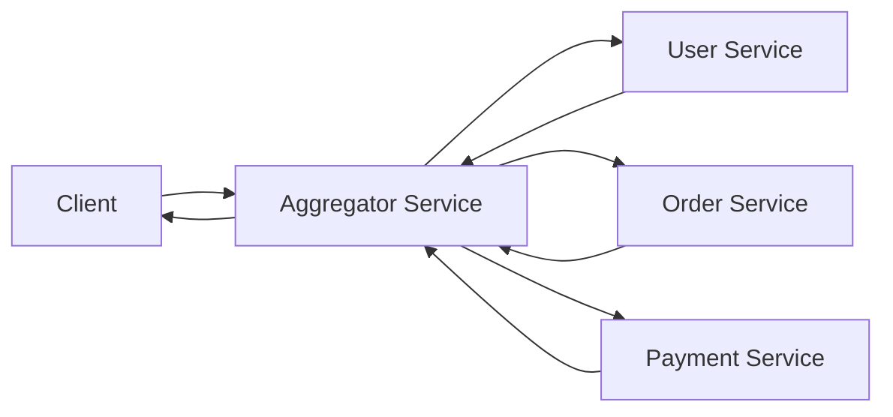
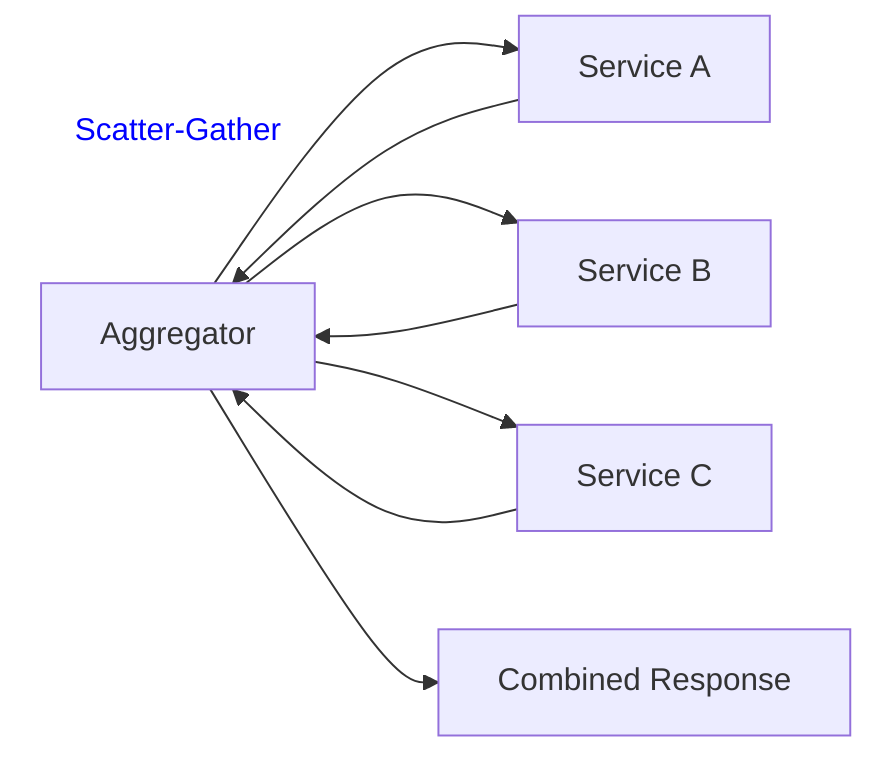
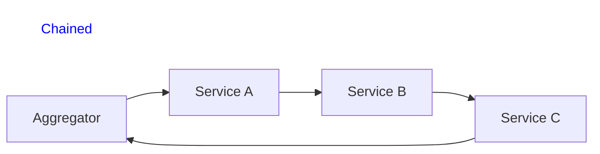
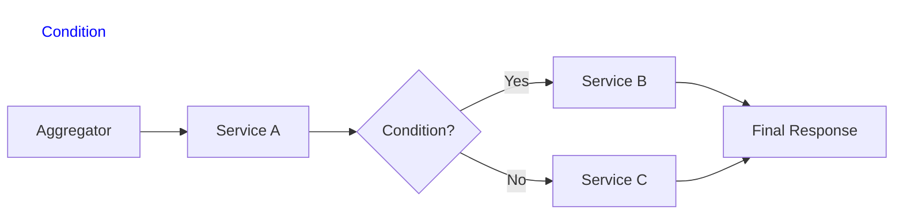

# Aggregator Pattern
- https://www.youtube.com/watch?v=6W8FCW2rWNQ

---
## Aggregator service
> - looks similar to aggregator in saga
> - Aggregator = fan-out calls to multiple services + combine results into one unified response.

> Type: 
> - Simple = fetch + combine
> - Complex = fetch + orchestrate + process + combine

**Simple Aggregator** 
- Handle straightforward scenarios 
- where data from services can be directly combined without extensive processing, 
- eg:  displaying product categories on an e-commerce homepage.

**Complex Aggregator** 
- Deal with intricate scenarios involving dependencies and complex computations, 
- eg:  personalized financial dashboard 

---
## Aggregator service :: Implementation Methods

| Pattern        | Flow        | Use when                |
| -------------- | ----------- | ----------------------- |
| Scatter-Gather | Parallel    | Independent services    |
| Chained        | Sequential  | Dependent services      |
| Branch         | Conditional | Decision-based workflow |

## Challenges 
- Aggregator service -> **single point of failure**
- **Performance Overhead**
  - Slow or failing underlying services can impact the aggregator service.
  - aggregating multiple responses can introduce latency, 
  - thus requiring optimization.  👈🏻
- As complexity grows, **maintaining and scaling** the aggregator ms becomes challenging